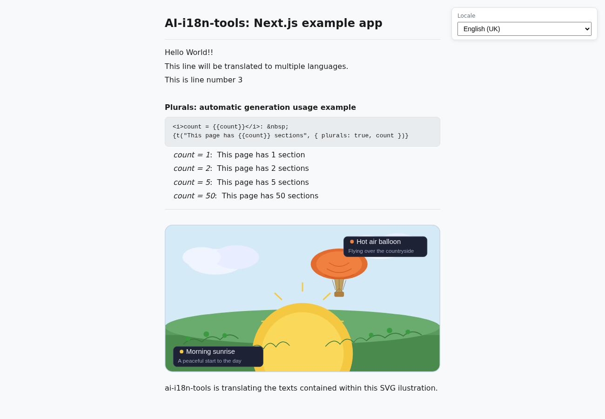

# Next.js App Example

This example shows how to use `ai-i18n-tools` with a **TypeScript** [Next.js](https://nextjs.org/) app and **pnpm**. The UI matches the [console app example](../console-app/), using the same string keys and a locale selector driven by `locales/ui-languages.json` (source locale `en-GB` first, followed by the translation targets). [`src/lib/i18n.ts`](./src/lib/i18n.ts) builds **`localeLoaders`** from that manifest (every `code` except `SOURCE_LOCALE`), like the console app; bundles load with **`fetch`** to **`public/locales/<locale>.json`**.

Nested under this folder is a small **[Docusaurus](https://docusaurus.io/)** site ([`docs-site/`](./docs-site/)) with copies of the main project docs for local browsing.

<small>**Read in other languages:** </small>
<small id="lang-list">[English](./README.md) · [العربية](./translated-docs/README.ar.md) · [Español](./translated-docs/README.es.md) · [Français](./translated-docs/README.fr.md) · [Deutsch](./translated-docs/README.de.md) · [Português (BR)](./translated-docs/README.pt-BR.md)</small>


## Screenshot



## Requirements

- Node.js >= 18
- [pnpm](https://pnpm.io/)
- An [OpenRouter](https://openrouter.ai) API key (for generating translations)

## Installation

From the **repository root**, run:

```bash
pnpm install
```

The root `pnpm-workspace.yaml` includes the library and this example, so pnpm links `ai-i18n-tools` via `"ai-i18n-tools": "workspace:^"` in `package.json`. No separate build or link step is needed — after changing library sources, run `pnpm run build` at the repo root and the example will pick up the updated `dist/` automatically.

## Usage

### Next.js app (port 3030)

Development server:

```bash
pnpm dev
```

Production build and start:

```bash
pnpm build
pnpm start
```

Open [http://localhost:3030](http://localhost:3030). Use the **Locale** dropdown to switch language (locale ID / English name / native label). You can also deep-link a locale with the query string **`?locale=<code>`** (for example [`?locale=ar`](http://localhost:3030/?locale=ar)); the page keeps the dropdown and URL in sync.

### Cardinal plurals example

The home page includes a **plurals demo** (“Plurals: automatic generation usage example”) that shows how **cardinal plural** UI strings are wired end-to-end:

- **Rendering:** The same message is repeated for several sample counts defined in **`PLURAL_DEMO_COUNTS`** in [`src/app/page.tsx`](./src/app/page.tsx) (by default **1**, **2**, **5**, and **50**) so you can compare plural behaviour across locales (including languages with several plural forms, such as Arabic).
- **API:** Each line uses `t("This page has {{count}} sections", { plurals: true, count })`. Pass **`plurals: true`** so extraction and translation treat the key as a plural group; **`count`** selects the active plural form at runtime.
- **Runtime:** “Plural forms are resolved at runtime using the helpers wired up in [src/lib/i18n.ts](src/lib/i18n.ts) (see the package’s runtime docs for the full picture).
- **Outputs:** Target locales use suffixed entries in `public/locales/<locale>.json`; the source locale keeps plural bundles in **`public/locales/en-GB.json`** alongside the usual flat entries.

The demo also shows a small **gray code block** with the JSX snippet above the live examples for quick reference.

The home page also shows a **demo SVG** at the bottom. The image URL follows `public/assets/translation_demo_svg.<locale>.svg` (flat layout from the `svg` block in `ai-i18n-tools.config.json`). After running `translate-svg`, each locale file contains translated `<text>`, `<title>`, and `<desc>` content; until then, committed copies may look identical across locales.

### Documentation site (port 3040)

```bash
cd docs-site
pnpm install
pnpm start
```

Open [http://localhost:3040](http://localhost:3040) (English). In **development**, Docusaurus serves **one locale at a time**: paths such as `/es/getting-started` **404** unless you run `pnpm run start:es` (or `start:fr`, `start:de`, `start:pt-BR`, `start:ar`). After `pnpm build && pnpm serve`, all locales are available. See [`docs-site/README.md`](./docs-site/README.md).

## Supported Languages

| Code     | Language             |
| -------- | -------------------- |
| `en-GB`  | English (UK) default |
| `es`     | Spanish              |
| `fr`     | French               |
| `de`     | German               |
| `pt-BR`  | Portuguese (Brazil)  |
| `ar`     | Arabic               |

## Workflow

### 1. Extract UI strings

Scans `src/` for `t()` calls and updates `locales/strings.json`:

```bash
pnpm run i18n:extract
```

### 2. Translate

Set `OPENROUTER_API_KEY`, then run the translate scripts:

```bash
export OPENROUTER_API_KEY=your_key_here
pnpm run i18n:translate-ui
pnpm run i18n:translate-svg
pnpm run i18n:translate-docs
```

### Sync command

The sync command runs extraction and all translation steps in sequence:

```bash
pnpm run i18n:sync
```

or

```bash
ai-i18n-tools sync
```

Steps run in order:

1. **`ai-i18n-tools extract`** — extracts UI strings and updates `locales/strings.json`.
2. **`ai-i18n-tools translate-ui`** — writes flat locale JSON under `public/locales/` from `locales/strings.json`.
3. **`ai-i18n-tools translate-svg`** — translates SVG assets from `images/` to `public/assets/` when `features.translateSVG` is true and the `svg` block is set in `ai-i18n-tools.config.json` (this example uses flat names: `translation_demo_svg.<locale>.svg`).
4. **`ai-i18n-tools translate-docs`** — translates Docusaurus markdown under `docs-site/i18n/<locale>/docusaurus-plugin-content-docs/current/` (see **Workflow 2** in `docs/GETTING_STARTED.md` at the repository root).

You can run any step individually (e.g. `ai-i18n-tools translate-svg`) when only the sources for that workflow have changed.

If logs show many skips and few writes, the tool is reusing **existing outputs** and the **SQLite cache** in `.translation-cache/`. To force re-translation, pass `--force` or `--force-update` on the relevant command where supported, or run `pnpm run i18n:clean` and translate again.

This example has `features.translateSVG` and an `svg` block, so **`i18n:sync` runs the same SVG step as `translate-svg`**. You can still call `ai-i18n-tools translate-svg` alone for that step, or use `pnpm run i18n:translate` for the fixed UI → SVG → docs order **without** running **extract**.

### 3. Clean up cache and re-translate

After changes to the UI or documentation, some cache entries may be stale or orphaned (for example, if a document was removed or renamed). `i18n:cleanup` runs `sync --force-update` first, then removes stale entries:

```bash
pnpm run i18n:cleanup
```

To force re-translation of the UI, documents, or SVGs, use `--force`. This ignores the cache and re-translates using AI models.

To re-translate the entire project (UI, documents, SVGs):

```bash
pnpm run i18n:sync --force
```

To re-translate a single locale:

```bash
pnpm run i18n:sync --force --locale pt-BR
```

To re-translate only the UI strings for a specific locale:

```bash
ai-i18n-tools translate-ui --force --locale pt-BR
```

### 4. Manual Edits (Cache Editor)

You can launch a local web UI to manually review and edit translations in the cache, UI strings, and glossary:

```bash
pnpm run i18n:editor
```

> **Important:** If you manually edit an entry in the cache editor, you need to run a `sync --force-update` (e.g. `pnpm run i18n:sync --force-update`) to rewrite the generated flat files or markdown files with the updated translation. Also note that if the original source text changes in the future, your manual edit will be lost since the tool generates a new hash for the new source text.

## Project Structure

```text
nextjs-app/
├── ai-i18n-tools.config.json # `svg` block: images/ → public/assets/ (translate-svg)
├── src/
│   ├── app/
│   │   ├── layout.tsx
│   │   ├── page.tsx
│   │   └── globals.css
│   └── lib/
│       └── i18n.ts
├── images/
│   └── translation_demo_svg.svg   # Source SVG for translate-svg
├── locales/
│   ├── ui-languages.json
│   └── strings.json          # Generated string catalogue (extract)
├── public/locales/           # Flat per-locale JSON (committed; regenerate with translate-ui)
│   ├── es.json
│   ├── fr.json
│   ├── de.json
│   ├── pt-BR.json
│   └── ar.json
├── public/assets/            # Per-locale SVGs (translate-svg; page uses translation_demo_svg.<locale>.svg)
│   └── translation_demo_svg.*.svg
└── docs-site/                # Docusaurus docs (port 3040)
    ├── docs/                 # Source (English)
    └── i18n/                 # Translated docs (Docusaurus layout; committed in git)
```

English doc sources under `docs-site/docs/` can be synced from the repository root with `pnpm run sync-docs`, which adds `{#slug}` heading anchors and mirrors `docusaurus write-heading-ids`; see the script header in `scripts/sync-docs-to-nextjs-example.mjs`.

Translated UI strings, demo SVGs, and Docusaurus pages are already committed under `public/locales/`, `public/assets/`, `locales/strings.json`, and `docs-site/i18n/`. After changing sources and running `i18n:translate`, restart the Next.js and Docusaurus dev servers as needed; Docusaurus locales are listed in `docs-site/docusaurus.config.js`.
