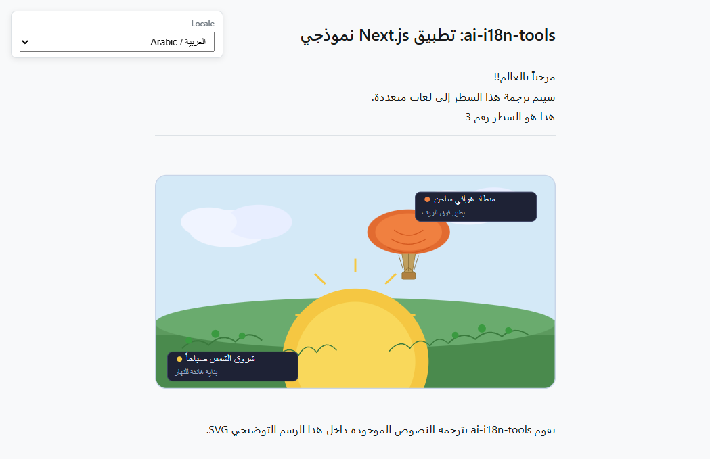

# مثال تطبيق Next.js

يوضح هذا المثال كيفية استخدام `ai-i18n-tools` مع تطبيق **TypeScript** [Next.js](https://nextjs.org/) و **pnpm**. ويوافق واجهة المستخدم [مثال تطبيق وحدة التحكم](../../console-app/)، باستخدام نفس مفاتيح النصوص ومنتقي لغات يعتمد على `locales/ui-languages.json` (لغة المصدر `en-GB` أولاً، تليها لغات الترجمة المستهدفة).

موجود ضمن هذا المجلد موقع صغير **[Docusaurus](https://docusaurus.io/)** ([`docs-site/`](../docs-site/)) يحتوي نسخًا من وثائق المشروع الرئيسية للتصفح المحلي.

<small>**اقرأ بلغات أخرى:** </small>

<small id="lang-list">[en-GB](../README.md) · [ar](./README.ar.md) · [de](./README.de.md) · [es](./README.es.md) · [fr](./README.fr.md) · [pt-BR](./README.pt-BR.md)</small>

## لقطة شاشة



## المتطلبات

- Node.js >= 18
- [pnpm](https://pnpm.io/)
- مفتاح API من [OpenRouter](https://openrouter.ai) (لإنشاء الترجمات)

## التثبيت

من **جذر المستودع**، قم بتشغيل:

```bash
pnpm install
```

يتضمن ملف `pnpm-workspace.yaml` في الجذر المكتبة وعينة هذا المثال، وبالتالي يقوم pnpm بربط `ai-i18n-tools` عبر `"ai-i18n-tools": "workspace:^"` في `package.json`. ولا حاجة لخطوة بناء أو ربط منفصلة — بعد تعديل مصادر المكتبة، قم بتشغيل `pnpm run build` في جذر المستودع وسيتم تلقائيًا تحميل الملفات المحدثة من `dist/` في المثال.

## الاستخدام

### تطبيق Next.js (المنفذ 3030)

خادم التطوير:

```bash
pnpm dev
```

بناء الإنتاج والبدء:

```bash
pnpm build
pnpm start
```

افتح [http://localhost:3030](http://localhost:3030). استخدم القائمة المنسدلة **Locale** لتغيير اللغة (معرّف اللغة / الاسم الإنجليزي / التسمية الأصلية).

تعرض الصفحة الرئيسية أيضًا **رسمًا بيانيًا SVG تجريبيًا** في الأسفل. يتبع عنوان URL للصورة النمط `public/assets/translation_demo_svg.<locale>.svg` (بنية مسطحة من الكتلة `svg` في ملف `ai-i18n-tools.config.json`). بعد تشغيل `translate-svg`، تحتوي كل ملف لغة على محتوى مترجم ضمن العناصر `<text>` و `<title>` و `<desc>`؛ قبل ذلك، قد تبدو النسخ المحفوظة متطابقة عبر اللغات.

### موقع الوثائق (المنفذ 3040)

```bash
cd docs-site
pnpm install
pnpm start
```

افتح [http://localhost:3040](http://localhost:3040) (باللغة الإنجليزية). في بيئة **التطوير**، يقوم Docusaurus بعرض **لغة واحدة في كل مرة**: المسارات مثل `/es/getting-started` تُرجع خطأ **404** ما لم تقم بتشغيل `pnpm run start:es` (أو `start:fr`، `start:de`، `start:pt-BR`، `start:ar`). بعد تنفيذ `pnpm build && pnpm serve`، تصبح جميع اللغات متاحة. راجع [`docs-site/README.md`](../docs-site/README.md).

## اللغات المدعومة

| الكود     | اللغة             |
| -------- | -------------------- |
| `en-GB`  | الإنجليزية (المملكة المتحدة) الافتراضية |
| `es`     | الإسبانية              |
| `fr`     | الفرنسية               |
| `de`     | الألمانية               |
| `pt-BR`  | البرتغالية (البرازيل)  |
| `ar`     | العربية               |

## سير العمل

### 1. استخراج سلاسل واجهة المستخدم

يقوم بمسح `src/` بحثًا عن استدعاءات `t()` ويُحدّث `locales/strings.json`:

```bash
pnpm run i18n:extract
```

### 2. الترجمة

عيّن `OPENROUTER_API_KEY`، ثم شغّل نصوص الترجمة:

```bash
export OPENROUTER_API_KEY=your_key_here
pnpm run i18n:translate-ui
pnpm run i18n:translate-svg
pnpm run i18n:translate-docs
```

### أمر المزامنة

يقوم أمر المزامنة بتشغيل خطوات الاستخراج وجميع خطوات الترجمة بشكل متسلسل:

```bash
pnpm run i18n:sync
```

أو

```bash
ai-i18n-tools sync
```

تُنفَّذ الخطوات بالترتيب:

1. **`ai-i18n-tools extract`** — يستخرج سلاسل واجهة المستخدم ويُحدّث `locales/strings.json`.
2. **`ai-i18n-tools translate-ui`** — يكتب ملفات JSON مسطحة للغات تحت `public/locales/` من `locales/strings.json`.
3. **`ai-i18n-tools translate-svg`** — يترجم أصول SVG من `images/` إلى `public/assets/` وفقًا للكتلة `svg` في ملف `ai-i18n-tools.config.json` (يستخدم هذا المثال أسماء مسطحة: `translation_demo_svg.<locale>.svg`).
4. **`ai-i18n-tools translate-docs`** — يترجم ملفات Docusaurus markdown الموجودة ضمن `docs-site/i18n/<locale>/docusaurus-plugin-content-docs/current/` (انظر **Workflow 2** في `docs/GETTING_STARTED.md` في جذر المستودع).

يمكنك تشغيل أي خطوة على حدة (مثلاً `ai-i18n-tools translate-svg`) عندما تتغير فقط المصادر الخاصة بسير العمل ذاك.

إذا أظهرت السجلات تخطيًا عديدًا وكتابات قليلة، فإن الأداة تعيد استخدام **المخرجات الحالية** و**ذاكرة التخزين المؤقت SQLite** في `.translation-cache/`. لإجبار إعادة الترجمة، استخدم الخيار `--force` أو `--force-update` مع الأمر المعني عند دعمه، أو شغّل `pnpm run i18n:clean` ثم قم بالترجمة مرة أخرى.

يتضمن تكوين هذا المثال `svg`، وبالتالي **`i18n:sync` يقوم بنفس خطوة SVG التي يقوم بها `translate-svg`**. لا يزال بإمكانك استدعاء `ai-i18n-tools translate-svg` وحدها لتلك الخطوة، أو استخدام `pnpm run i18n:translate` للحصول على الترتيب الثابت واجهة المستخدم → SVG → المستندات **دون** تشغيل **extract**.

### 3. تنظيف الذاكرة المؤقتة وإعادة الترجمة

بعد إجراء تغييرات على واجهة المستخدم أو الوثائق، قد تصبح بعض إدخالات الذاكرة المؤقتة قديمة أو منفصلة (مثلاً، إذا تم حذف مستند أو تغيير اسمه). يقوم `i18n:cleanup` أولاً بتشغيل `sync --force-update`، ثم يزيل الإدخالات القديمة:

```bash
pnpm run i18n:cleanup
```

لإجبار إعادة ترجمة واجهة المستخدم أو المستندات أو ملفات SVG، استخدم `--force`. هذا يتجاهل الذاكرة المؤقتة ويُعيد الترجمة باستخدام نماذج الذكاء الاصطناعي.

لإعادة ترجمة المشروع بأكمله (واجهة المستخدم، المستندات، ملفات SVG):

```bash
pnpm run i18n:sync --force
```

لإعادة ترجمة لغة واحدة فقط:

```bash
pnpm run i18n:sync --force --locale pt-BR
```

لإعادة ترجمة سلاسل واجهة المستخدم فقط بلغة محددة:

```bash
ai-i18n-tools translate-ui --force --locale pt-BR
```

### 4. التعديلات اليدوية (محرر الذاكرة المؤقتة)

يمكنك تشغيل واجهة ويب محلية لمراجعة الترجمات وتحريرها يدويًا في الذاكرة المؤقتة، وسلسلة واجهة المستخدم، والقاموس المسرد:

```bash
pnpm run i18n:editor
```

> **مهم:** إذا قمت بتحرير إدخال يدويًا في محرر الذاكرة المؤقتة، فعليك تشغيل الأمر `sync --force-update` (مثل `pnpm run i18n:sync --force-update`) لإعادة كتابة الملفات المسطحة أو ملفات markdown التي تم إنشاؤها مع الترجمة المحدثة. لاحظ أيضًا أنه إذا تغير النص الأصلي في المستقبل، فستفقد التعديل اليدوي الخاص بك لأن الأداة تقوم بإنشاء تجزئة جديدة للنص الأصلي الجديد.

## هيكل المشروع

```
nextjs-app/
├── ai-i18n-tools.config.json # `svg` block: images/ → public/assets/ (translate-svg)
├── src/
│   ├── app/
│   │   ├── layout.tsx
│   │   ├── page.tsx
│   │   └── globals.css
│   └── lib/
│       └── i18n.ts
├── images/
│   └── translation_demo_svg.svg   # Source SVG for translate-svg
├── locales/
│   ├── ui-languages.json
│   └── strings.json          # Generated string catalogue (extract)
├── public/locales/           # Flat per-locale JSON (committed; regenerate with translate-ui)
│   ├── es.json
│   ├── fr.json
│   ├── de.json
│   ├── pt-BR.json
│   └── ar.json
├── public/assets/            # Per-locale SVGs (translate-svg; page uses translation_demo_svg.<locale>.svg)
│   └── translation_demo_svg.*.svg
└── docs-site/                # Docusaurus docs (port 3040)
    ├── docs/                 # Source (English)
    └── i18n/                 # Translated docs (Docusaurus layout; committed in git)
```

يمكن مزامنة مصادر الوثائق الإنجليزية الموجودة ضمن `docs-site/docs/` من جذر المستودع باستخدام الأمر `pnpm run sync-docs`، والذي يضيف عناوين `{#slug}` ويعكس سلوك `docusaurus write-heading-ids`؛ راجع رأس النص البرمجي في `scripts/sync-docs-to-nextjs-example.mjs`.

تم بالفعل إدخال سلاسل واجهة المستخدم المترجمة، وملفات SVG التوضيحية، وصفحات Docusaurus ضمن `public/locales/` و`public/assets/` و`locales/strings.json` و`docs-site/i18n/`. بعد تغيير المصادر وتشغيل `i18n:translate`، أعد تشغيل خوادم التطوير الخاصة بـ Next.js وDocusaurus حسب الحاجة؛ وتظهر لغات Docusaurus في ملف `docs-site/docusaurus.config.js`.
