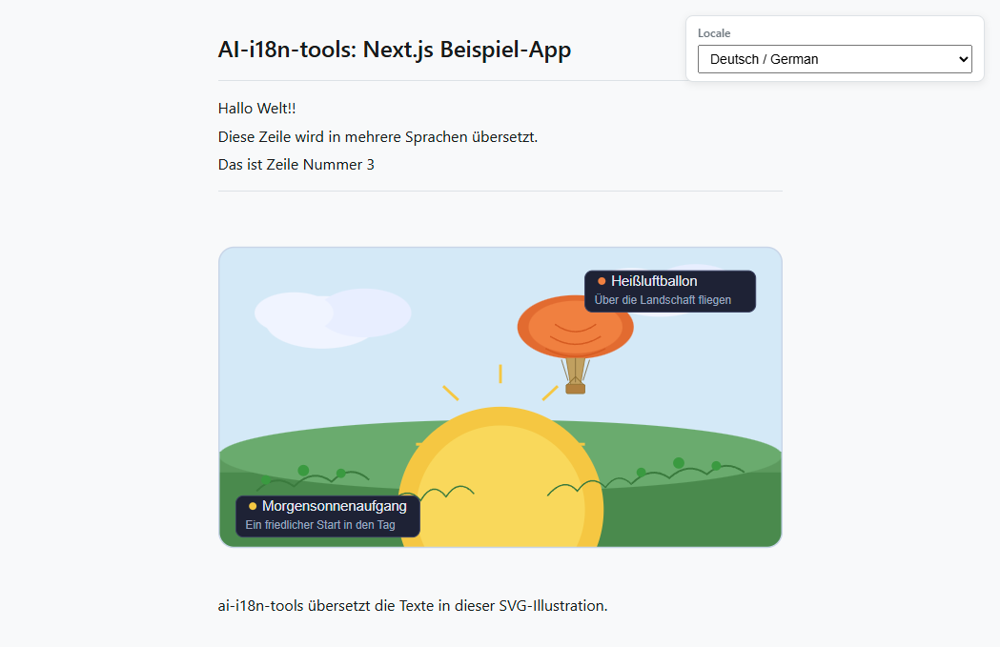

# Next.js-App-Beispiel

Dieses Beispiel zeigt, wie `ai-i18n-tools` mit einer **TypeScript**-[Next.js](https://nextjs.org/)-App und **pnpm** verwendet wird. Die Benutzeroberfläche entspricht dem [Konsole-App-Beispiel](../../console-app/) und verwendet dieselben Zeichenfolgenschlüssel sowie einen Sprachauswahl-Handler, der von `locales/ui-languages.json` gesteuert wird (Quelllokalisierung `en-GB` zuerst, gefolgt von den Zielsprachen).

Unterhalb dieses Ordners befindet sich eine kleine **[Docusaurus](https://docusaurus.io/)**-Website ([`docs-site/`](../docs-site/)) mit Kopien der wichtigsten Projekt-Dokumentationen zum lokalen Durchsuchen.

<small>**In anderen Sprachen lesen:** </small>

<small id="lang-list">[en-GB](../README.md) · [ar](./README.ar.md) · [de](./README.de.md) · [es](./README.es.md) · [fr](./README.fr.md) · [pt-BR](./README.pt-BR.md)</small>

## Screenshot



## Voraussetzungen

- Node.js >= 18
- [pnpm](https://pnpm.io/)
- Ein [OpenRouter](https://openrouter.ai)-API-Schlüssel (zum Generieren von Übersetzungen)

## Installation

Führen Sie aus dem **Repository-Stammverzeichnis** heraus Folgendes aus:

```bash
pnpm install
```

Die Datei `pnpm-workspace.yaml` im Stammverzeichnis enthält die Bibliothek und dieses Beispiel, sodass pnpm `ai-i18n-tools` über `"ai-i18n-tools": "workspace:^"` in der `package.json` verknüpft. Es ist kein separater Build- oder Link-Schritt erforderlich – nach Änderungen an den Bibliotheksquellen führen Sie `pnpm run build` im Repository-Stamm aus, und das Beispiel übernimmt automatisch das aktualisierte `dist/`-Verzeichnis.

## Verwendung

### Next.js-App (Port 3030)

Entwicklungsserver:

```bash
pnpm dev
```

Produktions-Build und Start:

```bash
pnpm build
pnpm start
```

Öffnen Sie [http://localhost:3030](http://localhost:3030). Verwenden Sie den **Locale**-Dropdown, um die Sprache zu wechseln (Lokalisierungs-ID / englischer Name / native Bezeichnung).

Auf der Startseite wird unten außerdem ein **Demo-SVG** angezeigt. Die Bild-URL folgt dem Muster `public/assets/translation_demo_svg.<locale>.svg` (flache Struktur aus dem `svg`-Block in `ai-i18n-tools.config.json`). Nachdem `translate-svg` ausgeführt wurde, enthält jede Lokalisierungsdatei übersetzte Inhalte für `<text>`, `<title>` und `<desc>`; bis dahin können die committeten Kopien in allen Lokalisierungen identisch aussehen.

### Dokumentationswebsite (Port 3040)

```bash
cd docs-site
pnpm install
pnpm start
```

Öffnen Sie [http://localhost:3040](http://localhost:3040) (Englisch). In der **Entwicklungsumgebung** bedient Docusaurus jeweils **nur eine Lokalisierung**: Pfade wie `/es/getting-started` führen zu einem **404**, es sei denn, Sie führen `pnpm run start:es` aus (oder `start:fr`, `start:de`, `start:pt-BR`, `start:ar`). Nach `pnpm build && pnpm serve` sind alle Lokalisierungen verfügbar. Siehe [`docs-site/README.md`](../docs-site/README.md).

## Unterstützte Sprachen

| Code     | Sprache              |
| -------- | -------------------- |
| `en-GB`  | Englisch (GB) Standard |
| `es`     | Spanisch               |
| `fr`     | Französisch            |
| `de`     | Deutsch                |
| `pt-BR`  | Portugiesisch (Brasilien) |
| `ar`     | Arabisch               |

## Workflow

### 1. UI-Texte extrahieren

Durchsucht `src/` nach `t()`-Aufrufen und aktualisiert `locales/strings.json`:

```bash
pnpm run i18n:extract
```

### 2. Übersetzen

Legen Sie `OPENROUTER_API_KEY` fest und führen Sie dann die Übersetzungsskripte aus:

```bash
export OPENROUTER_API_KEY=your_key_here
pnpm run i18n:translate-ui
pnpm run i18n:translate-svg
pnpm run i18n:translate-docs
```

### Sync-Befehl

Der Sync-Befehl führt die Extraktion und alle Übersetzungsschritte nacheinander aus:

```bash
pnpm run i18n:sync
```

oder

```bash
ai-i18n-tools sync
```

Die Schritte werden in folgender Reihenfolge ausgeführt:

1. **`ai-i18n-tools extract`** – extrahiert UI-Zeichenketten und aktualisiert `locales/strings.json`.
2. **`ai-i18n-tools translate-ui`** – schreibt flaches Locale-JSON unter `public/locales/` aus `locales/strings.json`.
3. **`ai-i18n-tools translate-svg`** – übersetzt SVG-Ressourcen von `images/` nach `public/assets/`, wenn `features.translateSVG` true ist und der `svg`-Block in `ai-i18n-tools.config.json` gesetzt ist (dieses Beispiel verwendet flache Namen: `translation_demo_svg.<locale>.svg`).
4. **`ai-i18n-tools translate-docs`** – übersetzt Docusaurus-Markdown unter `docs-site/i18n/<locale>/docusaurus-plugin-content-docs/current/` (siehe **Workflow 2** in `docs/GETTING_STARTED.md` im Stammverzeichnis des Repositorys).

Sie können jeden Schritt einzeln ausführen (z. B. `ai-i18n-tools translate-svg`), wenn sich nur die Quellen für diesen Workflow geändert haben.

Wenn die Protokolle viele Überspringungen und nur wenige Schreibvorgänge anzeigen, wiederverwendet das Tool **bestehende Ausgaben** und den **SQLite-Cache** in `.translation-cache/`. Um eine erneute Übersetzung zu erzwingen, übergeben Sie `--force` oder `--force-update` an den entsprechenden Befehl (sofern unterstützt), oder führen Sie `pnpm run i18n:clean` aus und übersetzen Sie erneut.

Dieses Beispiel enthält `features.translateSVG` und einen `svg`-Block, daher **`i18n:sync` führt denselben SVG-Schritt wie `translate-svg`** aus. Sie können dennoch `ai-i18n-tools translate-svg` allein für diesen Schritt aufrufen oder `pnpm run i18n:translate` verwenden, um die feste Reihenfolge UI → SVG → Dokumentation durchzuführen, **ohne** **extract** auszuführen.

### 3. Cache bereinigen und erneut übersetzen

Nach Änderungen an der Benutzeroberfläche oder an der Dokumentation können einige Cache-Einträge veraltet oder verwaist sein (z. B., wenn ein Dokument entfernt oder umbenannt wurde). `i18n:cleanup` führt zuerst `sync --force-update` aus und entfernt anschließend veraltete Einträge:

```bash
pnpm run i18n:cleanup
```

Um die erneute Übersetzung der Benutzeroberfläche, Dokumente oder SVGs zu erzwingen, verwenden Sie `--force`. Dadurch wird der Cache ignoriert und eine erneute Übersetzung mithilfe von KI-Modellen durchgeführt.

Um das gesamte Projekt (UI, Dokumente, SVGs) erneut zu übersetzen:

```bash
pnpm run i18n:sync --force
```

Um ein einzelnes Gebietsschema erneut zu übersetzen:

```bash
pnpm run i18n:sync --force --locale pt-BR
```

Um nur die UI-Texte für ein bestimmtes Gebietsschema erneut zu übersetzen:

```bash
ai-i18n-tools translate-ui --force --locale pt-BR
```

### 4. Manuelle Bearbeitungen (Cache-Editor)

Sie können eine lokale Web-Oberfläche starten, um Übersetzungen im Cache, in UI-Texten und im Glossar manuell zu überprüfen und zu bearbeiten:

```bash
pnpm run i18n:editor
```

> **Wichtig:** Wenn Sie einen Eintrag im Cache-Editor manuell bearbeiten, müssen Sie einen `sync --force-update` ausführen (z. B. `pnpm run i18n:sync --force-update`), um die generierten flachen Dateien oder Markdown-Dateien mit der aktualisierten Übersetzung erneut zu schreiben. Beachten Sie außerdem, dass Ihre manuelle Bearbeitung verloren geht, wenn sich der ursprüngliche Quelltext in Zukunft ändert, da das Tool einen neuen Hash für den neuen Quelltext generiert.

## Projektstruktur

```
nextjs-app/
├── ai-i18n-tools.config.json # `svg` block: images/ → public/assets/ (translate-svg)
├── src/
│   ├── app/
│   │   ├── layout.tsx
│   │   ├── page.tsx
│   │   └── globals.css
│   └── lib/
│       └── i18n.ts
├── images/
│   └── translation_demo_svg.svg   # Source SVG for translate-svg
├── locales/
│   ├── ui-languages.json
│   └── strings.json          # Generated string catalogue (extract)
├── public/locales/           # Flat per-locale JSON (committed; regenerate with translate-ui)
│   ├── es.json
│   ├── fr.json
│   ├── de.json
│   ├── pt-BR.json
│   └── ar.json
├── public/assets/            # Per-locale SVGs (translate-svg; page uses translation_demo_svg.<locale>.svg)
│   └── translation_demo_svg.*.svg
└── docs-site/                # Docusaurus docs (port 3040)
    ├── docs/                 # Source (English)
    └── i18n/                 # Translated docs (Docusaurus layout; committed in git)
```

Englische Dokumentationsquellen unter `docs-site/docs/` können vom Repository-Stamm aus mit `pnpm run sync-docs` synchronisiert werden, wodurch `{#slug}`-Überschriftenanker hinzugefügt werden, analog zu `docusaurus write-heading-ids`; siehe Skript-Kopfzeile in `scripts/sync-docs-to-nextjs-example.mjs`.

Übersetzte UI-Texte, Demo-SVGs und Docusaurus-Seiten sind bereits unter `public/locales/`, `public/assets/`, `locales/strings.json` und `docs-site/i18n/` committet. Nach Änderungen an den Quellen und Ausführen von `i18n:translate` starten Sie die Next.js- und Docusaurus-Entwicklungsserver bei Bedarf neu; die Docusaurus-Sprachversionen sind in `docs-site/docusaurus.config.js` aufgelistet.
