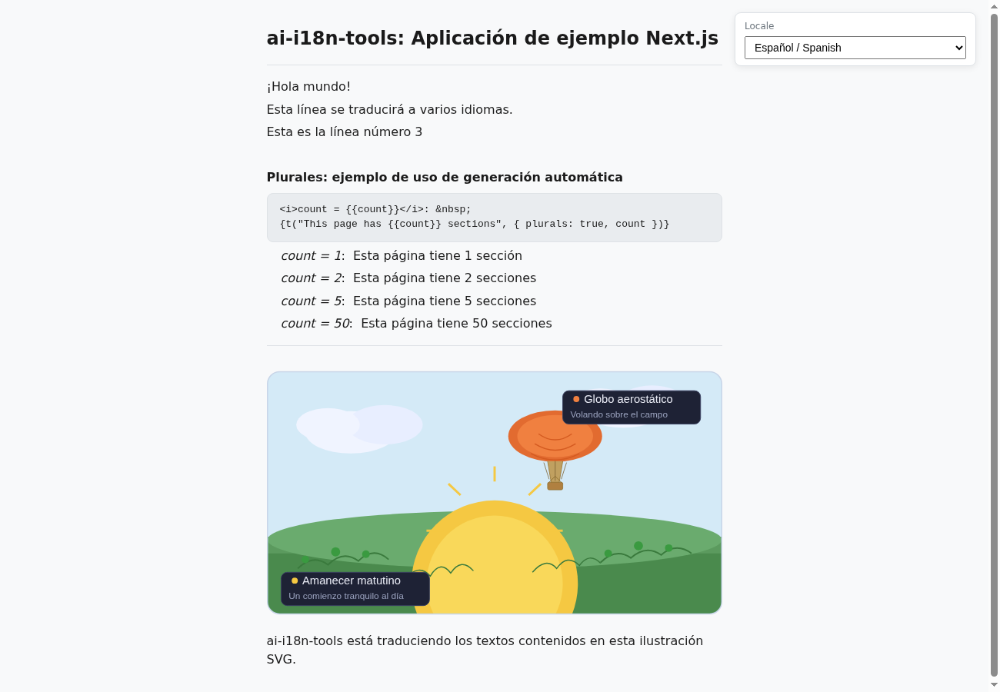

# Ejemplo de aplicación Next.js

Este ejemplo muestra cómo usar `ai-i18n-tools` con una aplicación [Next.js](https://nextjs.org/) en **TypeScript** y **pnpm**. La interfaz coincide con el ejemplo de la aplicación de consola [console app example](../../console-app/), utilizando las mismas claves de cadena y un selector de idioma controlado por `locales/ui-languages.json` (primero el idioma fuente `en-GB`, seguido de los idiomas de traducción). [`src/lib/i18n.ts`](../src/lib/i18n.ts) genera **`localeLoaders`** a partir de ese manifiesto (todas las `code` excepto `SOURCE_LOCALE`), como en la aplicación de consola; los paquetes se cargan con **`fetch`** a **`public/locales/<locale>.json`**.

Anidado bajo esta carpeta hay un pequeño sitio **[Docusaurus](https://docusaurus.io/)** ([`docs-site/`](../docs-site/)) con copias de la documentación principal del proyecto para navegación local.

<small>**Leer en otros idiomas:** </small>

<small id="lang-list">[English](../README.md) · [العربية](./README.ar.md) · [Español](./README.es.md) · [Français](./README.fr.md) · [Deutsch](./README.de.md) · [Português (BR)](./README.pt-BR.md)</small>

## Captura de pantalla



## Requisitos

- Node.js >= 18
- [pnpm](https://pnpm.io/)
- Una clave API de [OpenRouter](https://openrouter.ai) (para generar traducciones)

## Instalación

Desde la **raíz del repositorio**, ejecute:

```bash
pnpm install
```

El archivo raíz `pnpm-workspace.yaml` incluye la biblioteca y este ejemplo, por lo que pnpm enlaza `ai-i18n-tools` mediante `"ai-i18n-tools": "workspace:^"` en `package.json`. No se necesita un paso separado de compilación o enlace: después de cambiar las fuentes de la biblioteca, ejecute `pnpm run build` en la raíz del repositorio y el ejemplo recogerá automáticamente la carpeta `dist/` actualizada.

## Uso

### Aplicación Next.js (puerto 3030)

Servidor de desarrollo:

```bash
pnpm dev
```

Compilación para producción e inicio:

```bash
pnpm build
pnpm start
```

Abra [http://localhost:3030](http://localhost:3030). Use el menú desplegable **Locale** para cambiar el idioma (ID de configuración regional / nombre en inglés / etiqueta nativa). También puede enlazar directamente una configuración regional con la cadena de consulta **`?locale=<code>`** (por ejemplo [`?locale=ar`](http://localhost:3030/?locale=ar)); la página mantiene sincronizados el menú desplegable y la URL.

### Ejemplo de plurales cardinales

La página principal incluye una **demostración de plurales** ("Plurales: ejemplo de uso de generación automática") que muestra cómo se conectan de extremo a extremo las cadenas de interfaz de usuario de **plural cardinal**:

- **Representación:** El mismo mensaje se repite para varias cantidades de ejemplo definidas en **`PLURAL_DEMO_COUNTS`** en [`src/app/page.tsx`](../src/app/page.tsx) (por defecto **1**, **2**, **5** y **50**) para que pueda comparar el comportamiento plural entre configuraciones regionales (incluidos idiomas con varias formas plurales, como el árabe).
- **API:** Cada línea utiliza `t("This page has {{count}} sections", { plurals: true, count })`. Pase **`plurals: true`** para que la extracción y la traducción traten la clave como un grupo plural; **`count`** selecciona la forma plural activa en tiempo de ejecución.
- **Tiempo de ejecución:** "Las formas plurales se resuelven en tiempo de ejecución usando los ayudantes configurados en [src/lib/i18n.ts](../src/lib/i18n.ts) (consulte la documentación en tiempo de ejecución del paquete para obtener una visión completa).
- **Salidas:** Las configuraciones regionales de destino usan entradas con sufijo en `public/locales/<locale>.json`; la configuración regional fuente mantiene los paquetes plurales en **`public/locales/en-GB.json`** junto con las entradas planas habituales.

La demostración también muestra un pequeño **bloque de código gris** con el fragmento JSX encima de los ejemplos en vivo para referencia rápida.

La página de inicio también muestra un **demo SVG** en la parte inferior. La URL de la imagen sigue el patrón `public/assets/translation_demo_svg.<locale>.svg` (estructura plana desde el bloque `svg` en `ai-i18n-tools.config.json`). Después de ejecutar `translate-svg`, cada archivo de configuración regional contiene contenido traducido en las etiquetas `<text>`, `<title>` y `<desc>`; hasta entonces, las copias confirmadas pueden parecer idénticas entre configuraciones regionales.

### Sitio de documentación (puerto 3040)

```bash
cd docs-site
pnpm install
pnpm start
```

Abra [http://localhost:3040](http://localhost:3040) (inglés). En **desarrollo**, Docusaurus sirve **una configuración regional a la vez**: rutas como `/es/getting-started` dan error **404** a menos que ejecute `pnpm run start:es` (o `start:fr`, `start:de`, `start:pt-BR`, `start:ar`). Después de `pnpm build && pnpm serve`, todas las configuraciones regionales están disponibles. Consulte [`docs-site/README.md`](../docs-site/README.md).

## Idiomas soportados

| Código     | Idioma             |
| -------- | -------------------- |
| `en-GB`  | Inglés (Reino Unido) por defecto |
| `es`     | Español              |
| `fr`     | Francés               |
| `de`     | Alemán               |
| `pt-BR`  | Portugués (Brasil)  |
| `ar`     | Árabe               |

## Flujo de trabajo

### 1. Extraer cadenas de la interfaz de usuario

Analiza `src/` en busca de llamadas a `t()` y actualiza `locales/strings.json`:

```bash
pnpm run i18n:extract
```

### 2. Traducir

Establece `OPENROUTER_API_KEY` y luego ejecuta los scripts de traducción:

```bash
export OPENROUTER_API_KEY=your_key_here
pnpm run i18n:translate-ui
pnpm run i18n:translate-svg
pnpm run i18n:translate-docs
```

### Comando de sincronización

El comando de sincronización ejecuta la extracción y todos los pasos de traducción en secuencia:

```bash
pnpm run i18n:sync
```

o

```bash
ai-i18n-tools sync
```

Los pasos se ejecutan en orden:

1. **`ai-i18n-tools extract`** — extrae cadenas de interfaz de usuario y actualiza `locales/strings.json`.
2. **`ai-i18n-tools translate-ui`** — escribe JSON plano de configuración regional en `public/locales/` a partir de `locales/strings.json`.
3. **`ai-i18n-tools translate-svg`** — traduce recursos SVG de `images/` a `public/assets/` cuando `features.translateSVG` es verdadero y el bloque `svg` está definido en `ai-i18n-tools.config.json` (este ejemplo utiliza nombres planos: `translation_demo_svg.<locale>.svg`).
4. **`ai-i18n-tools translate-docs`** — traduce el markdown de Docusaurus en `docs-site/i18n/<locale>/docusaurus-plugin-content-docs/current/` (véase **Flujo de trabajo 2** en `docs/GETTING_STARTED.md` en la raíz del repositorio).

Puedes ejecutar cualquier paso individualmente (por ejemplo, `ai-i18n-tools translate-svg`) cuando solo hayan cambiado las fuentes correspondientes a ese flujo de trabajo.

Si los registros muestran muchos saltos y pocas escrituras, la herramienta está reutilizando **salidas existentes** y la **caché SQLite** en `.translation-cache/`. Para forzar la traducción nuevamente, pasa `--force` o `--force-update` al comando correspondiente cuando sea compatible, o ejecuta `pnpm run i18n:clean` y traduce de nuevo.

Este ejemplo tiene `features.translateSVG` y un bloque `svg`, por lo que **`i18n:sync` ejecuta el mismo paso SVG que `translate-svg`**. Aún puedes llamar a `ai-i18n-tools translate-svg` por separado para ese paso, o usar `pnpm run i18n:translate` para el orden fijo interfaz de usuario → SVG → documentación **sin** ejecutar **extract**.

### 3. Limpiar la caché y volver a traducir

Después de cambios en la interfaz de usuario o en la documentación, algunas entradas de la caché pueden estar obsoletas o huérfanas (por ejemplo, si un documento fue eliminado o renombrado). `i18n:cleanup` ejecuta primero `sync --force-update`, y luego elimina las entradas obsoletas:

```bash
pnpm run i18n:cleanup
```

Para forzar la traducción nuevamente de la interfaz de usuario, documentos o SVGs, utiliza `--force`. Esto ignora la caché y vuelve a traducir usando modelos de IA.

Para volver a traducir todo el proyecto (UI, documentos, SVGs):

```bash
pnpm run i18n:sync --force
```

Para volver a traducir un solo idioma:

```bash
pnpm run i18n:sync --force --locale pt-BR
```

Para volver a traducir solo las cadenas de interfaz de usuario de un idioma específico:

```bash
ai-i18n-tools translate-ui --force --locale pt-BR
```

### 4. Ediciones manuales (Editor de caché)

Puede iniciar una interfaz de usuario web local para revisar y editar manualmente las traducciones en la caché, las cadenas de la interfaz de usuario y el glosario:

```bash
pnpm run i18n:editor
```

> **Importante:** Si edita manualmente una entrada en el editor de caché, debe ejecutar un `sync --force-update` (por ejemplo, `pnpm run i18n:sync --force-update`) para reescribir los archivos planos generados o los archivos markdown con la traducción actualizada. Tenga en cuenta también que si el texto fuente original cambia en el futuro, su edición manual se perderá, ya que la herramienta genera un nuevo hash para el nuevo texto fuente.

## Estructura del proyecto

```
nextjs-app/
├── ai-i18n-tools.config.json # `svg` block: images/ → public/assets/ (translate-svg)
├── src/
│   ├── app/
│   │   ├── layout.tsx
│   │   ├── page.tsx
│   │   └── globals.css
│   └── lib/
│       └── i18n.ts
├── images/
│   └── translation_demo_svg.svg   # Source SVG for translate-svg
├── locales/
│   ├── ui-languages.json
│   └── strings.json          # Generated string catalogue (extract)
├── public/locales/           # Flat per-locale JSON (committed; regenerate with translate-ui)
│   ├── es.json
│   ├── fr.json
│   ├── de.json
│   ├── pt-BR.json
│   └── ar.json
├── public/assets/            # Per-locale SVGs (translate-svg; page uses translation_demo_svg.<locale>.svg)
│   └── translation_demo_svg.*.svg
└── docs-site/                # Docusaurus docs (port 3040)
    ├── docs/                 # Source (English)
    └── i18n/                 # Translated docs (Docusaurus layout; committed in git)
```

Las fuentes en inglés bajo `docs-site/docs/` pueden sincronizarse desde la raíz del repositorio con `pnpm run sync-docs`, lo cual añade anclajes de encabezado `{#slug}` y replica el comportamiento de `docusaurus write-heading-ids`; consulte el encabezado del script en `scripts/sync-docs-to-nextjs-example.mjs`.

Las cadenas de interfaz de usuario traducidas, los SVG de demostración y las páginas de Docusaurus ya están confirmadas en `public/locales/`, `public/assets/`, `locales/strings.json` y `docs-site/i18n/`. Después de modificar las fuentes y ejecutar `i18n:translate`, reinicie los servidores de desarrollo de Next.js y Docusaurus según sea necesario; los idiomas de Docusaurus se enumeran en `docs-site/docusaurus.config.js`.
