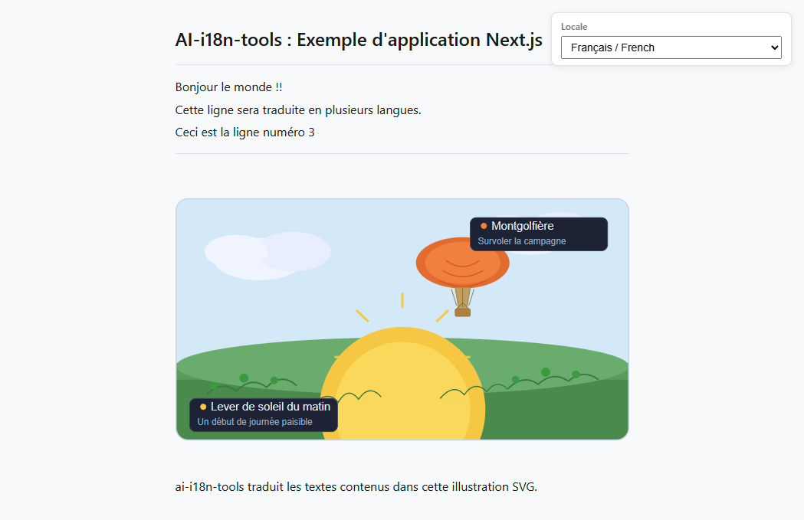

# Exemple d'application Next.js

Cet exemple montre comment utiliser `ai-i18n-tools` avec une application **TypeScript** [Next.js](https://nextjs.org/) et **pnpm**. L'interface utilisateur correspond à celle de l'[exemple d'application console](../../console-app/), en utilisant les mêmes clés de chaînes et un sélecteur de langue piloté par `locales/ui-languages.json` (la langue source `en-GB` en premier, suivie des langues cibles de traduction).

Imbriqué dans ce dossier se trouve un petit site **[Docusaurus](https://docusaurus.io/)** ([`docs-site/`](../docs-site/)) contenant des copies de la documentation principale du projet, accessibles en local.

<small>**Lire dans d'autres langues :** </small>

<small id="lang-list">[en-GB](../README.md) · [ar](./README.ar.md) · [de](./README.de.md) · [es](./README.es.md) · [fr](./README.fr.md) · [pt-BR](./README.pt-BR.md)</small>

## Capture d'écran



## Prérequis

- Node.js >= 18
- [pnpm](https://pnpm.io/)
- Une clé API [OpenRouter](https://openrouter.ai) (pour générer les traductions)

## Installation

Depuis la **racine du dépôt**, exécutez :

```bash
pnpm install
```

Le fichier racine `pnpm-workspace.yaml` inclut la bibliothèque et cet exemple, donc pnpm lie `ai-i18n-tools` via `"ai-i18n-tools": "workspace:^"` dans `package.json`. Aucune étape de construction ou de liaison séparée n'est nécessaire — après avoir modifié les sources de la bibliothèque, exécutez `pnpm run build` à la racine du dépôt et l'exemple récupérera automatiquement le dossier `dist/` mis à jour.

## Utilisation

### Application Next.js (port 3030)

Serveur de développement :

```bash
pnpm dev
```

Construction en production et démarrage :

```bash
pnpm build
pnpm start
```

Ouvrez [http://localhost:3030](http://localhost:3030). Utilisez le menu déroulant **Locale** pour changer de langue (identifiant de langue / nom en anglais / libellé natif).

La page d'accueil affiche également une **démonstration SVG** en bas. L'URL de l'image suit le modèle `public/assets/translation_demo_svg.<locale>.svg` (organisation plate issue du bloc `svg` dans `ai-i18n-tools.config.json`). Après avoir exécuté `translate-svg`, chaque fichier de langue contient du contenu traduit dans les balises `<text>`, `<title>` et `<desc>` ; avant cela, les copies validées peuvent sembler identiques entre les langues.

### Site de documentation (port 3040)

```bash
cd docs-site
pnpm install
pnpm start
```

Ouvrez [http://localhost:3040](http://localhost:3040) (anglais). En **développement**, Docusaurus ne sert **qu'une seule langue à la fois** : les chemins tels que `/es/getting-started` renvoient une erreur **404** sauf si vous exécutez `pnpm run start:es` (ou `start:fr`, `start:de`, `start:pt-BR`, `start:ar`). Après `pnpm build && pnpm serve`, toutes les langues sont disponibles. Voir [`docs-site/README.md`](../docs-site/README.md).

## Langues prises en charge

| Code     | Langue                   |
| -------- | ------------------------ |
| `en-GB`  | Anglais (Royaume-Uni) par défaut |
| `es`     | Espagnol                 |
| `fr`     | Français                 |
| `de`     | Allemand                 |
| `pt-BR`  | Portugais (Brésil)       |
| `ar`     | Arabe                    |

## Flux de travail

### 1. Extraire les chaînes d'interface utilisateur

Analyse `src/` à la recherche des appels `t()` et met à jour `locales/strings.json` :

```bash
pnpm run i18n:extract
```

### 2. Traduire

Définissez `OPENROUTER_API_KEY`, puis exécutez les scripts de traduction :

```bash
export OPENROUTER_API_KEY=your_key_here
pnpm run i18n:translate-ui
pnpm run i18n:translate-svg
pnpm run i18n:translate-docs
```

### Commande de synchronisation

La commande de synchronisation exécute l'extraction et toutes les étapes de traduction en séquence :

```bash
pnpm run i18n:sync
```

ou

```bash
ai-i18n-tools sync
```

Les étapes s'exécutent dans l'ordre suivant :

1. **`ai-i18n-tools extract`** — extrait les chaînes d'interface utilisateur et met à jour `locales/strings.json`.
2. **`ai-i18n-tools translate-ui`** — génère les fichiers JSON plats des langues dans `public/locales/` à partir de `locales/strings.json`.
3. **`ai-i18n-tools translate-svg`** — traduit les ressources SVG depuis `images/` vers `public/assets/` selon le bloc `svg` dans `ai-i18n-tools.config.json` (cet exemple utilise des noms plats : `translation_demo_svg.<locale>.svg`).
4. **`ai-i18n-tools translate-docs`** — traduit les fichiers Markdown Docusaurus situés dans `docs-site/i18n/<locale>/docusaurus-plugin-content-docs/current/` (voir **Workflow 2** dans `docs/GETTING_STARTED.md` à la racine du dépôt).

Vous pouvez exécuter chaque étape individuellement (par exemple `ai-i18n-tools translate-svg`) lorsque seules les sources concernant cette étape ont été modifiées.

Si les journaux affichent de nombreux passages en revue et peu d'écritures, l'outil réutilise les **sorties existantes** et le **cache SQLite** dans `.translation-cache/`. Pour forcer la retraduction, utilisez l'option `--force` ou `--force-update` sur la commande concernée si elle est prise en charge, ou exécutez `pnpm run i18n:clean` puis traduisez à nouveau.

Cette configuration d'exemple inclut `svg`, donc **`i18n:sync` exécute la même étape SVG que `translate-svg`**. Vous pouvez tout de même appeler `ai-i18n-tools translate-svg` seul pour cette étape, ou utiliser `pnpm run i18n:translate` pour l'ordre fixe UI → SVG → docs **sans** exécuter **extract**.

### 3. Nettoyer le cache et retraduire

Après des modifications de l'interface utilisateur ou de la documentation, certaines entrées du cache peuvent être obsolètes ou orphelines (par exemple, si un document a été supprimé ou renommé). `i18n:cleanup` exécute d'abord `sync --force-update`, puis supprime les entrées obsolètes :

```bash
pnpm run i18n:cleanup
```

Pour forcer la retraduction de l'interface utilisateur, des documents ou des SVG, utilisez `--force`. Cela ignore le cache et effectue une retraduction à l'aide de modèles d'IA.

Pour retraduire l'intégralité du projet (interface utilisateur, documents, SVG) :

```bash
pnpm run i18n:sync --force
```

Pour retraduire une langue spécifique :

```bash
pnpm run i18n:sync --force --locale pt-BR
```

Pour retraduire uniquement les chaînes d'interface utilisateur d'une langue spécifique :

```bash
ai-i18n-tools translate-ui --force --locale pt-BR
```

### 4. Modifications manuelles (éditeur de cache)

Vous pouvez lancer une interface utilisateur web locale pour examiner et modifier manuellement les traductions dans le cache, les chaînes d'interface et le glossaire :

```bash
pnpm run i18n:editor
```

> **Important :** Si vous modifiez manuellement une entrée dans l'éditeur de cache, vous devez exécuter une commande `sync --force-update` (par exemple `pnpm run i18n:sync --force-update`) pour réécrire les fichiers plats générés ou les fichiers Markdown avec la traduction mise à jour. Notez également que si le texte source original change à l'avenir, votre modification manuelle sera perdue, car l'outil génère un nouveau hachage pour le nouveau texte source.

## Structure du projet

```
nextjs-app/
├── ai-i18n-tools.config.json # `svg` block: images/ → public/assets/ (translate-svg)
├── src/
│   ├── app/
│   │   ├── layout.tsx
│   │   ├── page.tsx
│   │   └── globals.css
│   └── lib/
│       └── i18n.ts
├── images/
│   └── translation_demo_svg.svg   # Source SVG for translate-svg
├── locales/
│   ├── ui-languages.json
│   └── strings.json          # Generated string catalogue (extract)
├── public/locales/           # Flat per-locale JSON (committed; regenerate with translate-ui)
│   ├── es.json
│   ├── fr.json
│   ├── de.json
│   ├── pt-BR.json
│   └── ar.json
├── public/assets/            # Per-locale SVGs (translate-svg; page uses translation_demo_svg.<locale>.svg)
│   └── translation_demo_svg.*.svg
└── docs-site/                # Docusaurus docs (port 3040)
    ├── docs/                 # Source (English)
    └── i18n/                 # Translated docs (Docusaurus layout; committed in git)
```

Les sources en anglais situées dans `docs-site/docs/` peuvent être synchronisées depuis la racine du dépôt avec `pnpm run sync-docs`, ce qui ajoute les ancres de titre `{#slug}` et reproduit le comportement de `docusaurus write-heading-ids` ; voir l'en-tête du script dans `scripts/sync-docs-to-nextjs-example.mjs`.

Les chaînes d'interface traduites, les SVG de démonstration et les pages Docusaurus sont déjà validées dans `public/locales/`, `public/assets/`, `locales/strings.json` et `docs-site/i18n/`. Après avoir modifié les sources et exécuté `i18n:translate`, redémarrez les serveurs de développement Next.js et Docusaurus selon les besoins ; les locales Docusaurus sont listées dans `docs-site/docusaurus.config.js`.
