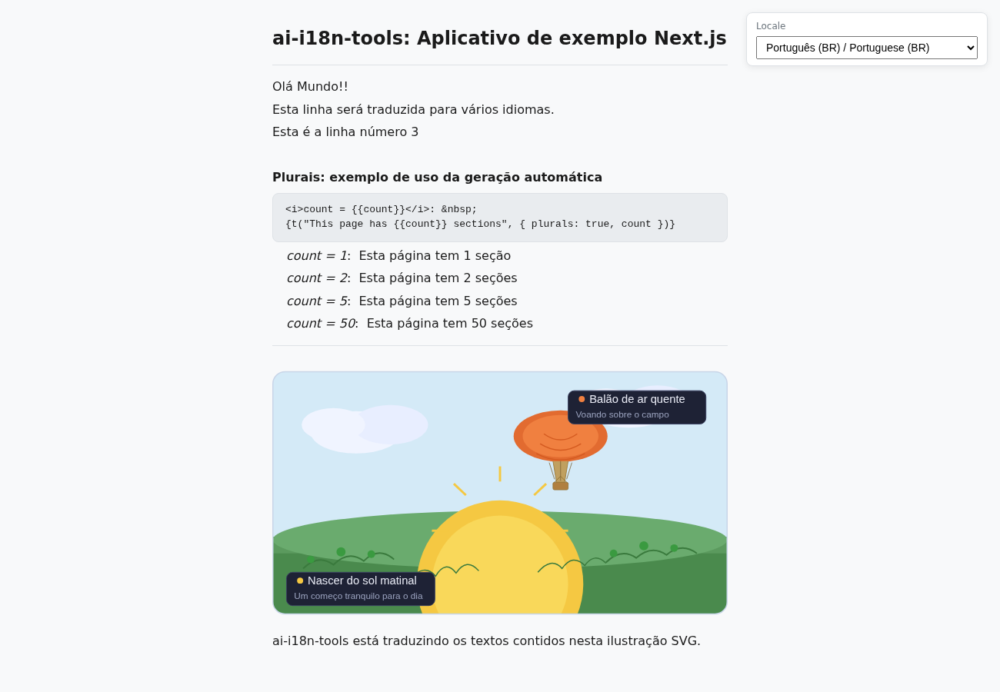

# Exemplo de Aplicativo Next.js

Este exemplo mostra como usar `ai-i18n-tools` com um aplicativo **TypeScript** [Next.js](https://nextjs.org/) e **pnpm**. A interface do usuário corresponde ao [exemplo do aplicativo de console](../../console-app/), usando as mesmas chaves de string e um seletor de localidade controlado por `locales/ui-languages.json` (localidade de origem `en-GB` primeiro, seguido pelos alvos de tradução). [`src/lib/i18n.ts`](../src/lib/i18n.ts) constrói **`localeLoaders`** a partir desse manifesto (cada `code` exceto `SOURCE_LOCALE`), como o aplicativo de console; os pacotes são carregados com **`fetch`** para **`public/locales/<locale>.json`**.

Aninhado nesta pasta há um pequeno site **[Docusaurus](https://docusaurus.io/)** ([`docs-site/`](../docs-site/)) com cópias da documentação principal do projeto para navegação local.

<small>**Leia em outros idiomas:** </small>

<small id="lang-list">[English](../README.md) · [العربية](./README.ar.md) · [Español](./README.es.md) · [Français](./README.fr.md) · [Deutsch](./README.de.md) · [Português (BR)](./README.pt-BR.md)</small>

## Captura de tela



## Requisitos

- Node.js >= 18
- [pnpm](https://pnpm.io/)
- Uma chave de API [OpenRouter](https://openrouter.ai) (para gerar traduções)

## Instalação

A partir da **raiz do repositório**, execute:

```bash
pnpm install
```

O arquivo `pnpm-workspace.yaml` na raiz inclui a biblioteca e este exemplo, portanto o pnpm vincula o `ai-i18n-tools` via `"ai-i18n-tools": "workspace:^"` no `package.json`. Nenhuma etapa separada de build ou link é necessária — após alterar as fontes da biblioteca, execute `pnpm run build` na raiz do repositório e o exemplo usará automaticamente o `dist/` atualizado.

## Uso

### Aplicativo Next.js (porta 3030)

Servidor de desenvolvimento:

```bash
pnpm dev
```

Build de produção e inicialização:

```bash
pnpm build
pnpm start
```

Abra [http://localhost:3030](http://localhost:3030). Use o menu suspenso **Locale** para alternar o idioma (ID de localidade / nome em inglês / rótulo nativo). Você também pode usar um link direto para uma localidade com a string de consulta **`?locale=<code>`** (por exemplo, [`?locale=ar`](http://localhost:3030/?locale=ar)); a página mantém o menu suspenso e a URL sincronizados.

### Exemplo de plurais cardinais

A página inicial inclui uma **demonstração de plurais** (“Plurais: exemplo de uso da geração automática”) que mostra como as strings de interface de usuário de **plural cardinal** são conectadas de ponta a ponta:

- **Renderização:** A mesma mensagem é repetida para várias contagens de exemplo definidas em **`PLURAL_DEMO_COUNTS`** em [`src/app/page.tsx`](../src/app/page.tsx) (por padrão **1**, **2**, **5** e **50**) para que você possa comparar o comportamento plural entre localidades (incluindo idiomas com várias formas plurais, como o árabe).
- **API:** Cada linha usa `t("This page has {{count}} sections", { plurals: true, count })`. Passe **`plurals: true`** para que a extração e a tradução tratem a chave como um grupo plural; **`count`** seleciona a forma plural ativa em tempo de execução.
- **Tempo de execução:** “As formas plurais são resolvidas em tempo de execução usando os auxiliares configurados em [src/lib/i18n.ts](../src/lib/i18n.ts) (consulte a documentação de tempo de execução do pacote para obter o panorama completo).
- **Saídas:** As localidades de destino usam entradas com sufixo em `public/locales/<locale>.json`; a localidade de origem mantém os pacotes plurais em **`public/locales/en-GB.json`** ao lado das entradas planas usuais.

O exemplo também mostra um pequeno **bloco de código cinza** com o trecho JSX acima dos exemplos em tempo real para referência rápida.

A página inicial também exibe um **SVG de demonstração** na parte inferior. A URL da imagem segue o padrão `public/assets/translation_demo_svg.<locale>.svg` (estrutura plana do bloco `svg` em `ai-i18n-tools.config.json`). Após executar `translate-svg`, cada arquivo de localidade contém conteúdo traduzido em `<text>`, `<title>` e `<desc>`; até então, as cópias comitadas podem parecer idênticas entre as localidades.

### Site de documentação (porta 3040)

```bash
cd docs-site
pnpm install
pnpm start
```

Abra [http://localhost:3040](http://localhost:3040) (em inglês). Em **desenvolvimento**, o Docusaurus serve **uma localidade por vez**: caminhos como `/es/getting-started` retornam **404** a menos que você execute `pnpm run start:es` (ou `start:fr`, `start:de`, `start:pt-BR`, `start:ar`). Após `pnpm build && pnpm serve`, todas as localidades estarão disponíveis. Veja [`docs-site/README.md`](../docs-site/README.md).

## Idiomas Suportados

| Código     | Idioma                   |
| -------- | ------------------------ |
| `en-GB`  | Inglês (Reino Unido) padrão |
| `es`     | Espanhol                 |
| `fr`     | Francês                  |
| `de`     | Alemão                   |
| `pt-BR`  | Português (Brasil)       |
| `ar`     | Árabe                    |

## Fluxo de trabalho

### 1. Extrair strings da interface

Analisa `src/` em busca de chamadas `t()` e atualiza `locales/strings.json`:

```bash
pnpm run i18n:extract
```

### 2. Traduzir

Defina `OPENROUTER_API_KEY`, depois execute os scripts de tradução:

```bash
export OPENROUTER_API_KEY=your_key_here
pnpm run i18n:translate-ui
pnpm run i18n:translate-svg
pnpm run i18n:translate-docs
```

### Comando de sincronização

O comando de sincronização executa a extração e todas as etapas de tradução em sequência:

```bash
pnpm run i18n:sync
```

ou

```bash
ai-i18n-tools sync
```

As etapas são executadas na ordem:

1. **`ai-i18n-tools extract`** — extrai strings de interface e atualiza `locales/strings.json`.
2. **`ai-i18n-tools translate-ui`** — gera JSON plano de localidade em `public/locales/` a partir de `locales/strings.json`.
3. **`ai-i18n-tools translate-svg`** — traduz recursos SVG de `images/` para `public/assets/` quando `features.translateSVG` é verdadeiro e o bloco `svg` está definido em `ai-i18n-tools.config.json` (este exemplo usa nomes planos: `translation_demo_svg.<locale>.svg`).
4. **`ai-i18n-tools translate-docs`** — traduz o markdown do Docusaurus em `docs-site/i18n/<locale>/docusaurus-plugin-content-docs/current/` (veja **Workflow 2** em `docs/GETTING_STARTED.md` na raiz do repositório).

Você pode executar qualquer etapa individualmente (por exemplo, `ai-i18n-tools translate-svg`) quando apenas as fontes dessa etapa forem alteradas.

Se os logs mostrarem muitos pulos e poucas gravações, a ferramenta está reutilizando **saídas existentes** e o **cache SQLite** em `.translation-cache/`. Para forçar a retradução, passe `--force` ou `--force-update` no comando relevante, onde suportado, ou execute `pnpm run i18n:clean` e traduza novamente.

Este exemplo possui `features.translateSVG` e um bloco `svg`, portanto **`i18n:sync` executa o mesmo passo SVG que `translate-svg`**. Você ainda pode chamar `ai-i18n-tools translate-svg` isoladamente para essa etapa, ou usar `pnpm run i18n:translate` para a ordem fixa UI → SVG → docs **sem** executar **extract**.

### 3. Limpar cache e retraduzir

Após alterações na interface ou na documentação, algumas entradas de cache podem estar desatualizadas ou órfãs (por exemplo, se um documento foi removido ou renomeado). `i18n:cleanup` executa `sync --force-update` primeiro e depois remove entradas desatualizadas:

```bash
pnpm run i18n:cleanup
```

Para forçar a retradução da interface, documentos ou SVGs, use `--force`. Isso ignora o cache e retraduz usando modelos de IA.

Para retraduzir todo o projeto (UI, documentos, SVGs):

```bash
pnpm run i18n:sync --force
```

Para retraduzir um único idioma:

```bash
pnpm run i18n:sync --force --locale pt-BR
```

Para retraduzir apenas as strings da interface para um idioma específico:

```bash
ai-i18n-tools translate-ui --force --locale pt-BR
```

### 4. Edições manuais (Editor de cache)

Você pode iniciar uma interface web local para revisar e editar manualmente traduções no cache, nas strings da interface e no glossário:

```bash
pnpm run i18n:editor
```

> **Importante:** Se você editar manualmente uma entrada no editor de cache, precisa executar um `sync --force-update` (por exemplo, `pnpm run i18n:sync --force-update`) para reescrever os arquivos planos gerados ou os arquivos markdown com a tradução atualizada. Observe também que, se o texto original for alterado no futuro, sua edição manual será perdida, pois a ferramenta gerará um novo hash para o novo texto de origem.

## Estrutura do Projeto

```
nextjs-app/
├── ai-i18n-tools.config.json # `svg` block: images/ → public/assets/ (translate-svg)
├── src/
│   ├── app/
│   │   ├── layout.tsx
│   │   ├── page.tsx
│   │   └── globals.css
│   └── lib/
│       └── i18n.ts
├── images/
│   └── translation_demo_svg.svg   # Source SVG for translate-svg
├── locales/
│   ├── ui-languages.json
│   └── strings.json          # Generated string catalogue (extract)
├── public/locales/           # Flat per-locale JSON (committed; regenerate with translate-ui)
│   ├── es.json
│   ├── fr.json
│   ├── de.json
│   ├── pt-BR.json
│   └── ar.json
├── public/assets/            # Per-locale SVGs (translate-svg; page uses translation_demo_svg.<locale>.svg)
│   └── translation_demo_svg.*.svg
└── docs-site/                # Docusaurus docs (port 3040)
    ├── docs/                 # Source (English)
    └── i18n/                 # Translated docs (Docusaurus layout; committed in git)
```

As fontes em inglês dos documentos em `docs-site/docs/` podem ser sincronizadas a partir da raiz do repositório com `pnpm run sync-docs`, o que adiciona âncoras de títulos `{#slug}` e espelha o comportamento do `docusaurus write-heading-ids`; consulte o cabeçalho do script em `scripts/sync-docs-to-nextjs-example.mjs`.

As strings de interface traduzidas, os SVGs de demonstração e as páginas do Docusaurus já estão commitados em `public/locales/`, `public/assets/`, `locales/strings.json` e `docs-site/i18n/`. Após alterar as fontes e executar `i18n:translate`, reinicie os servidores de desenvolvimento do Next.js e do Docusaurus conforme necessário; os locais do Docusaurus estão listados em `docs-site/docusaurus.config.js`.
