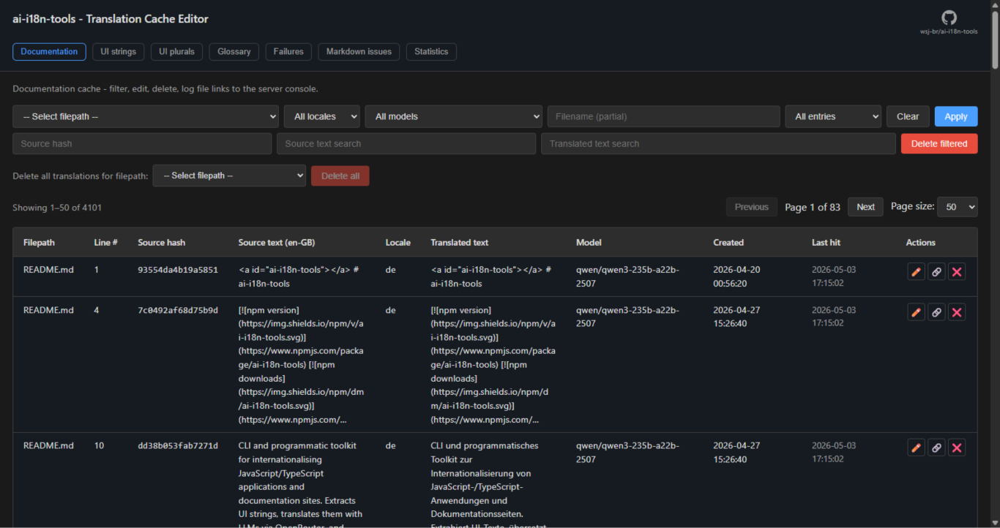

<a id="ai-i18n-tools-getting-started"></a>
# ai-i18n-tools：入门指南

`ai-i18n-tools` 提供两种独立且可组合的工作流：

- **工作流 1 - UI 翻译**：从任意 JS/TS 源码中提取 `t("…")` 调用，通过 OpenRouter 进行翻译，并生成适用于 i18next 的按语言环境划分的扁平 JSON 文件。
- **工作流 2 - 文档翻译**：将 Markdown（MDX）和 Docusaurus JSON 标签文件翻译为任意数量的语言环境，并支持智能缓存。**SVG** 资源使用 `features.translateSVG`、顶级 `svg` 块以及 `translate-svg`（参见 [CLI 参考文档](#cli-reference))。

两个工作流均使用 OpenRouter（任何兼容的 LLM）并共享一个配置文件。

<small>**阅读其他语言版本：** </small>
<small id="lang-list">[English (GB)](../../docs/GETTING_STARTED.md) · [Deutsch](./GETTING_STARTED.de.md) · [Español](./GETTING_STARTED.es.md) · [Français](./GETTING_STARTED.fr.md) · [हिन्दी](./GETTING_STARTED.hi.md) · [日本語](./GETTING_STARTED.ja.md) · [한국어](./GETTING_STARTED.ko.md) · [Português (Brasil)](./GETTING_STARTED.pt-BR.md) · [中文 (中国大陆)](./GETTING_STARTED.zh-CN.md) · [中文 (台灣)](./GETTING_STARTED.zh-TW.md)</small>

---

<!-- START doctoc generated TOC please keep comment here to allow auto update -->
<!-- DON'T EDIT THIS SECTION, INSTEAD RE-RUN doctoc TO UPDATE -->
**目录**

- [安装](#installation)
- [快速开始](#quick-start)
  - [推荐的 `package.json` 脚本](#recommended-packagejson-scripts)
- [工作流 1 - UI 翻译](#workflow-1---ui-translation)
  - [步骤 1：初始化](#step-1-initialise)
  - [步骤 2：提取字符串](#step-2-extract-strings)
  - [步骤 3：翻译 UI 字符串](#step-3-translate-ui-strings)
  - [导出为 XLIFF 2.0（可选）](#exporting-to-xliff-20-optional)
  - [步骤 4：运行时集成 i18next](#step-4-wire-i18next-at-runtime)
  - [在源码中使用 `t()`](#using-t-in-source-code)
  - [插值](#interpolation)
  - [基数复数（`plurals: true`）](#cardinal-plurals-plurals-true)
  - [语言切换器 UI](#language-switcher-ui)
  - [RTL 语言](#rtl-languages)
- [工作流 2 - 文档翻译](#workflow-2---document-translation)
  - [步骤 1：为文档初始化](#step-1-initialise-for-documentation)
  - [步骤 2：翻译文档](#step-2-translate-documents)
    - [复杂 Markdown 和质量检查失败](#complex-markdown-and-failed-quality-checks)
    - [缓存行为和 `translate-docs` 标志](#cache-behaviour-and-translate-docs-flags)
    - [批量提示格式](#batch-prompt-format)
    - [SQLite 中的段落去重和路径](#segment-dedupe-and-paths-in-sqlite)
  - [输出布局](#output-layouts)
    - [扁平布局中的锚点链接](#anchor-links-in-flat-layout)
    - [翻译文档中的图像和光栅资源](#images-and-raster-assets-in-translated-docs)
    - [`pathTemplate` / `jsonPathTemplate` 占位符](#pathtemplate--jsonpathtemplate-placeholders)
- [组合工作流（UI + 文档）](#combined-workflow-ui--docs)
  - [混合文档工作流（Docusaurus + 扁平）](#mixed-documentation-workflow-docusaurus--flat)
- [翻译缓存编辑器](#translation-cache-editor)
  - [失败（文档翻译）](#failures-document-translation)
    - [何时使用](#when-to-use-it)
    - [为何源文本编辑很重要](#why-source-edits-matter)
    - [如何使用该标签页](#how-to-use-the-tab)
- [配置参考](#configuration-reference)
  - [`sourceLocale`](#sourcelocale)
  - [`targetLocales`](#targetlocales)
  - [`uiLanguagesPath`（可选）](#uilanguagespath-optional)
  - [`concurrency`（可选）](#concurrency-optional)
  - [`batchConcurrency`（可选）](#batchconcurrency-optional)
  - [`batchSize` / `maxBatchChars`（可选）](#batchsize--maxbatchchars-optional)
  - [`openrouter`](#openrouter)
  - [`features`](#features)
  - [`ui`](#ui)
  - [`cacheDir`](#cachedir)
  - [`documentations`](#documentations)
  - [`svg`（可选）](#svg-optional)
  - [`glossary`](#glossary)
- [CLI 参考](#cli-reference)
- [环境变量](#environment-variables)

<!-- END doctoc generated TOC please keep comment here to allow auto update -->

<a id="installation"></a>
## 安装

已发布的包仅支持 **ESM**。在 Node.js 或打包工具中使用 `import`/`import()`；不要使用 `require('ai-i18n-tools')`。该包声明了 **`engines.node` `>=22.16.0`**；不支持较旧版本的 Node.js。

```bash
npm install ai-i18n-tools
# or
pnpm add ai-i18n-tools
# or
yarn add ai-i18n-tools
```

ai-i18n-tools 内置字符串提取器。如果您之前使用过 `i18next-scanner`、`babel-plugin-i18next-extract` 或类似工具，在迁移后可以移除这些开发依赖。

设置您的 OpenRouter API 密钥：

```bash
export OPENROUTER_API_KEY=sk-or-v1-your-key-here
```

或者在项目根目录创建一个 `.env` 文件：

```env
OPENROUTER_API_KEY=sk-or-v1-your-key-here
```

---

<a id="quick-start"></a>
## 快速开始

默认的 `init` 模板（`ui-markdown`）仅启用 **UI** 提取和翻译。`ui-docusaurus` 模板启用 **文档** 翻译（`translate-docs`）。当您希望使用一个命令根据配置运行提取、UI 翻译、可选的独立 SVG 翻译和文档翻译时，请使用 `sync`。

```bash
# Workflow 1 - UI strings (default template enables extract + translate-ui)
npx ai-i18n-tools init
npx ai-i18n-tools extract
npx ai-i18n-tools translate-ui

# Workflow 2 - docs (Docusaurus-oriented template)
npx ai-i18n-tools init -t ui-docusaurus
npx ai-i18n-tools translate-docs

# Combined: extract UI strings, then translate UI + SVG + docs (per config features)
npx ai-i18n-tools sync

# Translation status (UI strings per locale; markdown per file × locale in chunked tables)
npx ai-i18n-tools status
# npx ai-i18n-tools status --max-columns 12   # wider tables, fewer chunks
```

<a id="recommended-packagejson-scripts"></a>
### 推荐的 `package.json` 脚本

在本地安装该包后，你可以在脚本中直接使用 CLI 命令（无需 `npx`）。

**建议使用 `sync`** 来替代过去需要“运行 `translate-ui`，然后 `translate-svg`，再然后 `translate-docs`”的流程：`ai-i18n-tools sync` 会根据你的配置，按正确顺序并共享参数运行 **extract**（如果启用）、**translate-ui**、可选的 **translate-svg** 以及 **translate-docs**。手动依次调用这三个翻译命令容易出错（顺序、extract、区域设置参数等）。仅当你需要单独执行 **单个** 步骤时才使用 `i18n:translate:ui`、`i18n:translate:svg` 和 `i18n:translate:docs`。

```json
{
  "i18n:extract": "ai-i18n-tools extract",
  "i18n:sync": "ai-i18n-tools sync",
  "i18n:translate:ui": "ai-i18n-tools translate-ui",
  "i18n:translate:svg": "ai-i18n-tools translate-svg",
  "i18n:translate:docs": "ai-i18n-tools translate-docs",
  "i18n:status": "ai-i18n-tools status",
  "i18n:editor": "ai-i18n-tools editor",
  "i18n:cleanup": "ai-i18n-tools cleanup"
}
```

---

<a id="workflow-1---ui-translation"></a>
## 工作流 1 - UI 翻译

适用于任何使用 i18next 的 JS/TS 项目：React 应用、Next.js（客户端和服务端组件）、Node.js 服务、CLI 工具。

<a id="step-1-initialise"></a>
### 步骤 1：初始化

```bash
npx ai-i18n-tools init
```

这会使用 `ui-markdown` 模板写入 `ai-i18n-tools.config.json`。编辑它以设置：

- `sourceLocale` - 您的源语言 BCP-47 代码（例如 `"en-GB"`）。**必须与** 从运行时 i18n 配置文件（`src/i18n.ts` / `src/i18n.js`）导出的 `SOURCE_LOCALE` 相匹配。
- `targetLocales` - 目标语言的 BCP-47 代码数组（例如 `["de", "fr", "pt-BR"]`）。运行 `generate-ui-languages` 以从此列表创建 `ui-languages.json` 清单。
- `ui.sourceRoots` - 要扫描 `t("…")` 调用的目录（例如 `["src/"]`）。
- `ui.stringsJson` - 写入主目录的位置（例如 `"src/locales/strings.json"`）。
- `ui.flatOutputDir` - 在哪里写 `de.json`, `pt-BR.json`, 等等（例如 `"src/locales/"`）。
- `ui.preferredModel`（可选） - OpenRouter 模型 ID，仅尝试 **first** 的 `translate-ui`；如果失败，CLI 将按顺序继续使用 `openrouter.translationModels`（或遗留的 `defaultModel` / `fallbackModel`），跳过重复项。

<a id="step-2-extract-strings"></a>
### 步骤 2：提取字符串

```bash
npx ai-i18n-tools extract
```

扫描 `ui.sourceRoots` 下所有 JS/TS 文件中的 `t("literal")` 和 `i18n.t("literal")` 调用。写入（或合并到）`ui.stringsJson`。

扫描器是可配置的：可通过 `ui.reactExtractor.funcNames` 添加自定义函数名。

<a id="step-3-translate-ui-strings"></a>
### 步骤 3：翻译 UI 字符串

```bash
npx ai-i18n-tools translate-ui
```

读取 `strings.json`，向每个目标区域设置批量发送请求至 OpenRouter，并将扁平化的 JSON 文件（`de.json`、`fr.json` 等）写入 `ui.flatOutputDir`。当设置了 `ui.preferredModel` 时，会优先尝试该模型，失败后按 `openrouter.translationModels` 中的顺序尝试（文档翻译和其他命令仍仅使用 `openrouter`）。

对于每个条目，`translate-ui` 在一个可选的 `models` 对象中存储成功翻译各区域设置所使用的 **OpenRouter 模型 ID**（区域设置键与 `translated` 相同）。在本地 `editor` 命令中编辑的字符串会在对应区域设置的 `models` 中标记为特殊值 `user-edited`。`ui.flatOutputDir` 下每个区域设置的扁平文件仅保留 **源字符串 → 翻译** 映射；不包含 `models`（因此运行时包保持不变）。

> **关于使用缓存编辑器的说明：** 如果您在缓存编辑器中编辑了某个条目，需要运行 `sync --force-update`（或带有 `--force-update` 的等效 `translate` 命令）以用更新后的缓存条目重写输出文件。此外，请注意，如果源文本之后发生变化，您的手动编辑将丢失，因为新源字符串会生成新的缓存键（哈希值）。

<a id="exporting-to-xliff-20-optional"></a>
### 导出为 XLIFF 2.0（可选）

若要将 UI 字符串交给翻译供应商、TMS 或 CAT 工具，请将目录导出为 **XLIFF 2.0** 格式（每个目标区域设置一个文件）。此命令为 **只读**：不会修改 `strings.json` 或调用任何 API。

```bash
npx ai-i18n-tools export-ui-xliff
```

默认情况下，文件写入到 `ui.stringsJson` 旁边，命名为 `strings.de.xliff`、`strings.pt-BR.xliff`（您的目录文件名 + 区域设置 + `.xliff`）。使用 `-o` / `--output-dir` 指定其他输出位置。来自 `strings.json` 的现有翻译会出现在 `<target>` 中；缺失的区域设置使用 `state="initial"` 且无 `<target>`，以便工具填充。使用 `--untranslated-only` 仅导出每个区域设置仍需翻译的单元（适用于供应商批量处理）。`--dry-run` 仅打印路径而不写入文件。

<a id="step-4-wire-i18next-at-runtime"></a>
### 第 4 步：在运行时配置 i18next

使用 `'ai-i18n-tools/runtime'` 导出的辅助函数创建你的 i18n 配置文件：

```js
// src/i18n.js or src/i18n.ts — use ../locales and ../public/locales instead of ./ when this file is under src/
import i18n from 'i18next';
import { initReactI18next } from 'react-i18next';
import aiI18n from 'ai-i18n-tools/runtime';

// Project locale files — paths must match `ui` in ai-i18n-tools.config.json (paths there are relative to the project root).
import uiLanguages from './locales/ui-languages.json'; // `ui.uiLanguagesPath` (defaults to `{ui.flatOutputDir}/ui-languages.json`)
import stringsJson from './locales/strings.json'; // `ui.stringsJson`
import sourcePluralFlat from './public/locales/en-GB.json'; // `{ui.flatOutputDir}/{SOURCE_LOCALE}.json` from translate-ui

// Must match `sourceLocale` in ai-i18n-tools.config.json (same string as in the import path above)
export const SOURCE_LOCALE = 'en-GB';

// initialise i18n with the default options
void i18n.use(initReactI18next).init(aiI18n.defaultI18nInitOptions(SOURCE_LOCALE));

// set up the key-as-default translation
aiI18n.setupKeyAsDefaultT(i18n, {
  stringsJson,
  sourcePluralFlatBundle: { lng: SOURCE_LOCALE, bundle: sourcePluralFlat },
});

// apply the direction to the i18n instance
i18n.on('languageChanged', aiI18n.applyDirection);
aiI18n.applyDirection(i18n.language);

// create the locale loaders
const localeLoaders = aiI18n.makeLocaleLoadersFromManifest(
  uiLanguages,
  SOURCE_LOCALE,
  (code) => () => import(`./locales/${code}.json`),
);

// create the loadLocale function
export const loadLocale = aiI18n.makeLoadLocale(i18n, localeLoaders, SOURCE_LOCALE);

// export the i18n instance
export default i18n;
```

<!--
  Translate-docs note: paragraphs here stack many `bold` / `` `code` `` patterns (nested backticks, long sentences).
  Some target locales fail AST-style validation; see "Complex Markdown and failed quality checks" under Workflow 2 — simplify source rather than forcing literal markup parity.
-->

**保持三个值一致：** `sourceLocale` 在 `ai-i18n-tools.config.json` 中，本文件中的 `SOURCE_LOCALE`，以及扁平 JSON 复数形式的 `translate-ui` 写入到扁平输出目录下的 `{sourceLocale}.json`（通常是 `public/locales/`）。在静态 `import` 中使用相同的文件名基（例如上面的例子：`en-GB` → `en-GB.json`）。`sourcePluralFlatBundle` 中的 `lng` 字段必须等于 `SOURCE_LOCALE`。静态 ES `import` 路径不能使用变量；如果你更改了源语言环境，请同时更新 `SOURCE_LOCALE` 和导入路径。或者，使用动态 `import(\`./public/locales/${SOURCE_LOCALE}.json\`)`、`fetch` 或 `readFileSync` 来加载该文件，使路径由 `SOURCE_LOCALE` 构建。

该代码片段假设 `i18n` 与这些文件夹位于同一级目录下，因此使用了 `./locales/…` 和 `./public/locales/…`。如果你的文件位于 `src/` 下（常见情况），请使用 `../locales/…` 和 `../public/locales/…`，以便导入路径与 `ui.stringsJson`、`uiLanguagesPath` 和 `ui.flatOutputDir` 保持一致。

在 React 渲染之前导入 `i18n.js`（例如，在入口文件的顶部）。当用户切换语言时，调用 `await loadLocale(code)`，然后调用 `i18n.changeLanguage(code)`。

使 `localeLoaders` **与配置保持一致**，方法是使用 `makeLocaleLoadersFromManifest` 从 `ui-languages.json` 中派生它们（这会使用与 `makeLoadLocale` 相同的归一化方式过滤掉 `SOURCE_LOCALE`）。当你向 `targetLocales` 添加区域设置并运行 `generate-ui-languages` 时，清单将自动更新，加载器也会自动跟踪此变更——无需维护单独的硬编码映射。

如果你的 JSON 包位于 `public/` 下（典型的 Next.js 配置），请实现每个加载器从你的公共 URL 路径获取文件，例如：

```js
(code) => () => fetch(`/locales/${code}.json`).then(res => res.json())
```

这允许浏览器加载静态 JSON。

对于没有打包工具的 Node CLI，请在小型 `makeFileLoader` 辅助函数中使用 `readFileSync`，为每种语言代码读取并解析 JSON 文件。

`SOURCE_LOCALE` 被导出，以便任何需要它的其他文件（例如语言切换器）可以直接从 `'./i18n'` 导入。如果你正在迁移现有的 i18next 配置，请将组件中散落的硬编码源语言字符串（例如 `'en-GB'` 判断）替换为从 i18n 引导文件导入的 `SOURCE_LOCALE`。

如果你不希望使用默认导出，也可以使用具名导入（`import { defaultI18nInitOptions, … } from 'ai-i18n-tools/runtime'`）。

`aiI18n.defaultI18nInitOptions(sourceLocale)`（或具名导入时的 `defaultI18nInitOptions(sourceLocale)`）返回键即默认值配置的标准选项：

- `parseMissingKeyHandler` 返回键本身，因此未翻译的字符串将显示源文本。
- `nsSeparator: false` 允许键中包含冒号。
- `interpolation.escapeValue: false` — 可以安全地禁用：React 本身会转义值，而 Node.js/CLI 输出中没有 HTML 需要转义。

`setupKeyAsDefaultT(i18n, { stringsJson, sourcePluralFlatBundle? })` 是 ai-i18n-tools 项目的 **推荐** 配置方式：它应用了键裁剪 + 源语言环境 <code>{"{{var}}"}</code> 插值回退（行为与底层的 `wrapI18nWithKeyTrim` 相同），可选择通过 `addResourceBundle` 合并 `translate-ui` `{sourceLocale}.json` 复数后缀键，然后安装来自 `strings.json` 的支持复数的 `wrapT`。该捆绑文件必须是你 **已配置** 源语言环境的复数扁平文件 —— 与 i18n 引导文件中的 `sourceLocale`、`ai-i18n-tools.config.json` 和 `SOURCE_LOCALE` 相同（见上面第 4 步）。仅在引导阶段省略 `sourcePluralFlatBundle`（一旦 `translate-ui` 生成了 `{sourceLocale}.json`，就将其合并）。单独使用 `wrapI18nWithKeyTrim` 在应用代码中已被 **弃用** —— 请改用 `setupKeyAsDefaultT`。

`makeLoadLocale(i18n, loaders, sourceLocale)` 返回一个异步的 `loadLocale(lang)` 函数，用于动态导入某个语言环境的 JSON 包并将其注册到 i18next。

<a id="using-t-in-source-code"></a>
### 在源码中使用 `t()`

使用 **字面量字符串** 调用 `t()`，以便提取脚本能够找到它：

```jsx
import { useTranslation } from 'react-i18next';

function MyComponent() {
  const { t } = useTranslation();
  return <button>{t('Save')}</button>;
}
```

相同的模式也适用于 React 之外的环境（Node.js、服务端组件、CLI）：

```js
import i18n from './i18n.js';
console.log(i18n.t('Processing complete'));
```

**规则：**

- 仅提取以下形式：`t("…")`、`t('…')`、`t(`…`)`、`i18n.t("…")`。
- 键必须是 **字面字符串** — 键不能使用变量或表达式。
- 不要对键使用模板字符串：<code>{'t(`Hello ${name}`)'}</code> 无法被提取。

<a id="interpolation"></a>
### 插值

对 <code>{"{{var}}"}</code> 占位符使用 i18next 原生的第二个参数插值功能：

```js
// i18next handles substitution natively, even in key-as-default mode
t('Hello {{name}}, you have {{count}} messages', { name, count })
// → "Hello Alice, you have 3 messages"
```

extract 命令会解析 **第二个参数**，当它是一个纯对象字面量时，读取仅用于工具的标志，例如 `plurals: true` 和 `zeroDigit`（参见下方的 **基数复数**）。对于普通字符串，仅使用字面量键进行哈希；插值选项仍会在运行时传递给 i18next。

如果您的项目使用了自定义插值工具（例如调用 `t('key')`，然后将结果通过类似 `interpolateTemplate(t('Hello {{name}}'), { name })` 的模板函数处理），则 `setupKeyAsDefaultT`（通过 `wrapI18nWithKeyTrim`）使其变得不再必要 —— 即使源语言返回原始键，它也会应用 <code>{"{{var}}"}</code> 插值。请将调用点迁移到 `t('Hello {{name}}', { name })` 并移除自定义工具。

<a id="cardinal-plurals-plurals-true"></a>
### 基数复数（`plurals: true`）

使用您希望作为开发者默认文本的 **相同字面量**，并传入 `plurals: true`，以便 extract 和 `translate-ui` 将该调用视为一个 **基数复数组**（符合 i18next JSON v4 风格的 `_zero` … `_other` 形式）。

```tsx
{t('{{count}} items in your cart', { plurals: true, count: n })}
```

- `zeroDigit`（可选）— 仅用于工具，**不会**被 i18next 读取。当设置为 `true` 时，提示会倾向于在每个存在该形式的区域中使用字面阿拉伯数字 `0` 作为 `_zero` 字符串；当设置为 `false` 或省略时，使用自然的零值表达方式。在调用 `i18next.t` 前应移除这些键（参见下方的 `wrapT`）。

**验证：** 如果消息包含 **两个或更多**不同的 `{{…}}` 占位符，则其中 **必须有一个是 `{{count}}`**（复数轴）。否则 `extract` 将 **失败**，并显示明确的文件/行号信息。

**两个独立计数**（例如章节和页数）不能共享一个复数消息 — 应使用 **两个** `t()` 调用（每个都带有 `plurals: true` 及其各自的 `count`），并在 UI 中拼接。

**在** `strings.json` 复数组中，每条哈希使用 **一行一记录**，包含 `"plural": true`、原始字面量 `source`，以及一个将基数类别（`zero`、`one`、`two`、`few`、`many`、`other`）映射到对应区域字符串的对象 `translated[locale]`。

**扁平化区域 JSON：** 非复数行保持 **源句 → 翻译** 格式。复数行以 `<groupId>_original`（等于 `source`，供参考）和每个后缀的 `<groupId>_<form>` 形式输出，以便 i18next 原生解析复数。`translate-ui` 还会写入一个仅包含 **复数扁平键** 的 `{sourceLocale}.json`（为源语言加载此包，以便带后缀的键能正确解析；普通字符串仍使用键作为默认值）。对于每个目标区域，输出的后缀键会匹配该区域的 `Intl.PluralRules`（`requiredCldrPluralForms`）：如果 `strings.json` 因压缩后与其他类别相同而省略了某个类别（例如阿拉伯语的 `many` 与 `other` 相同），`translate-ui` 仍会通过从回退的同类字符串复制，将每个必需的后缀写入扁平文件，确保运行时查找不会丢失任何键。

运行时（`ai-i18n-tools/runtime`）：**调用** `setupKeyAsDefaultT(i18n, { stringsJson, sourcePluralFlatBundle })` — 它会运行 `wrapI18nWithKeyTrim`，注册可选的 `translate-ui` `{sourceLocale}.json` 复数包，然后使用 `buildPluralIndexFromStringsJson(stringsJson)` 执行 `wrapT`。`wrapT` 会剥离 `plurals` / `zeroDigit`，在需要时将键重写为组 ID，并转发 `count`（可选：如果只有一个非 `{{count}}` 占位符，则 `count` 会从该数值选项复制）。

**较旧环境：** `Intl.PluralRules` 对工具和行为一致性是必需的；如果需要支持非常旧的浏览器，请使用 polyfill。

**v1 中不包含：** 序数复数（`_ordinal_*`、`ordinal: true`）、区间复数、仅限 ICU 的管道。

<a id="language-switcher-ui"></a>
### 语言切换器 UI

使用 `ui-languages.json` 清单构建语言选择器。`ai-i18n-tools` 导出两个显示辅助函数：

```tsx
import { useMemo } from 'react';
import { useTranslation } from 'react-i18next';
import {
  getUILanguageLabel,
  getUILanguageLabelNative,
  type UiLanguageEntry,
} from 'ai-i18n-tools/runtime';
import uiLanguages from './locales/ui-languages.json';
import { loadLocale } from './i18n';

function LanguageSelect({
  value,
  onChange,
}: {
  value: string;
  onChange: (code: string) => void;
}) {
  const { t, i18n } = useTranslation();

  const options = useMemo(
    () =>
      (uiLanguages as UiLanguageEntry[]).map((lang) => ({
        code: lang.code,
        // Settings/content dropdowns: shows translated name when available
        label: getUILanguageLabel(lang, t),
        // Header globe menu: shows "English / Deutsch"-style label, no t() call
        nativeLabel: getUILanguageLabelNative(lang),
      })),
    [t]
  );

  const handleChange = async (code: string) => {
    await loadLocale(code);
    i18n.changeLanguage(code);
    onChange(code);
  };

  return (
    <select value={value} onChange={(e) => handleChange(e.target.value)}>
      {options.map((row) => (
        <option key={row.code} value={row.code}>
          {row.label}
        </option>
      ))}
    </select>
  );
}
```

`getUILanguageLabel(lang, t)` - 翻译后显示 `t(englishName)`，或两者不同时显示 `englishName / t(englishName)`。适用于设置界面。

`getUILanguageLabelNative(lang)` - 显示 `englishName / label`（每行不调用 `t()`）。适用于希望显示本地名称的页眉菜单。

`ui-languages.json` 清单是一个 JSON 数组，包含 <code>{"{ code, label, englishName, direction }"}</code> 条目（`direction` 为 `"ltr"` 或 `"rtl"`）。示例：

```json
[
  { "code": "en-GB", "label": "English (UK)", "englishName": "English (UK)", "direction": "ltr" },
  { "code": "pt-BR", "label": "Português (BR)", "englishName": "Portuguese (BR)", "direction": "ltr" },
  { "code": "de",    "label": "Deutsch",        "englishName": "German", "direction": "ltr" },
  { "code": "fr",    "label": "Français",       "englishName": "French", "direction": "ltr" },
  { "code": "ar",    "label": "العربية",         "englishName": "Arabic", "direction": "rtl" }
]
```

清单由 `generate-ui-languages` 根据 `sourceLocale` + `targetLocales` 和捆绑的主目录生成，并写入 `ui.flatOutputDir`。如果更改了配置中的任何区域设置，请运行 `generate-ui-languages` 来更新 `ui-languages.json` 文件。

<a id="rtl-languages"></a>
### 从右到左语言

`ai-i18n-tools` 导出 `getTextDirection(lng)` 和 `applyDirection(lng)`：

```js
import { getTextDirection, applyDirection } from 'ai-i18n-tools/runtime';

getTextDirection('ar')    // 'rtl'
getTextDirection('en-GB') // 'ltr'

// Applied automatically via i18n.on('languageChanged', applyDirection) - see Step 4
```

`applyDirection` 设置 `document.documentElement.dir`（浏览器环境）或为空操作（Node.js 环境）。可传入可选的 `element` 参数以指定目标元素。

对于可能包含 `→` 箭头的字符串，在 RTL 布局中需翻转它们：

```js
import { flipUiArrowsForRtl } from 'ai-i18n-tools/runtime';
const { i18n } = useTranslation();
const isRtl = getTextDirection(i18n.language) === 'rtl';
const label = flipUiArrowsForRtl(t('Next → Step'), isRtl);
```

---

<a id="workflow-2---document-translation"></a>
## 工作流程 2 - 文档翻译

专为 Markdown 文档、Docusaurus 网站和 JSON 标签文件设计。对于嵌入在 Markdown 中的 PNG 和其他光栅图像，请参阅[翻译文档中的图像和光栅资源](#images-and-raster-assets-in-translated-docs)。独立的 SVG 资源在启用 `features.translateSVG` 并设置了顶层 `svg` 块时，通过 [`translate-svg`](#cli-reference) 进行翻译 —— 而非通过 `documentations[].contentPaths`。

<a id="step-1-initialise-for-documentation"></a>
### 步骤 1：为文档初始化

```bash
npx ai-i18n-tools init -t ui-docusaurus
```

编辑生成的 `ai-i18n-tools.config.json`：

- `sourceLocale` - 源语言（必须与 `defaultLocale` 中的 `docusaurus.config.js` 匹配）。
- `targetLocales` - BCP-47 区域代码数组（例如 `["de", "fr", "es"]`）。
- `cacheDir` - 所有文档流水线共享的 SQLite 缓存目录（也是 `--write-logs` 的默认日志目录）。
- `documentations` - 文档块数组。每个块包含可选的 `description`、`contentPaths`、`outputDir`、可选的 `jsonSource`、`markdownOutput`、可选的 `segmentSplitting`、`targetLocales`、`addFrontmatter` 等。
- `documentations[].description` - 维护者的可选简短说明（说明此块涵盖的内容）。设置后，它会出现在 `translate-docs` 标题（`🌐 …: translating …`）和 `status` 的节标题中。
- `documentations[].contentPaths` - Markdown/MDX 源目录或文件（另见 `documentations[].jsonSource` 获取 JSON 标签）。
- `documentations[].outputDir` - 该块的翻译输出根目录。
- `documentations[].markdownOutput.style` - `"nested"`（默认）、`"docusaurus"` 或 `"flat"`（参见 [输出布局](#output-layouts)）。

<a id="step-2-translate-documents"></a>
### 步骤 2：翻译文档

```bash
npx ai-i18n-tools translate-docs
```

这会将每个 `documentations` 块中的 `contentPaths` 内所有文件翻译成所有有效的文档区域设置（若设置了每个块的 `targetLocales`，则取其并集，否则使用根 `targetLocales`）。已翻译的片段从 SQLite 缓存中提供服务——只有新增或更改的片段才会发送到 LLM。

要翻译单个区域设置：

```bash
npx ai-i18n-tools translate-docs --locale de
```

要检查需要翻译的内容：

```bash
npx ai-i18n-tools status
```

<a id="complex-markdown-and-failed-quality-checks"></a>
#### 复杂的 Markdown 和质量检查失败

`translate-docs` 会检查每个翻译片段是否保留了 Markdown 结构（包括从文档解析的强调格式）。包含多个 `bold` 跨度围绕 `` `inline code` ``、在粗体中嵌套反引号（例如模板字面量如 `` `fetch(\`/locales/${code}.json\`)` ``），或在一个长句中交织粗体和代码的段落较为脆弱：某些区域设置需要不同的词序，这可能导致翻译后 `**` 和 `` ` `` 对齐方式发生变化，并触发 CLI 错误，例如 `AST mismatch`。

**如果遇到此类验证失败，建议简化源语言文本**——拆分段落、将示例移至围栏代码块，或用更少的粗体/代码组合描述相同概念——而不是期望每个模型和区域设置都能完美复现密集的内联标记。本页其他位置（特别是步骤 4 中关于 `SOURCE_LOCALE`、加载器和 `public/` 路径的说明）的格式是刻意贴近实际的；当你在自己的文档中复用类似表述时，在广泛翻译时应保持更简洁。

要查看 **哪些片段失败**、失败频率以及存储的 **质量/错误消息**，请使用翻译缓存编辑器的 **失败** 标签页（[翻译缓存编辑器 → 失败](#translation-cache-editor-failures)）。

<a id="cache-behaviour-and-translate-docs-flags"></a>
#### 缓存行为和 `translate-docs` 标志

CLI 使用 SQLite 保存 **文件跟踪**信息（每个文件 × 区域设置的源哈希）和 **段落**记录（每个可翻译块 × 区域设置的哈希）。正常运行时，如果已记录的哈希与当前源匹配 **且**输出文件已存在，则完全跳过该文件；否则处理该文件，并使用段落缓存，以避免对未更改的文本调用 API。

| 标志                          | 效果                                                                                                                                                                                                                                                                  |
|-------------------------------|-------------------------------------------------------------------------------------------------------------------------------------------------------------------------------------------------------------------------------------------------------------------------|
| *(默认)*                   | 当跟踪记录和磁盘上的输出匹配时跳过未更改的文件；其余情况使用段落缓存。                                                                                                                                                                              |
| `-l, --locale <codes>`        | 以逗号分隔的目标区域设置（若省略，则默认为根 `targetLocales` 和每个 `documentations[]` 块中可选的 `targetLocales` 的并集）。                                                                                                                                                          |
| `-p, --path` / `-f, --file`   | 仅翻译此路径下的 Markdown/JSON（项目相对路径或绝对路径）；`--file` 是 `--path` 的别名。                                                                                                                                                         |
| `--dry-run`                   | 不写入文件且不调用 API。                                                                                                                                                                                                                                        |
| `--type <kind>`               | 限制为 `markdown` 或 `json`（否则在配置中启用时两者都处理）。                                                                                                                                                                                               |
| `--json-only` / `--no-json`   | 仅翻译 JSON 标签文件，或跳过 JSON 仅翻译 Markdown。                                                                                                                                                                                              |
| `-j, --concurrency <n>`       | 最大并行目标区域设置数（默认来自配置或 CLI 内置默认值）。                                                                                                                                                                                              |
| `-b, --batch-concurrency <n>` | 每个文件的最大并行批处理 API 调用数（文档；默认来自配置或 CLI）。                                                                                                                                                                                               |
| `--emphasis-placeholders`     | 在翻译前将 Markdown 强调标记掩码为占位符（可选；默认关闭）。                                                                                                                                                                              |
| `--debug-failed`              | 当验证失败时，在 `cacheDir` 下写入详细的 `FAILED-TRANSLATION` 日志。                                                                                                                                                                                        |
| `--force-update`              | 即使文件跟踪本应跳过，也会重新处理每个匹配的文件（提取、重新组装、写入输出）。**分段缓存仍然适用** —— 未更改的分段不会发送给 LLM。                                                                                    |
| `--force`                     | 清除每个已处理文件的文件跟踪，并且**不读取**API 翻译的分段缓存（完全重新翻译）。新的结果仍然会**写入**分段缓存。                                                                                 |
| `--stats`                     | 打印分段数量、已跟踪文件数量以及每个区域设置的分段总数，然后退出。                                                                                                                                                                                    |
| `--clear-cache [locale]`      | 删除缓存的翻译（以及文件跟踪）：所有区域设置，或单个区域设置，然后退出。                                                                                                                                                                             |
| `--prompt-format <mode>`      | 每个**批处理**的分段发送到模型并解析的方式（`xml`、`json-array` 或 `json-object`）。默认为 `json-array`。不会改变提取、占位符、验证、缓存或回退行为 —— 参见 [批处理提示格式](#batch-prompt-format)。 |

您不能将 `--force` 与 `--force-update` 结合使用（它们互斥）。

<a id="batch-prompt-format"></a>
#### 批处理提示格式

`translate-docs` 将可翻译的分段以**批处理**形式发送到 OpenRouter（按 `batchSize` / `maxBatchChars` 分组）。`--prompt-format` 标志仅更改该批处理的**线上传输格式**；`PlaceholderHandler` 令牌、Markdown AST 检查、SQLite 缓存键以及批处理解析失败时的每分段回退机制均保持不变。

| 模式                       | 用户消息                                                           | 模型回复                                                 |
|----------------------------|------------------------------------------------------------------------|-------------------------------------------------------------|
| `xml`                  | 伪 XML：每个分段一个 `<seg id="N">…</seg>`（含 XML 转义）。 | 仅包含 `<t id="N">…</t>` 块，每个分段索引一个。       |
| `json-array` (默认) | 一个字符串的 JSON 数组，按顺序每个分段一个条目。               | 一个 **相同长度**的 JSON 数组（顺序相同）。           |
| `json-object`          | 一个以分段索引为键的 JSON 对象 `{"0":"…","1":"…",…}`。            | 一个具有**相同键**和翻译后值的 JSON 对象。 |

运行头信息还会打印 `Batch prompt format: …`，以便您确认当前活动模式。JSON 标签文件（`jsonSource`）和独立 SVG 批处理在作为 `translate-docs`（或 `sync` 的文档阶段 —— `sync` 不暴露此标志，默认为 `json-array`）的一部分运行时，使用相同的设置。

<a id="segment-dedupe-and-paths-in-sqlite"></a>
#### SQLite 中的分段去重和路径

- 段行通过 `(source_hash, locale)`（哈希值 = 规范化后的内容）进行全局键控。两个文件中相同的文本共享一行；`translations.filepath` 是元数据（最后写入者），并非每个文件的第二个缓存条目。
- `file_tracking.filepath` 使用命名空间键：每个 `documentations` 块对应一个 `doc-block:{index}:{relPath}`（`relPath` 是相对于项目根目录的 POSIX 路径：收集的 Markdown 路径；**JSON 标签文件使用相对于当前工作目录的源文件路径**，例如 `docs-site/i18n/en/code.json`，以便清理操作能解析实际文件），而 `svg-assets:{relPath}` 用于 `translate-svg` 下的独立 SVG 资源。
- `translations.filepath` 存储 Markdown、JSON 和 SVG 段相对于当前工作目录的 POSIX 路径（SVG 使用与其他资源相同的路径格式；`svg-assets:…` 前缀 **仅** 用于 `file_tracking`）。
- 运行后，`last_hit_at` 仅会清除 **同一翻译范围内**（遵循 `--path` 和启用的类型）未被命中的段行，因此经过筛选或仅文档的运行不会将无关文件标记为过时。

<a id="output-layouts"></a>
### 输出布局

`"nested"`（省略时的默认值）—— 在 `{outputDir}/{locale}/` 下镜像源树（例如 `docs/guide.md` → `i18n/de/docs/guide.md`）。

`"docusaurus"` — 将位于 `docsRoot` 下的文件放置到 `i18n/<locale>/docusaurus-plugin-content-docs/current/<relativeToDocsRoot>`，符合通常的 Docusaurus i18n 布局。将 `documentations[].markdownOutput.docsRoot` 设置为你的文档源根目录（例如 `"docs"`）。

```text
docs/guide.md         → i18n/de/docusaurus-plugin-content-docs/current/guide.md
i18n/en/sidebar.json  → i18n/de/sidebar.json  (JSON label files)
```

`"flat"` — 将翻译后的文件放置在源文件旁边，并添加语言环境后缀，或放入子目录中。页面之间的相对链接会自动重写。

```text
docs/guide.md → i18n/guide.de.md
```

<a id="anchor-links-in-flat-layout"></a>
#### 扁平布局中的锚点链接

扁平输出会为每种语言环境重写页面之间的**相对路径**（`guide.md` → `guide.de.md`）。**锚点链接**——在路径后使用 `#` 的常见 Markdown 内联形式——可跳转到目标文件中的某个章节：

```markdown
Read the [installation checklist](../setup.md#first-run) before you deploy.
```

此处链接目标为 `setup.md`，而 `#first-run` 是锚点：它应滚动至该文件中的正确标题处。

**为何需要特别注意锚点链接**

- `rewriteRelativeLinks` 会为每种语言环境修正**文件名**（`setup.md` → `setup.de.md`）。
- 许多渲染器根据**可见的标题文本**生成 `#` slug。翻译后，各语言环境的标题不同，因此自动生成的 slug 可能发生变化，而重写的链接仍可能显示为 `#first-run` —— 或者你的英文 `#…` 锚点不再与渲染器从翻译后标题生成的 slug 匹配。
- 结果：读者会进入正确的**文件**，但定位到了错误的**行**，或浏览器找不到匹配的标题。

**应对方法**

1. 在 `.md` / `.mdx` 上运行 `ai-i18n-tools write-heading-ids`，然后再进行 `translate-docs`（与平常相同的 `documentations[]` / `contentPaths`）。该操作会在每个标题前插入显式的 HTML 锚点，从而确保每个翻译副本共享相同的 `id` 值。
2. 将你的 Markdown **锚点链接** 指向这些稳定 ID，例如 `[label](../other.md#section-id)`，其中 `section-id` 必须与工具生成的锚点完全匹配——而不仅仅根据英文单词猜测。

**示例**

`docs/overview.md`:

```markdown
See [TLS setup](../security.md#tls-configuration) for certificate steps.
```

`write-heading-ids` 后的 `docs/security.md`（简化版）：

```markdown
<a id="tls-configuration"></a>
## TLS configuration

Your CA and cert steps…
```

在 `translate-docs` 之后，每个语言环境文件中的文件路径和 `#…` 锚点保持一致，例如：

```markdown
Siehe [TLS-Einrichtung](../security.de.md#tls-configuration) für die Zertifikatsschritte.
```

`#tls-configuration` 锚点在所有语言环境中都相同，因为 `id` 在源文件中是固定的；只有标题的**文本**和链接的**标签**被翻译。

<a id="images-and-raster-assets-in-translated-docs"></a>
#### 翻译文档中的图像和光栅资源

`translate-docs` 会翻译 Markdown 段落（包括图像的 alt 文本）。但它 **不会** 将光栅文件（PNG、JPEG、WebP、GIF）复制到您的文档 `outputDir` 中。您需要将文件放置在重写后的 URL 所指向的位置，或在翻译后调整 URL（通常使用 `markdownOutput.postProcessing.regexAdjustments`）。

**作为插图资源使用的 SVG** 应使用 `svg` 块和 `translate-svg` —— 参见 [`svg`（可选）](#svg-optional)。`documentations[].contentPaths` 中列出的路径适用于 Markdown/MDX（以及可选的 JSON 标签），不适用于独立 SVG 的翻译。

**为何扁平布局通常需要修复**

使用 `markdownOutput.style` `flat` 和默认的相对链接重写时，翻译页面之间的链接会按语言区域重写。指向非 Markdown 文件的链接会被添加深度前缀，以保持相对于每个输出文件的相对性（例如，与源文件并列的 `figure.png` 在翻译文件中可能变为 `../figure.png`）。该 URL 通常仅在输出目录 **内部** 可解析。CLI 不会将二进制文件输出到该位置，因此除非您复制资源、在其他位置提供服务或重写链接，否则读者会遇到文件缺失。在翻译后挂钩您的规则：`postProcessing` 在段落重组和扁平链接重写后运行（参见 [配置参考](#configuration-reference) 中的 `markdownOutput.postProcessing` 行）。

**模式 1 —— 与英文源文件同仓库的资源（本包）**

本仓库将 `docs/GETTING_STARTED.md` 翻译为 `translated-docs/docs/GETTING_STARTED.<locale>.md`。源文件使用了一个同级图像 `translation-cache-editor.png`。扁平重写会指向 `translated-docs/translation-cache-editor.png`，但该文件永远不会被写入。根目录的 `ai-i18n-tools.config.json` 添加了一条规则，匹配 Markdown 图像中稳定的结尾部分（即 `](…)` URL 段，而非翻译后的 alt 文本），并将其指向 `docs/`：

```json
{
  "description": "Editor screenshot: flat link rewrite points to translated-docs/; asset lives in docs/",
  "search": "\\]\\(\\.\\./translation-cache-editor\\.png\\)",
  "replace": "](../../docs/translation-cache-editor.png)"
}
```

**模式 2 —— 按语言区域划分的截图文件夹（`examples/nextjs-app`）**

Next.js 示例在 `examples/nextjs-app/ai-i18n-tools.config.json` 中使用了两个 `documentations[]` 块。

- **Docusaurus 文档**（`markdownOutput.style` `docusaurus`）：`docs-site/docs/` 下的英文页面引用截图时，URL 中包含固定的语言区域段，例如 `/img/screenshots/en-GB/screenshot.png` 出现在 `feature-showcase.md` 中。后处理会替换该段，使每个 `docs-site/i18n/<locale>/…/current/` 下的翻译页面解析到其各自的文件夹：

```json
{
  "description": "Per-locale screenshot folders in docs-site static assets",
  "search": "screenshots/en-GB/",
  "replace": "screenshots/${translatedLocale}/"
}
```

在您的网站静态资源树下部署对应的 PNG 文件（例如，对于以 `/img/screenshots/` 开头的 URL，使用 `docs-site/static/img/screenshots/<locale>/`）。

- **根目录 README，扁平输出**（同一文件中的第二个 `documentations[]` 块）：仅 `README.md` 被翻译，带有 `markdownOutput.style` `flat` 和 `outputDir` `translated-docs`，因此你得到 `translated-docs/README.<locale>.md`。英文图片路径中通常在中间使用一个稳定的文件夹段（例如 `images/screenshots/en-GB/overview.png`）。后处理会将 `images/screenshots/` 与 URL 其余部分之间的任意单个路径段替换为当前的 `${translatedLocale}`，因此每个翻译后的 README 指向的是 `images/screenshots/de/…`、`images/screenshots/fr/…` 等。该模式不同于 Docusaurus 规则：此处 `search` 匹配 **任意** 文件夹名称（`[^/]+/`），而不仅限于 `en-GB/`。

```json
{
  "description": "Per-locale screenshot folders under translated-docs",
  "search": "images/screenshots/[^/]+/",
  "replace": "images/screenshots/${translatedLocale}/"
}
```

将 PNG 文件保留在磁盘上的 `images/screenshots/<locale>/` 目录下（与重写后的 URL 使用的结构相同）。

**模式 3 —— 独立 SVG（`examples/nextjs-app`）**

同一示例启用了 `features.translateSVG`，并将源 SVG 映射到 Web 应用的 public 文件夹：

```json
"svg": {
  "sourcePath": "images",
  "outputDir": "public/assets",
  "style": "flat"
}
```

运行 `translate-svg`（或 `sync`），使 `images/*.svg` 生成位于 `public/assets/` 下的按语言区域划分的输出。Markdown 单独引用这些 URL，与 `translate-docs` 无关。

**最小化的仅 README 示例（`examples/console-app`）**

`examples/console-app/ai-i18n-tools.config.json` 使用 `postProcessing.languageListBlock` 将 `README.md` 翻译为 `translated-docs/`。它未定义任何图像规则 —— 当 README 没有同级光栅文件，或仅使用主机已提供服务的绝对 URL 时，这是合适的。

替换模板支持 `${translatedLocale}` 和 `${translatedBasedir}` 等占位符（完整列表见 [配置参考](#configuration-reference) 中的 `markdownOutput.postProcessing.regexAdjustments` 行）。

<a id="markdown-output-path-template-placeholders"></a>
#### `pathTemplate` / `jsonPathTemplate` 占位符

通过设置 `documentations[].markdownOutput.pathTemplate`（用于 Markdown 和 MDX）或 `jsonPathTemplate`（用于 JSON 标签文件）来覆盖翻译文件的写入位置。两者接受相同的占位符。解析后的路径必须保留在该块的 `outputDir` 内（CLI 会拒绝超出此范围的路径）。

如果你使用了自定义的 `pathTemplate`，除非显式设置，否则 `rewriteRelativeLinks` 默认为 `false` —— 扁平式链接重写是为内置的 `flat` 布局设计的。

| 占位符 | 作用 | 示例 |
|-------------|------|---------|
| `{outputDir}` | 本文档块 `outputDir` 的绝对解析路径 | `/home/acme/repo/i18n` |
| `{locale}` | 目标语言环境代码（与配置/CLI 中的形式相同） | `de`, `pt-BR` |
| `{LOCALE}` | 同上，但大写 | `DE`, `PT-BR` |
| `{relPath}` | 相对于项目根目录的源文件路径，使用 POSIX `/` | `docs/guide.md`, `README.md` |
| `{stem}` | 文件名 **无**扩展名 | `guide` 用于 `docs/guide.md` |
| `{basename}` | 文件名 **与** 扩展名 | `guide.md` |
| `{extension}` | 扩展名 **包含** 点 | `.md`, `.mdx` |
| `{docsRoot}` | `markdownOutput.docsRoot` 的绝对解析路径（如果省略则默认为 `docs`） | `/home/acme/repo/docs` |
| `{relativeToDocsRoot}` | 当路径字符串对齐时，移除带有匹配 `docsRoot` 前缀的 `{relPath}`（POSIX）；否则保持不变 | `docs/guide.md`（常见）；仅在执行移除操作时使用 `guide.md` |

**示例**

配置片段：

```json
{
  "outputDir": "i18n",
  "markdownOutput": {
    "pathTemplate": "{outputDir}/{locale}/{relPath}"
  }
}
```

对于区域设置 `de` 和源文件 `docs/guide.md`，项目根目录为 `/home/acme/repo`，且 `outputDir` 解析为 `/home/acme/repo/i18n` 时，展开后的路径为：

```text
/home/acme/repo/i18n/de/docs/guide.md
```

一种 `flat` 风格的模式，若仅保留文件名，可使用 `{stem}` 和 `{extension}`，例如 `{outputDir}/{stem}.{locale}{extension}`，在解析后的 `outputDir` 下结果为 `…/guide.de.md`。

---

<a id="combined-workflow-ui--docs"></a>
## 组合工作流（UI + 文档）

在单个配置中启用所有功能，以同时运行两个工作流：

```json
{
  "sourceLocale": "en-GB",
  "targetLocales": ["de", "fr", "es", "pt-BR", "ja", "ko", "zh-CN"],
  "features": {
    "extractUIStrings": true,
    "translateUIStrings": true,
    "translateMarkdown": true,
    "translateJSON": false,
    "translateSVG": false
  },
  "glossary": {
    "uiGlossary": "src/locales/strings.json",
    "userGlossary": "glossary-user.csv"
  },
  "ui": {
    "sourceRoots": ["src/"],
    "stringsJson": "src/locales/strings.json",
    "flatOutputDir": "src/locales/"
  },
  "cacheDir": ".translation-cache",
  "documentations": [
    {
      "contentPaths": ["docs/"],
      "outputDir": "i18n/",
      "markdownOutput": { "style": "flat" }
    }
  ]
}
```

`glossary.uiGlossary` 将文档翻译指向与 UI 相同的 `strings.json` 目录，以保持术语一致；`glossary.userGlossary` 添加产品术语的 CSV 覆盖。

运行 `npx ai-i18n-tools sync` 以执行一个完整流程：**提取** UI 字符串（如果启用了 `features.extractUIStrings`），**翻译 UI** 字符串（如果启用了 `features.translateUIStrings`），**翻译独立的 SVG 资源**（如果启用了 `features.translateSVG` 并设置了 `svg` 块），然后 **翻译文档**（每个 `documentations` 块按配置处理 markdown/JSON）。可通过 `--no-ui`、`--no-svg` 或 `--no-docs` 跳过部分步骤。文档步骤支持 `--dry-run`、`-p` / `--path`、`--force` 和 `--force-update`（最后两个仅在执行文档翻译时生效；若传入 `--no-docs` 则会被忽略）。

在某个块上使用 `documentations[].targetLocales` 可将该块的文件翻译为比 UI 更**小的子集**（有效文档区域设置是各块之间的**并集**）：

```json
{
  "targetLocales": ["de", "fr", "es", "pt-BR", "ja", "ko", "zh-CN"],
  "documentations": [
    {
      "contentPaths": ["docs/"],
      "outputDir": "i18n/",
      "targetLocales": ["de", "fr", "es"]
    }
  ]
}
```

<a id="mixed-documentation-workflow-docusaurus--flat"></a>
### 混合文档工作流（Docusaurus + 扁平结构）

通过在 `documentations` 中添加多个条目，可在同一配置中组合多个文档处理流程。当项目包含 Docusaurus 站点以及需要以扁平输出方式翻译的根级 Markdown 文件（例如仓库的 README）时，这是一种常见配置。

```json
{
  "sourceLocale": "en-GB",
  "targetLocales": ["ar", "es", "fr", "de", "pt-BR"],
  "features": {
    "extractUIStrings": true,
    "translateUIStrings": true,
    "translateMarkdown": true,
    "translateJSON": true
  },
  "ui": {
    "sourceRoots": ["src/"],
    "stringsJson": "locales/strings.json",
    "flatOutputDir": "public/locales/"
  },
  "cacheDir": ".translation-cache",
  "documentations": [
    {
      "description": "Docusaurus docs and JSON labels",
      "contentPaths": ["docs-site/docs/"],
      "outputDir": "docs-site/i18n",
      "jsonSource": "docs-site/i18n/en",
      "addFrontmatter": true,
      "markdownOutput": {
        "style": "docusaurus",
        "docsRoot": "docs-site/docs"
      }
    },
    {
      "description": "Root README in flat output",
      "contentPaths": ["README.md"],
      "outputDir": "translated-docs",
      "addFrontmatter": false,
      "markdownOutput": {
        "style": "flat",
        "postProcessing": {
          "languageListBlock": {
            "start": "<small id=\"lang-list\">",
            "end": "</small>",
            "separator": " · ",
            "label": "local"
          }
        }
      }
    }
  ]
}
```

使用 `npx ai-i18n-tools sync` 时的执行方式：

- 从 `src/` 提取/翻译 UI 字符串到 `public/locales/`。
- 第一个文档块将 Markdown 和 JSON 标签翻译为 Docusaurus 的 `i18n/<locale>/...` 布局。
- 第二个文档块将 `README.md` 翻译为 `translated-docs/` 下带区域设置后缀的扁平文件。
- 所有文档块共享 `cacheDir`，因此未更改的片段会在多次运行中复用，以减少 API 调用和成本。

---

<a id="translation-cache-editor"></a>
## 翻译缓存编辑器

运行：

```bash
ai-i18n-tools editor
# Optional: choose port, do not auto-open browser
# ai-i18n-tools editor -p 8765 --no-open
```

这将启动一个本地 Web UI，其后端为已配置的 **`cacheDir`** SQLite 数据库——与 CLI 用于文档片段、日志及相关元数据的文件夹相同。它包含以下标签页：**文档**（缓存的文档片段）、**UI 字符串**、**UI 复数形式**、**术语表**、**失败** 和 **统计信息**。



如果您在此应用中 **编辑缓存行**（例如文档片段），请运行 `sync --force-update` 或使用 `--force-update` 参数执行等效的翻译命令，以确保磁盘上的输出与缓存一致；如果稍后仓库中的 **源文本** 发生更改，片段哈希值会变化，之前对旧文本的手动编辑将被覆盖。

<a id="translation-cache-editor-failures"></a>
### 失败（文档翻译）

**失败** 标签页仅用于 **文档** 翻译。它读取写入 SQLite 的失败记录，这些记录表示某个片段在特定语言环境中无法成功翻译的情况——例如模型输出为空或无效、翻译后验证错误（`AST mismatch`、占位符泄漏等 **质量** 检查问题），或导致流程中断的 **严重** 错误。它帮助您回答以下问题：*哪个源片段出错，针对的是哪种语言和模型，记录了什么错误信息？*

<a id="when-to-use-it"></a>
#### 何时使用

- 当 `translate-docs` 或 `sync` 因错误、部分区域设置或混乱的日志而结束时，您可以对失败项进行排序和筛选，而不必单独滚动终端输出。
- 当您需要 **优先处理返工**时：按 **# 失败次数** 排序，使在多次重试中反复失败的片段排在前面；这些片段很可能是需要在源 Markdown 中 **简化或重新格式化** 的候选内容，以确保后续运行成功。
- 当您需要获取 **确切的片段**——文件路径、行号提示、源哈希值和完整源文本——以便在您的代码仓库中编辑正确的段落时。

<a id="why-source-edits-matter"></a>
#### 为何源文本编辑很重要

密集的内联标记（**粗体** 与 `` `code` `` 混合、嵌套强调、包含多个跨度的长句）会使模型更难返回仍能通过结构检查的翻译。对于 **有多个记录失败** 的片段，通常通过 **重写或拆分** 源文本（或将示例移至代码块中）比在未更改的文本上重新运行翻译能获得更好的改善效果。这与 [复杂 Markdown 和质量检查失败](#complex-markdown-and-failed-quality-checks) 中的建议一致。

<a id="how-to-use-the-tab"></a>
#### 如何使用该标签页

1. 在编辑器中打开 **Failures**（与 [Translation Cache Editor](#translation-cache-editor) 使用相同的浏览器会话）。
2. 阅读 **summary** 栏（包含存在任何失败的片段，以及分别有 **1**、**2** 或 **3+** 条失败记录的片段数量统计）。
3. 按部分 **filename**、**locale**、**model**、**quality error**（值来自您的缓存）、仅 **fatal only**，以及可选的 **source hash**、**source text** 或 **error message** 子字符串进行筛选，然后点击 **Apply**。
4. 选择 **Sort: # Failures**（默认）或 **Sort: filepath + line #**。
5. 使用表格顶部或底部的分页控件。**单击某一行** 可展开查看完整的源文本。行内的链接控件（启用时）会请求服务器进程将文件/行号提示信息输出到运行 `ai-i18n-tools editor` 的 **terminal**——便于从浏览器跳转至您的编辑器。
6. 在您的项目中修复 **source file**，然后再次运行 `translate-docs` 或 `sync`。如果成功运行后列表看起来 **过期了**，请运行 `ai-i18n-tools sync --force-update` 并重新加载编辑器（Failures 面板会显示相同的提示）。

若要在使用 UI 的同时进行基于文件的调试，您仍可使用 `translate-docs --debug-failed` 在重试期间将 `FAILED-TRANSLATION` 的详细信息写入 `cacheDir`——参见 [Cache behaviour and `translate-docs` flags](#cache-behaviour-and-translate-docs-flags)。

---

<a id="configuration-reference"></a>
## 配置参考

<a id="sourcelocale"></a>
### `sourceLocale`

源语言的 BCP-47 代码（例如 `"en-GB"`、`"en"`、`"pt-BR"`）。此区域设置不生成翻译文件——键字符串本身即为源文本。

**必须与** 从运行时 i18n 配置文件（`src/i18n.ts` / `src/i18n.js`）导出的 `SOURCE_LOCALE` 相匹配。

<a id="targetlocales"></a>
### `targetLocales`

要翻译到的 BCP-47 区域设置代码数组（例如 `["de", "fr", "es", "pt-BR"]`）。

`targetLocales` 是 UI 翻译的主要区域设置列表，也是文档块的默认区域设置列表。使用 `generate-ui-languages` 可从 `sourceLocale` + `targetLocales` 生成 `ui-languages.json` 清单。

<a id="uilanguagespath-optional"></a>
### `uiLanguagesPath`（可选）

用于显示名称、区域设置过滤和语言列表后处理的 `ui-languages.json` 清单路径。若省略，CLI 将在 `ui.flatOutputDir/ui-languages.json` 处查找该清单。

在以下情况下使用：

- 清单位于 `ui.flatOutputDir` 外部，需要显式指向 CLI。
- 您希望 `markdownOutput.postProcessing.languageListBlock` 从清单构建区域设置标签。
- `extract` 应将清单中的 `englishName` 条目合并到 `strings.json` 中（需要 `ui.reactExtractor.includeUiLanguageEnglishNames: true`）。

<a id="concurrency-optional"></a>
### `concurrency`（可选）

同时翻译的最大**目标区域设置**数量（`translate-ui`、`translate-docs`、`translate-svg` 以及 `sync` 中对应的步骤）。若省略，CLI 对 UI 翻译使用 **4**，对文档翻译使用 **3**（内置默认值）。可通过 `-j` / `--concurrency` 在每次运行时覆盖。

<a id="batchconcurrency-optional"></a>
### `batchConcurrency`（可选）

**translate-docs** 和 **translate-svg**（以及 `sync` 的文档步骤）：每个文件的最大并行 OpenRouter **批处理**请求数（每个批处理可包含多个片段）。若省略，默认为 **4**。`translate-ui` 忽略此设置。可通过 `-b` / `--batch-concurrency` 覆盖。在 `sync` 上，`-b` 仅适用于文档翻译步骤。

<a id="batchsize--maxbatchchars-optional"></a>
### `batchSize` / `maxBatchChars`（可选）

文档翻译的片段批处理：每个 API 请求的片段数量及字符上限。默认值：**20** 个片段，**4096** 个字符（若省略）。

<a id="openrouter"></a>
### `openrouter`

| 字段               | 说明                                                                                                                                                                                                      |
|---------------------|------------------------------------------------------------------------------------------------------------------------------------------------------------------------------------------------------------------|
| `baseUrl`           | OpenRouter API 基础 URL。默认值：`https://openrouter.ai/api/v1`。                                                                                                                                                |
| `translationModels` | 首选的模型 ID 有序列表。优先尝试第一个；出错时依次使用后续项作为备用。对于 `translate-ui`，您还可以设置 `ui.preferredModel` 以在该列表之前尝试一个模型（参见 `ui`）。 |
| `defaultModel`      | 旧版单一主模型。仅当 `translationModels` 未设置或为空时使用。                                                                                                                               |
| `fallbackModel`     | 旧版单一备用模型。当 `defaultModel` 失败且 `translationModels` 未设置或为空时使用。                                                                                                              |
| `maxTokens`         | 每次请求的最大生成令牌数。默认值：`8192`。                                                                                                                                                              |
| `temperature`       | 采样温度。默认值：`0.2`。                                                                                                                                                                            |
| `requestTimeoutMs` | 等待每个发往 OpenRouter 的 HTTP 请求（聊天补全和内部 `GET /models` 调用）的最长时间（毫秒）。默认值：`30000`（30 秒）。|

**为何使用多个模型：** 不同提供商和模型的成本各不相同，且在不同语言和区域中的质量水平也存在差异。将 `openrouter.translationModels` 配置为 **有序的备用链**（而非单一模型），以便在请求失败时，CLI 可尝试下一个模型。

请将以下列表视为可扩展的**基准**：如果某个特定区域的翻译效果较差或失败，请研究哪些模型能有效支持该语言或文字（参考在线资源或提供商文档），并将这些 OpenRouter ID 添加为额外选项。

该列表已**经过广泛区域覆盖测试**（例如，在 **2026 年 4 月**，用于翻译一个大型文档项目中的 **36** 个目标区域）；它可作为实用的默认配置，但无法保证在所有区域下均有良好表现。

示例 `translationModels`（与 `npx ai-i18n-tools init` 默认值相同）：

```json
"translationModels": [
  "qwen/qwen3-235b-a22b-2507",
  "openai/gpt-4o-mini",
  "deepseek/deepseek-v4-flash",
  "anthropic/claude-3-haiku",
  "qwen/qwen3.6-plus",
  "anthropic/claude-3.5-haiku",
  "google/gemini-3-flash-preview",
  "~anthropic/claude-haiku-latest",
  "google/gemma-4-31b-it",
  "~anthropic/claude-sonnet-latest",
  "openai/gpt-5.3-codex"
]
```

在您的环境变量或 `.env` 文件中设置 `OPENROUTER_API_KEY`。

在更改 `translationModels` 之前，请运行 `npx ai-i18n-tools check-models` 以根据 OpenRouter 的实时目录（`GET /models`）验证每个已配置的模型 ID。该命令会报告缺失或已过期（`expiration_date`）的 ID，列出有效模型及其输入/输出的预估价格（每 100 万 token 的美元价格），并在任何已配置的 ID 无效时以非零状态退出。需要 `OPENROUTER_API_KEY`。

<a id="features"></a>
### `features`

| 字段                | 工作流程 | 说明                                                                                                                                                        |
|----------------------|----------|--------------------------------------------------------------------------------------------------------------------------------------------------------------------|
| `extractUIStrings`   | 1        | 扫描源码中的 `t("…")` / `i18n.t("…")`，将可选的 `package.json` 描述以及（若启用）`ui-languages.json` `englishName` 值合并到 `strings.json` 中。 |
| `translateUIStrings` | 1        | 翻译 `strings.json` 条目并生成各区域对应的 JSON 文件。                                                                                                  |
| `translateMarkdown`  | 2        | 翻译 `.md` / `.mdx` 文件。                                                                                                                                    |
| `translateJSON`      | 2        | 翻译 Docusaurus JSON 标签文件。                                                                                                                             |
| `translateSVG`       | 2        | 翻译独立的 `.svg` 资源（需要顶层配置 `svg` 块）。                                                                                         |

**当 `features.translateSVG` 为 true 且已配置顶层 `svg` 块时，使用 `translate-svg` **翻译独立的** SVG 资源。当这两个条件均满足时（除非设置了 `--no-svg`），`sync` 命令将执行该步骤。

<a id="ui"></a>
### `ui`

| 字段                                          | 说明                                                                                                                                                                                                                                                        |
|------------------------------------------------|--------------------------------------------------------------------------------------------------------------------------------------------------------------------------------------------------------------------------------------------------------------------|
| `sourceRoots`                                  | 要扫描 `t("…")` 调用的目录（相对于当前工作目录）。                                                                                                                                                                                                          |
| `stringsJson`                                  | 主目录文件的路径。由 `extract` 更新。                                                                                                                                                                                                             |
| `flatOutputDir`                                | 用于写入各语言环境 JSON 文件的目录（如 `de.json` 等）。                                                                                                                                                                                               |
| `preferredModel`                               | 可选。仅针对 `translate-ui` 时优先尝试使用的 OpenRouter 模型 ID；若失败则按顺序尝试 `openrouter.translationModels`（或旧版模型），且不重复此 ID。                                                                                                   |
| `reactExtractor.funcNames`                     | 需要扫描的额外函数名（默认：`["t", "i18n.t"]`）。                                                                                                                                                                                                    |
| `reactExtractor.extensions`                    | 要包含的文件扩展名（默认：`[".js", ".jsx", ".ts", ".tsx"]`）。                                                                                                                                                                                            |
| `reactExtractor.includePackageDescription`     | 当设置为 `true`（默认）时，若存在，`extract` 还会将 `package.json` `description` 作为 UI 字符串包含在内。                                                                                                                                                           |
| `reactExtractor.packageJsonPath`               | 用于提取可选描述的 `package.json` 文件的自定义路径。                                                                                                                                                                              |
| `reactExtractor.includeUiLanguageEnglishNames` | 当设置为 `true`（默认 `false`）时，若源扫描中尚未存在（相同哈希键），`extract` 还会将清单中 `uiLanguagesPath` 的每个 `englishName` 添加到 `strings.json`。需要 `uiLanguagesPath` 指向有效的 `ui-languages.json`。 |

<a id="cachedir"></a>
### `cacheDir`

| 字段       | 说明                                                                          |
| ---------- | ----------------------------------------------------------------------------- |
| `cacheDir` | SQLite 缓存目录（所有 `documentations` 块共享）。在多次运行中重复使用。如果从自定义文档翻译缓存迁移，请归档或删除旧缓存——`cacheDir` 会创建自己的 SQLite 数据库，不兼容其他模式。 |

版本控制系统（VCS）排除的最佳实践：

- 排除翻译缓存文件夹内容（例如通过 `.gitignore` 或 `.git/info/exclude`），以避免提交临时缓存产物。
- 保留 `cache.db`（不要常规性删除），因为保留 SQLite 缓存可避免重新翻译未更改的片段，在使用 `ai-i18n-tools` 的软件变更或升级时节省运行时间和 API 成本。

示例：

```gitignore
# Translation cache directory
.translation-cache/*

# Keep SQLite cache for reuse
!.translation-cache/cache.db
```

<a id="documentations"></a>
### `documentations`

文档处理流水线模块的数组。`translate-docs` 和 `sync` 的文档阶段 **按顺序处理每个** 模块。

| 字段                                             | 说明                                                                                                                                                                                                                                                                                                                                                                                                                                                                                                                                                                                                                                                            |
|---------------------------------------------------|------------------------------------------------------------------------------------------------------------------------------------------------------------------------------------------------------------------------------------------------------------------------------------------------------------------------------------------------------------------------------------------------------------------------------------------------------------------------------------------------------------------------------------------------------------------------------------------------------------------------------------------------------------------------|
| `description`                                     | 此区块的可选人类可读备注（不用于翻译）。设置后，会作为前缀显示在 `translate-docs` `🌐` 标题中；也会显示在 `status` 的章节标题中。                                                                                                                                                                                                                                                                                                                                                                                                                                                                                               |
| `contentPaths`                                    | 需要翻译的 Markdown/MDX 源文件（`translate-docs` 会扫描这些文件以查找 `.md` / `.mdx`）。JSON 标签来自同一区块中的 `jsonSource`。                                                                                                                                                                                                                                                                                                                                                                                                                                                                                                                             |
| `outputDir`                                       | 此区块翻译输出的根目录。                                                                                                                                                                                                                                                                                                                                                                                                                                                                                                                                                                                                                   |
| `sourceFiles`                                     | 加载时合并到 `contentPaths` 的可选别名。                                                                                                                                                                                                                                                                                                                                                                                                                                                                                                                                                                                                                     |
| `targetLocales`                                   | 仅针对此区块的可选区域设置子集（否则使用根级 `targetLocales`）。实际生效的文档区域设置是所有区块的并集。                                                                                                                                                                                                                                                                                                                                                                                                                                                                                                                                                                                          |
| `jsonSource`                                      | 此区块的 Docusaurus JSON 标签文件的源目录（例如 `"i18n/en"`）。                                                                                                                                                                                                                                                                                                                                                                                                                                                                                                                                                                                    |
| `markdownOutput.style`                            | `"nested"`（默认）、`"docusaurus"` 或 `"flat"`。                                                                                                                                                                                                                                                                                                                                                                                                                                                                                                                                                                                                                     |
| `markdownOutput.docsRoot`                         | Docusaurus 布局的源文档根目录（例如 `"docs"`）。                                                                                                                                                                                                                                                                                                                                                                                                                                                                                                                                                                                                                |
| `markdownOutput.pathTemplate`                     | 自定义 Markdown 输出路径。支持的占位符：<code>"{outputDir}"</code>、<code>"{locale}"</code>、<code>"{LOCALE}"</code>、<code>"{relPath}"</code>、<code>"{stem}"</code>、<code>"{basename}"</code>、<code>"{extension}"</code>、<code>"{docsRoot}"</code>、<code>"{relativeToDocsRoot}"</code>。                                                                                                                                                                                                                                                                                                                                                     |
| `markdownOutput.jsonPathTemplate`                 | 用于标签文件的自定义 JSON 输出路径。支持与 `pathTemplate` 相同的占位符。                                                                                                                                                                                                                                                                                                                                                                                                                                                                                                                                                                             |
| `markdownOutput.flatPreserveRelativeDir`          | 对于 `flat` 样式，保留源子目录以避免同名文件发生冲突。                                                                                                                                                                                                                                                                                                                                                                                                                                                                                                                                                                           |
| `markdownOutput.rewriteRelativeLinks`             | 翻译后重写相对链接（对于 `flat` 样式会自动启用）。                                                                                                                                                                                                                                                                                                                                                                                                                                                                                                                                                                                              |
| `markdownOutput.linkRewriteDocsRoot`              | 计算扁平化链接重写前缀时使用的仓库根目录。除非翻译后的文档位于不同的项目根目录下，否则通常应保持为 `"."`。                                                                                                                                                                                                                                                                                                                                                                                                                                                                                                                                                                                 |
| `markdownOutput.postProcessing`                | 对翻译后的 **markdown 正文** 应用可选的转换（YAML 页面前置内容保持不变）。在片段重新组装和扁平链接重写之后、`addFrontmatter` 之前执行。                                                                                                                                                                                                                                                                                                                                                                                                                                                                                             |
| `segmentSplitting`                             | 与 `markdownOutput` 相同层级（按 `documentations[]` 块划分）。用于 `translate-docs` 提取的更细粒度的可选片段：`{ "enabled", "maxCharsPerSegment"?, "splitPipeTables"?, "splitDenseParagraphs"?, "maxLinesPerParagraphChunk"?, "splitLongLists"?, "maxListItemsPerChunk"? }`。当 `enabled` 为 `true` 时（`segmentSplitting` 省略时的默认值），密集段落、GFM 管道表格（第一个片段包含表头、分隔符和首行数据）以及长列表将被拆分；子片段以单个换行符重新连接（`tightJoinPrevious`）。将 `"enabled": false` 设为该值则仅按空行分隔的正文块划分片段。 |
| `markdownOutput.postProcessing.regexAdjustments`  | `{ "description"?, "search", "replace" }` 的有序列表。`search` 是正则表达式模式（纯字符串使用标志 `g`，或 `/pattern/flags`）。`replace` 支持占位符，例如 `${translatedLocale}`、`${sourceLocale}`、`${sourceFullPath}`、`${translatedFullPath}`、`${sourceFilename}`、`${translatedFilename}`、`${sourceBasedir}`、`${translatedBasedir}`。                                                                                                                                                                                                                                                                                                    |
| `markdownOutput.postProcessing.languageListBlock` | `{ "start", "end", "separator", "label" }` — 翻译器会查找包含 `start` 的第一行以及对应的 `end` 行，然后将该部分内容替换为标准的语言切换器。`label` 控制清单标签的来源：`"local"`（默认，使用 `ui-languages.json` `label`）或 `"english"`（使用 `englishName`）。链接的路径相对于翻译后的文件生成；当未配置清单时，标签来自 `localeDisplayNames` 和区域设置代码。|
| `addFrontmatter`                                  | 当 `true` 时（省略时的默认值），翻译后的 markdown 文件包含以下 YAML 键：`translation_last_updated`、`source_file_mtime`、`source_file_hash`、`translation_language`、`source_file_path`，以及当至少一个片段具有模型元数据时的 `translation_models`（所用 OpenRouter 模型 ID 的排序列表）。设为 `false` 可跳过。                                                                                                                                                                                                                                                                                                                           |

示例（扁平 README 流水线 — 截图路径 + 可选语言列表包装器）：

```json
"markdownOutput": {
  "style": "flat",
  "postProcessing": {
    "regexAdjustments": [
      {
        "description": "Per-locale screenshot folders",
        "search": "images/screenshots/[^/]+/",
        "replace": "images/screenshots/${translatedLocale}/"
      }
    ],
    "languageListBlock": {
      "start": "<small id=\"lang-list\">",
      "end": "</small>",
      "separator": " · ",
      "label": "local"
    }
  }
}
```

<a id="svg-optional"></a>
### `svg`（可选）

独立 SVG 资源的顶层路径和布局。仅当 `features.translateSVG` 为 true 时（通过 `translate-svg` 或 `sync` 的 SVG 阶段）执行翻译。

| 字段                         | 说明                                                                                                                                                                                                                                                                        |
|-------------------------------|------------------------------------------------------------------------------------------------------------------------------------------------------------------------------------------------------------------------------------------------------------------------------------|
| `sourcePath`                  | 一个目录或多个目录的数组，将递归扫描其中的 `.svg` 文件。                                                                                                                                                                                                     |
| `outputDir`                   | 翻译后 SVG 输出的根目录。                                                                                                                                                                                                                                          |
| `style`                       | 当未设置 `pathTemplate` 时，默认为 `"flat"` 或 `"nested"`。                                                                                                                                                                                                                               |
| `pathTemplate`                | 自定义 SVG 输出路径。支持的占位符：<code>"{outputDir}"</code>、<code>"{locale}"</code>、<code>"{LOCALE}"</code>、<code>"{relPath}"</code>、<code>"{stem}"</code>、<code>"{basename}"</code>、<code>"{extension}"</code>、<code>"{relativeToSourceRoot}"</code>。 |
| `svgExtractor.forceLowercase` | 在 SVG 重新组装时使用小写翻译文本。适用于依赖全小写标签的设计。                                                                                                                                                                                |

<a id="glossary"></a>
### `glossary`

| 字段          | 说明                                                                                                                                                                 |
|----------------|-----------------------------------------------------------------------------------------------------------------------------------------------------------------------------|
| `uiGlossary`   | 指向 `strings.json` 的路径 —— 从现有翻译中自动构建术语表。                                                                                                 |
| `userGlossary` | 指向一个 CSV 文件的路径，该文件包含列 `Original language string`（或 `en`）、`locale`、`Translation` —— 每行对应一个源术语和目标语言环境（`locale` 可以是 `*`，表示适用于所有目标）。 |

旧版键 `uiGlossaryFromStringsJson` 仍被接受，并在加载配置时映射到 `uiGlossary`。

生成一个空的术语表 CSV：

```bash
npx ai-i18n-tools glossary-generate
```

---

<a id="cli-reference"></a>
## CLI 参考

| 命令                                                                     | 说明                                                                                                                                                                                                                                                                                                                                                                                                                                                                                                                                                                                                                                                                                                                                                                                                                                                                                                                                                                                                                                                                                                                                                                             |
|-----------------------------------------------------------------------------|-----------------------------------------------------------------------------------------------------------------------------------------------------------------------------------------------------------------------------------------------------------------------------------------------------------------------------------------------------------------------------------------------------------------------------------------------------------------------------------------------------------------------------------------------------------------------------------------------------------------------------------------------------------------------------------------------------------------------------------------------------------------------------------------------------------------------------------------------------------------------------------------------------------------------------------------------------------------------------------------------------------------------------------------------------------------------------------------------------------------------------------------------------------------------------------------|
| `version`                                                                   | 打印 CLI 版本和构建时间戳（与根程序上的 `-V` / `--version` 相同的信息）。                                                                                                                                                                                                                                                                                                                                                                                                                                                                                                                                                                                                                                                                                                                                                                                                                                                                                                                                                                                                                                                                                     |
| `init [-t ui-markdown\|ui-docusaurus] [-o path] [--with-translate-ignore]`  | 编写一个初始配置文件（包含 `concurrency`、`batchConcurrency`、`batchSize`、`maxBatchChars` 和 `documentations[].addFrontmatter`）。`--with-translate-ignore` 会创建一个初始的 `.translate-ignore`。                                                                                                                                                                                                                                                                                                                                                                                                                                                                                                                                                                                                                                                                                                                                                                                                                                                                                                                                                                         |
| `check-models`                                                              | 验证每个已配置的 OpenRouter 模型 ID 是否在 `GET /models` 中（目录成员资格、`expiration_date`、每百万 tokens 的提示/补全费用为 USD）。需要 `OPENROUTER_API_KEY`。当任何已配置的 ID 缺失或已过期时，以非零值退出。对于目录请求，遵循 `openrouter.requestTimeoutMs`。                                                                                                                                                                                                                                                                                                                                                                                                                                                                                                                                                                                                                                                                                                                                                                                                                                                                 |
| `extract`                                                                   | 根据 `t("…")` / `i18n.t("…")` 字面量更新 `strings.json`，可选的 `package.json` 描述以及可选的清单 `englishName` 条目（参见 `ui.reactExtractor`）。需要 `features.extractUIStrings`。                                                                                                                                                                                                                                                                                                                                                                                                                                                                                                                                                                                                                                                                                                                                                                                                                                                                                                                                                                         |
| `generate-ui-languages [--master <path>] [--dry-run]`                       | 使用 `sourceLocale` + `targetLocales` 和内置的 `data/ui-languages-complete.json`（或 `--master`）将 `ui-languages.json` 写入 `ui.flatOutputDir`（或设置时写入 `uiLanguagesPath`）。对于主文件中缺失的语言区域，会发出警告并生成 `TODO` 占位符。如果您现有的清单中包含自定义的 `label` 或 `englishName` 值，它们将被主目录中的默认值替换——请在生成文件后进行审查和调整。                                                                                                                                                                                                                                                                                                                                                                                                                                                                                                                                                                                                                                                                                                                            |
| `translate-docs …`                                                          | 为每个 `documentations` 块（`contentPaths`，可选的 `jsonSource`）翻译 Markdown/MDX 和 JSON。`-j`：最大并行区域设置数；`-b`：每个文件最大并行批处理 API 调用数。`--prompt-format`：批处理线格式（`xml` \| `json-array` \| `json-object`）。参见 [缓存行为和 `translate-docs` 标志](#cache-behaviour-and-translate-docs-flags) 和 [批处理提示格式](#batch-prompt-format)。                                                                                                                                                                                                                                                                                                                                                                                                                                                                                                                                                                                                                                                                                                                                                                           |
| `write-heading-ids …`                                                       | **无 API。** 需要至少一个 `documentations[]` 块。收集每个块下的 `.md` / `.mdx`（遵循 `contentPaths`，尊重 `.translate-ignore`）。在每个扁平的 ATX `#` 标题**之前**立即插入一个 HTML 锚点行 `<a id="slug"></a>`（跳过 fenced code block 内的标题）。`-p` / `--path` 或 `-f` / `--file`：限制为项目相对路径的文件或目录。`--slug-style`：`github`（默认；doctoc / anchor-markdown-header）、`bitbucket`、`gitlab`、`pymdown`、`azure-devops`。使用 `pymdown` 时，可选 `--pymdown-case`、`--pymdown-normalize`、`--pymdown-percent-encode` / `--no-pymdown-percent-encode`。`--dry-run`：仅列出变更。                                                                                                                                                                                                                                                                                                                                                                                                                                                                      |
| `strip-md-bold-inline …`                                                    | **无 API。** 至少需要一个 `documentations[]` 块。会移除每个块的 `contentPaths` 下 `.md` / `.mdx` 中内联代码周围的 `**`（遵循 `.translate-ignore`）。支持 `-p` / `--path` 或 `-f` / `--file`、`--dry-run`、`--no-backup`（在覆盖前跳过带时间戳的 `.backup.*`）。                                                                                                                                                                                                                                                                                                                                                                                                                                                                                                                                                                                                                                                                                                                                                                                                                           |
| `translate-svg …`                                                           | 翻译在 `config.svg` 中配置的独立 SVG 资源（与文档分离）。需要 `features.translateSVG`。与文档具有相同的缓存机制；支持 `--no-cache` 以跳过本次运行的 SQLite 读写操作。支持 `-j`、`-b`、`--force`、`--force-update`、`-p` / `--path`、`--dry-run`。                                                                                                                                                                                                                                                                                                                                                                                                                                                                                                                                                                                                                                                                                                                                                                                                                                                                                                     |
| `translate-ui [--locale <code>] [--force] [--dry-run] [-j <n>]`             | 仅翻译 UI 字符串。`--force`：按区域设置重新翻译所有条目（忽略现有翻译）。`--dry-run`：不写入，不调用 API。`-j`：最大并行区域设置数。需要 `features.translateUIStrings`。                                                                                                                                                                                                                                                                                                                                                                                                                                                                                                                                                                                                                                                                                                                                                                                                                                                                                                                                                                     |
| `lint-source [-l <code>] [--chunk <n>] [--dry-run] [--json] [-j <n>]`                                                                    | 首先运行 `extract` **first**（需要 `features.extractUIStrings`），使 `strings.json` 与源一致，然后由大语言模型审查 **source-locale** 的 UI 字符串（拼写、语法）。**术语提示** 仅来自 `glossary.userGlossary` CSV（范围与 `translate-ui` 相同——不包括 `strings.json` / `uiGlossary`，因此不会将错误文本强化为术语表）。使用 OpenRouter（`OPENROUTER_API_KEY`）。仅作建议用途（运行完成时以退出码 **0** 结束）。将 `lint-source-results_<timestamp>.log` 写入 `cacheDir` 下，作为 **人类可读** 报告（包含摘要、问题和每条字符串的 **OK** 行）；终端仅打印摘要统计和问题（不显示每条字符串的 `[ok]` 行）。最后一行输出日志文件名。`--json`：仅在标准输出生成完整机器可读的 JSON 报告（日志文件仍保持人类可读）。`--dry-run`：仍运行 `extract`，但仅打印批处理计划（不调用 API）。`--chunk`：每次 API 批处理的字符串数量（默认 **50**）。`-j`：最大并行批处理数（默认 `concurrency`）。使用 `--json` 时，人工格式输出发送到 stderr。链接使用 `path:line`，类似于 `editor` UI 字符串的“链接”按钮。 |
| `export-ui-xliff [-l <codes>] [-o <dir>] [--untranslated-only] [--dry-run]` | 将 `strings.json` 导出为 XLIFF 2.0 格式（每个目标区域设置一个 `.xliff`）。`-o` / `--output-dir`：输出目录（默认：与目录文件同文件夹）。`--untranslated-only`：仅导出该区域设置下缺少翻译的条目。只读操作；不调用 API。                                                                                                                                                                                                                                                                                                                                                                                                                                                                                                                                                                                                                                                                                                                                                                                                                                                                                                                                         |
| `sync …`                                                                    | 提取（如果启用），然后进行 UI 翻译，接着在设置 `features.translateSVG` 和 `config.svg` 时执行 `translate-svg`，最后进行文档翻译——除非通过 `--no-ui`、`--no-svg` 或 `--no-docs` 跳过。共享标志：`-l`、`-p` / `-f`、`--dry-run`、`-j`、`-b`（仅限文档批处理）、`--force` / `--force-update`（仅限文档；文档运行时互斥）。文档阶段还会传递 `--emphasis-placeholders` 和 `--debug-failed`（含义与 `translate-docs` 相同）。`--prompt-format` 不是 `sync` 标志；文档步骤使用内置默认值（`json-array`）。                                                                                                                                                                                                                                                                                                                                                                                                                                                                                                                                                                                               |
| `status [--max-columns <n>]`                                                | 当启用 `features.translateUIStrings` 时，按区域设置打印 UI 覆盖情况（`Translated` / `Missing` / `Total`）。然后按文件 × 区域设置打印 Markdown 翻译状态（无 `--locale` 过滤器；区域设置来自配置）。较长的区域列表会被拆分为多个表格，每个表格最多包含 `n` 列区域设置（默认为 **9**），以确保终端中行宽较窄。                                                                                                                                                                                                                                                                                                                                                                                                                                                                                                                                                                                                                                                                                                                                                                                                                            |
| `statistics [--max-columns <n>]`                                             | 打印文档缓存和 `strings.json` 统计信息（与翻译缓存编辑器 → **统计信息** 中的聚合数据相同）。`--max-columns`：每个模型 × 区域设置表的最大区域列数（默认与编辑器一致）。                                                                                                                                                                                                                                                                                                                                                                                                                                                                                                                                                                                                                                                                                                                                                                                                                                                                                                                                                                   |
| `cleanup [--dry-run] [--no-backup] [--backup <path>]`                       | 首先运行 `sync --force-update`（提取、UI、SVG、文档），然后移除陈旧的段行（`last_hit_at` 为 null 或文件路径为空）；删除解析后源路径在磁盘上不存在的 `file_tracking` 行；移除其 `filepath` 元数据指向缺失文件的翻译行。记录三个计数（陈旧行、孤立的 `file_tracking`、孤立的翻译）。除非指定 `--no-backup`，否则在缓存目录下创建带时间戳的 SQLite 备份。                                                                                                                                                                                                                                                                                                                                                                                                                                                                                                                                                                                                                                                                                                                                      |
| `editor [-p <port>] [--no-open]`                                            | 启动本地 Web 编辑器，用于缓存、`strings.json` 和术语表 CSV。使用 `--no-open` 时，默认浏览器不会自动打开。<br><br>**注意：** 如果你在缓存编辑器中编辑了条目，则必须运行 `sync --force-update` 以使用更新后的缓存条目重写输出文件。此外，如果源文本后续发生变化，手动编辑将丢失，因为会生成新的缓存键。                                                                                                                                                                                                                                                                                                                                                                                                                                                                                                                                                                                                                                                                                                                                                                              |
| `glossary-generate [-o <path>]`                                             | 生成一个空的 `glossary-user.csv` 模板。`-o`：覆盖输出路径（默认：来自配置的 `glossary.userGlossary`，或 `glossary-user.csv`）。                                                                                                                                                                                                                                                                                                                                                                                                                                                                                                                                                                                                                                                                                                                                                                                                                                                                                                                                                                                                                                     |

所有命令都接受 `-c <path>` 来指定非默认的配置文件，`-v` 用于输出详细信息，以及 `-w` / `--write-logs [path]` 将控制台输出同时写入日志文件（默认路径：位于根目录下的 `cacheDir`）。主程序还支持 `-V` / `--version` 和 `-h` / `--help`；`ai-i18n-tools help [command]` 显示与 `ai-i18n-tools <command> --help` 相同的每个命令用法。

---

<a id="environment-variables"></a>
## 环境变量

| 变量                | 说明                                                |
|-------------------------|------------------------------------------------------------|
| `OPENROUTER_API_KEY`    | **必填。** 您的 OpenRouter API 密钥。                     |
| `OPENROUTER_BASE_URL`   | 覆盖 API 基础 URL。                                 |
| `I18N_SOURCE_LOCALE`    | 在运行时覆盖 `sourceLocale`。                        |
| `I18N_TARGET_LOCALES`   | 用逗号分隔的区域设置代码，用于覆盖 `targetLocales`。  |
| `I18N_LOG_LEVEL`        | 日志记录器级别（`debug`、`info`、`warn`、`error`、`silent`）。 |
| `NO_COLOR`              | 当设置为 `1` 时，禁用日志输出中的 ANSI 颜色。              |
| `I18N_LOG_SESSION_MAX`  | 每个日志会话保留的最大行数（默认 `5000`）。           |
