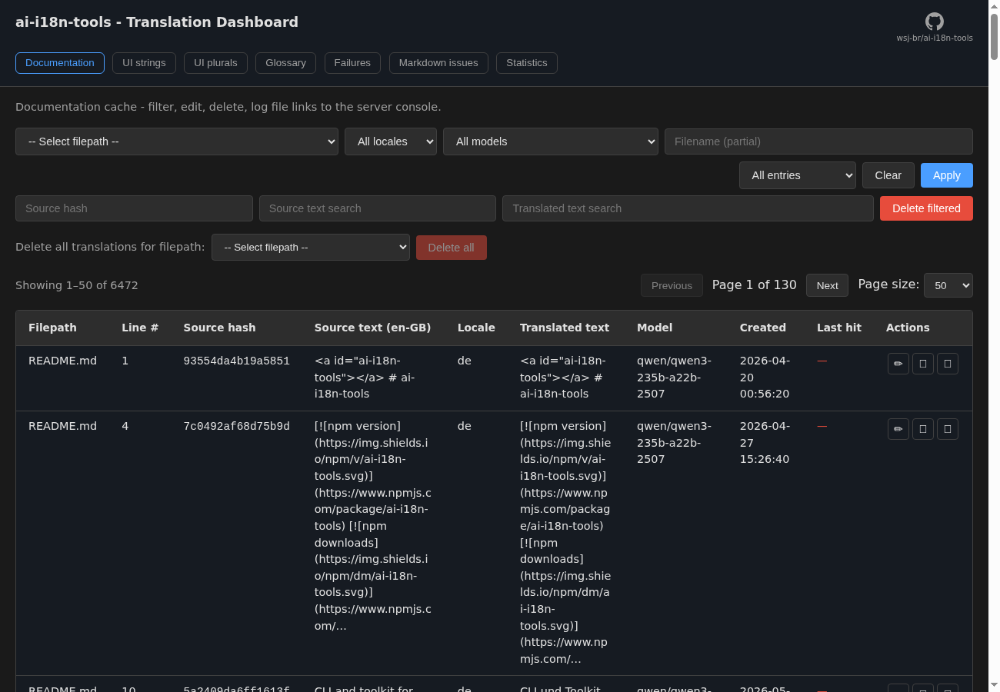

<a id="ai-i18n-tools-getting-started"></a>
# ai-i18n-tools：入門

`ai-i18n-tools` 套件提供三種不同的、模組化的工作流程：

- **工作流程 1 - UI 翻譯**：從任何 JS/TS 來源提取 `t("…")` 呼叫，透過 OpenRouter 翻譯它們，並寫入準備好用於 i18next 的平面式、每個地區設定的 JSON 檔案。
- **工作流程 2 - 文件翻譯**：透過 `translate-docs` 翻譯 `docs[].contentPaths` 中列出的 **markdown、MDX 和 `.astro` 頁面**，並具備智慧快取。當啟用 `features.translateDocs` 時，可在同一指令中翻譯選擇性的 **Docusaurus 目錄 JSON**（`docs[].docusaurusCatalogDir`，來自 `docusaurus write-translations`）— 這是網站的裝飾性文字（導覽列、頁腳、主題字串），而非 `docs/` 中的內文。
- **工作流程 3 - JSON 檔案翻譯**：透過頂層的 `json[]`、`features.translateJson` 和 `translate-json` 翻譯任意的巢狀 JSON 套件（例如 `src/i18n/en/translation.json`）— 適用於將 UI 複製內容儲存在每個地區設定的 JSON 檔案中，而不是儲存在來源中的 `t()`。

**SVG** 資產使用 `features.translateSVG`、頂層的 `svg` 區塊和 `translate-svg`（請參閱 [CLI 參考](#cli-reference)）。

**哪個工作流程？**

- 來源中的使用者介面字串透過 `t()` → 工作流程 1（`extract` / `translate-ui`）。
- 本地化的頁面或 Docusaurus 外殼 JSON → 工作流程 2（`translate-docs`）。
- 僅獨立的巢狀 JSON 地區設定檔案 → 工作流程 3（`translate-json`）。

所有三個工作流程都使用 OpenRouter（任何相容的 LLM）並共用單一設定檔。

<small>**以其他語言閱讀：** </small>
<small id="lang-list">[English (UK)](../../docs/GETTING_STARTED.md) · [Deutsch](./GETTING_STARTED.de.md) · [Español](./GETTING_STARTED.es.md) · [Français](./GETTING_STARTED.fr.md) · [Hindi (Roman)](./GETTING_STARTED.hi-Latn.md) · [日本語](./GETTING_STARTED.ja.md) · [한국어](./GETTING_STARTED.ko.md) · [Português (Brasil)](./GETTING_STARTED.pt-BR.md) · [简体中文](./GETTING_STARTED.zh-Hans.md) · [繁體中文](./GETTING_STARTED.zh-Hant.md)</small>

---

<!-- START doctoc generated TOC please keep comment here to allow auto update -->
<!-- DON'T EDIT THIS SECTION, INSTEAD RE-RUN doctoc TO UPDATE -->
**目錄**

- [安裝](#installation)
  - [使用 CLI](#using-the-cli)
- [快速入門](#quick-start)
  - [建議的 `package.json` 指令碼](#recommended-packagejson-scripts)
- [工作流程 1 - UI 翻譯](#workflow-1---ui-translation)
  - [步驟 1：初始化](#step-1-initialise)
  - [步驟 2：提取字串](#step-2-extract-strings)
  - [Astro 網站（純 Astro，非 Starlight）](#astro-website-plain-astro-not-starlight)
  - [Astro 網站 UI 字串（SSG）](#astro-website-ui-strings-ssg)
  - [Astro 網站頁面（剖析並取代）](#astro-website-pages-parse-and-replace)
  - [步驟 3：翻譯 UI 字串](#step-3-translate-ui-strings)
  - [匯出至 XLIFF 2.0（選用）](#exporting-to-xliff-20-optional)
  - [步驟 4：在執行階段串連 i18next](#step-4-wire-i18next-at-runtime)
    - [保持 `SOURCE_LOCALE` 同步](#keeping-source_locale-aligned)
    - [地區設定載入器](#locale-loaders)
    - [執行階段輔助程式參考](#runtime-helpers-reference)
  - [在原始碼中使用 `t()`](#using-t-in-source-code)
  - [插補](#interpolation)
  - [基數複數（`plurals: true`）](#cardinal-plurals-plurals-true)
    - [複數的儲存和輸出方式](#how-plurals-are-stored-and-emitted)
  - [語言切換器 UI](#language-switcher-ui)
  - [從右至左的語言](#rtl-languages)
- [工作流程 2 - 文件翻譯](#workflow-2---document-translation)
  - [步驟 1：為文件初始化](#step-1-initialise-for-documentation)
  - [步驟 2：翻譯文件](#step-2-translate-documents)
    - [複雜的 Markdown 和失敗的品質檢查](#complex-markdown-and-failed-quality-checks)
    - [快取行為和 `translate-docs` 旗標](#cache-behaviour-and-translate-docs-flags)
    - [批次提示格式](#batch-prompt-format)
    - [SQLite 中的區段去重複和路徑](#segment-dedupe-and-paths-in-sqlite)
  - [輸出佈局](#output-layouts)
    - [當 `docsOutput.style = "flat"` 時的錨點連結](#anchor-links-when-docsoutputstyle--flat)
    - [翻譯文件中的圖像和點陣圖資產](#images-and-raster-assets-in-translated-docs)
    - [語言切換器（`languageListBlock`）](#language-switcher-languagelistblock)
    - [`pathTemplate` / `jsonPathTemplate` 佔位符](#pathtemplate--jsonpathtemplate-placeholders)
  - [疑難排解](#troubleshooting)
- [工作流程 3 - JSON 檔案翻譯](#workflow-3---json-file-translation)
  - [步驟 1：為巢狀 JSON 初始化](#step-1-initialise-for-nested-json)
  - [步驟 2：設定 `json[]`](#step-2-configure-json)
  - [步驟 3：翻譯 JSON 套件](#step-3-translate-json-bundles)
  - [工作流程 3 與其他流程的比較](#workflow-3-vs-other-pipelines)
- [合併工作流程（UI + 文件）](#combined-workflow-ui--docs)
  - [混合文件工作流程（`docsOutput.style = "docusaurus"` + `"flat"`）](#mixed-documentation-workflow-docsoutputstyle--docusaurus--flat)
- [翻譯儀表板](#translation-dashboard)
  - [失敗（文件翻譯）](#failures-document-translation)
    - [何時使用它](#when-to-use-it)
    - [為何來源編輯很重要](#why-source-edits-matter)
    - [如何使用標籤頁](#how-to-use-the-tab)
  - [Markdown 問題（靜態檢查）](#markdown-issues-static-checks)
- [設定參考](#configuration-reference)
  - [`sourceLocale`](#sourcelocale)
  - [`targetLocales`](#targetlocales)
  - [`uiLanguagesPath`（選用）](#uilanguagespath-optional)
  - [`concurrency`（選用）](#concurrency-optional)
  - [`batchConcurrency`（選用）](#batchconcurrency-optional)
  - [`fileConcurrency`（選用）](#fileconcurrency-optional)
  - [`batchSize` / `maxBatchChars`（選用）](#batchsize--maxbatchchars-optional)
  - [`provider` 和 `providers`](#openrouter)
  - [`features`](#features)
  - [`ui`](#ui)
  - [`cacheDir`](#cachedir)
    - [Git 排除的最佳實踐：](#best-practice-for-git-exclusions)
  - [`docs`](#docs)
  - [`json`](#json)
  - [`svg`](#svg)
  - [`glossary`](#glossary)
- [CLI 參考](#cli-reference)
  - [根目錄和全域選項](#root-and-global-options)
  - [個別命令說明](#per-command-help)
  - [目標地區設定 (`-l` / `--locale`)](#target-locales--l----locale)
- [環境變數](#environment-variables)

<!-- END doctoc generated TOC please keep comment here to allow auto update -->

<a id="installation"></a>
## 安裝

已發佈的套件為 **僅 ESM**。請在 Node.js 或您的建置工具中使用 `import`/`import()`；請勿使用 `require('ai-i18n-tools')`。該套件宣告了 `engines.node` `>=22.16.0`；舊版 Node.js 不受支援。npm tarball 僅在 `docs/` 下包含英文檔案；位於 `translated-docs/` 的地區設定專用副本位於 [GitHub 儲存庫](https://github.com/wsj-br/ai-i18n-tools/tree/main/translated-docs)。

```bash
npm install ai-i18n-tools
# or
pnpm add ai-i18n-tools
# or
yarn add ai-i18n-tools
```

ai-i18n-tools 包含自己的字串提取器。如果您先前使用 `i18next-scanner`、`babel-plugin-i18next-extract` 或類似工具，遷移後可以移除這些開發相依性。

<a id="using-the-cli"></a>
### 使用 CLI

**每個專案（建議）** — 安裝為相依性或開發相依性，然後透過 `npx`、`pnpm exec` 或 `package.json` 指令碼呼叫。`package.json` 指令碼已在 `node_modules/.bin` 上使用 `PATH` 執行，因此像 `pnpm run i18n:sync` 這樣的命令會在不輸入 `npx` 的情況下叫用 CLI。

**裸機** `ai-i18n-tools` **在終端機中：** 若要在互動式 shell 中直接執行 CLI（從專案根目錄，在本地安裝後），請將本地 bin 目錄前置到 `PATH`：

```bash
# bash/zsh — project root
export PATH="$PWD/node_modules/.bin:$PATH"
ai-i18n-tools sync
```

```powershell
# Windows PowerShell — project root
$env:Path = "$PWD\node_modules\.bin;$env:Path"
ai-i18n-tools sync
```

使用 [**direnv**](https://direnv.net/) 時，將 `PATH_add node_modules/.bin` 新增至專案根目錄的 `.envrc` 中，以便在 `cd` 進入儲存庫後即可使用裸機命令。若不調整 `PATH`，請繼續使用 `npx ai-i18n-tools …` 或 `pnpm exec ai-i18n-tools …`。

**零安裝一次性使用** — `npx ai-i18n-tools <cmd>` 或 `pnpm dlx ai-i18n-tools <cmd>`（下載該次呼叫的套件；`package.json` 中沒有項目）。

在 Linux、macOS 和 WSL 上，登錄檔安裝會自動為 CLI 指令碼設定可執行位元。在 Windows 上，套件管理器會產生 `.cmd` 和 `.ps1` 代理程式，明確叫用 Node。

設定您的提供者 API 金鑰（顯示 OpenRouter；請使用與您作用中提供者相符的環境變數 — 請參閱 [預設設定表](#openrouter))：

```bash
export OPENROUTER_API_KEY=sk-or-v1-your-key-here
```

或在專案根目錄建立 `.env` 檔案：

```env
OPENROUTER_API_KEY=sk-or-v1-your-key-here
```

---

<a id="quick-start"></a>
## 快速入門

預設的 `init` 範本（`ui-markdown`）僅啟用 **UI** 提取和翻譯。`ui-docusaurus` 和 `ui-starlight` 範本啟用 **文件**翻譯（`translate-docs`）。`ui-astro-website` 範本為純 Astro 應用程式（包括 `.astro` 檔案）建置 **UI** 提取；當您也想要 `translate-docs` 的 `.astro` 頁面 HTML 時，請新增 `docs[]` 區塊（請參閱 [Astro 網站頁面（剖析後替換）](#astro-website-parse-and-replace))。參考資料 [`examples/astro-website`](../../docs/../examples/astro-website/) 使用 **兩種**管道。當您想要一個命令根據您的設定檔執行提取、UI 翻譯、選用的 SVG 檔案翻譯和文件翻譯時，請使用 `sync`。

```bash
# Workflow 1 - UI strings (default template enables extract + translate-ui)
npx ai-i18n-tools init
npx ai-i18n-tools extract
npx ai-i18n-tools translate-ui

# Workflow 2 - docs (Docusaurus-oriented template)
npx ai-i18n-tools init -t ui-docusaurus
# Astro Starlight docs: npx ai-i18n-tools init -t ui-starlight
# Plain Astro website UI: npx ai-i18n-tools init -t ui-astro-website
npx ai-i18n-tools translate-docs

# Workflow 3 - nested JSON bundles (no t() in source)
npx ai-i18n-tools init -t ui-json-bundles
npx ai-i18n-tools translate-json

# Combined: extract UI strings, then translate UI + SVG + docs + json[] (per config features)
npx ai-i18n-tools sync

# Translation status (UI strings per locale; markdown per file × locale in chunked tables)
npx ai-i18n-tools status
# npx ai-i18n-tools status --max-columns 12   # wider tables, fewer chunks
```

<a id="recommended-packagejson-scripts"></a>
### 建議的 `package.json` 指令碼

將套件本機安裝後，您可以直接在指令碼中使用 CLI 命令（無需 `npx`）。

**建議**使用 `sync` 處理所有過去需要「執行 `translate-ui`，然後 `translate-svg`，然後 `translate-docs`，然後 `translate-json`」的作業：`ai-i18n-tools sync` 會根據您的設定檔執行 **提取**（啟用時）、**翻譯 UI**、選用的 **翻譯 SVG**、**翻譯文件**，然後選用的 **翻譯 JSON** — 依正確順序並使用共用旗標。手動串連這些步驟很容易出錯（順序、提取、地區設定旗標）。僅在您需要單獨執行 **單一**步驟時使用 `i18n:translate:ui`、`i18n:translate:svg`、`i18n:translate:docs` 和 `i18n:translate:json`。

```json
{
  "i18n:extract": "ai-i18n-tools extract",
  "i18n:sync": "ai-i18n-tools sync",
  "i18n:translate:ui": "ai-i18n-tools translate-ui",
  "i18n:translate:svg": "ai-i18n-tools translate-svg",
  "i18n:translate:docs": "ai-i18n-tools translate-docs",
  "i18n:translate:json": "ai-i18n-tools translate-json",
  "i18n:status": "ai-i18n-tools status",
  "i18n:dashboard": "ai-i18n-tools dashboard",
  "i18n:cleanup": "ai-i18n-tools cleanup"
}
```

---

<a id="workflow-1---ui-translation"></a>
## 工作流程 1 - UI 翻譯

專為任何使用 i18next 的 JS/TS 專案設計：React 應用程式、Next.js（用戶端和伺服器元件）、Node.js 服務、CLI 工具。

<a id="step-1-initialise"></a>
### 步驟 1：初始化

```bash
npx ai-i18n-tools init
```

這會寫入使用 `ui-markdown` 範本的 `ai-i18n-tools.config.json`。編輯它以設定：

- `sourceLocale` - 您的來源語言 BCP-47 代碼（例如 `"en-GB"`）。**必須**與您運行時 i18n 設定檔（`src/i18n.ts` / `src/i18n.js`）中匯出的 `SOURCE_LOCALE` 相符。
- `targetLocales` - 您的目標語言的 BCP-47 代碼陣列（例如 `["de", "fr", "pt-BR"]`）。執行 `generate-ui-languages` 以從此清單建立 `ui-languages.json` manifest。
- `ui.sourceRoots` - 要掃描 `t("…")` 呼叫的目錄或 glob 模式（例如 `["src/"]`、`["src/**/*.ts"]`）。
- `ui.stringsJson` - 要寫入主目錄的位置（例如 `"src/locales/strings.json"`）。
- `ui.flatOutputDir` - 要寫入 `de.json`、`pt-BR.json` 等的位置（例如 `"src/locales/"`）。
- `ui.preferredModel`（選用）- 嘗試**首先**用於 `translate-ui` 的模型 ID；失敗時，CLI 會依序繼續使用作用中提供者的 `translationModels`，並略過重複項。

<a id="step-2-extract-strings"></a>
### 步驟 2：提取字串

```bash
npx ai-i18n-tools extract
```

掃描 `ui.sourceRoots` 下的所有 JS/TS 檔案，尋找 `t("literal")` 和 `i18n.t("literal")` 呼叫。寫入（或合併到）`ui.stringsJson`。

掃描器是可設定的：透過 `ui.uiExtractor.funcNames`（或舊版 `ui.reactExtractor.funcNames`）新增自訂函式名稱。對於 Astro 頁面和元件，請將 `.astro` 新增至 `ui.uiExtractor.extensions`。

<a id="astro-website-plain-astro-not-starlight"></a>
### Astro 網站（純 Astro，非 Starlight）

對於靜態 Astro 行銷或應用程式網站，請將 [Astro 內建 i18n 路由](https://docs.astro.build/en/guides/internationalization/) 與 ai-i18n-tools 結合使用。參考實例如 [`examples/astro-website`](../../docs/../examples/astro-website/)（另請參閱其 [README](../../docs/../examples/astro-website/README.md)）：英文位於 `/`，九個目標地區設定位於 `/{locale}/`（`de`、`fr`、`es`、`ar`、`ja`、`ko`、`zh-cn`、`zh-tw`、`pt-br`）。

大多數團隊使用兩種管道的**混合**（它們不會衝突）：

| 管道 | 用途 | 命令 | 輸出 |
|----------|---------|----------|--------|
| **頁面 HTML** | 範本主體中的標題、段落、導覽標籤、內嵌陣列 | `translate-docs` | 每種語言 `src/pages/{locale}/index.astro` |
| **UI 字串（`t()`）** | Frontmatter 資料、螢幕截圖標籤、共用陣列 | `extract` → `translate-ui` | `public/locales/{locale}.json`（英文來源作為金鑰）|

新增或移除語言時，請保持三個清單對齊：`ai-i18n-tools.config.json` 中的 `targetLocales`、`astro.config.mjs` 中的 `i18n.locales`（Astro 使用**小寫**路由代碼，例如 `pt-br`），以及 `ui-languages.json`（透過 `generate-ui-languages`）。Flat bundle 的**檔名**使用設定的大小寫（`pt-BR.json`）；透過您的 manifest 中的 `code` 欄位將 Astro 的 `pt-br` 路由對應到該檔案（請參閱 `examples/astro-website/src/i18n/locale.ts`）。

範例 `package.json` 腳本（來自參考專案）：

```json
{
  "i18n:extract": "ai-i18n-tools extract",
  "i18n:translate-ui": "ai-i18n-tools translate-ui",
  "i18n:translate": "ai-i18n-tools translate-docs",
  "i18n:locales": "ai-i18n-tools generate-ui-languages",
  "i18n:sync": "ai-i18n-tools sync"
}
```

<a id="astro-website-ui-strings-ssg"></a>
### Astro 網站 UI 字串（SSG）

使用 `init -t ui-astro-website` 建構 UI 提取腳手架，然後在您也翻譯頁面 HTML 時合併到 `docs[]` 區塊（見下文）。將 TypeScript 模組中的文字包裝在 `t('…')` 中，並將 frontmatter（以及模板 `{expression}` 區塊，如果您偏好 UI 字串而非重複的地區設定頁面）包裝在 `.astro` 中：

```bash
npx ai-i18n-tools init -t ui-astro-website
npx ai-i18n-tools extract
npx ai-i18n-tools translate-ui
```

將 `sourceLocale` 設定為與 `astro.config.mjs` 中的 `i18n.defaultLocale` 相符。將 flat bundles 寫入 Astro 在建置時可以匯入的目錄（模板使用 `public/locales/`）。**建置時**透過查找英文來源文字串作為金鑰來解析 `t('…')`（請參閱 `examples/astro-website/src/i18n/t.ts`；`strings.json` 是提取快取，而不是運行時 bundle）。除非您新增在載入後切換語言的用戶端 islands，否則靜態網站**不需要** `ai-i18n-tools/runtime` 或 i18next。

連接每個呼叫 `t()` 的頁面（英文根頁面和每個 `src/pages/{locale}/` 的副本）：

```astro
import { loadFlatBundle, makeT } from '../i18n/t';        // or ../../i18n/t in locale subfolders
import { resolvePageLocale, useTranslations } from '../i18n/utils';

const locale = resolvePageLocale(Astro.currentLocale);
const flat = await loadFlatBundle(Astro.currentLocale);
const t = useTranslations(locale, makeT(flat));
```

範例中的支援輔助程式：`src/i18n/utils.ts`、`src/i18n/locale.ts` 和 `ui-languages.json`，用於標籤、方向和 BCP-47 代碼。在變更 `targetLocales` 後執行 `generate-ui-languages`（可選地設定 `ui.uiLanguagesPath`，以便 manifest 位於您的輔助程式旁邊，例如 `src/i18n/ui-languages.json`）。`MainLayout.astro` 從 `resolveUiLanguage(Astro.currentLocale)` 設定 `<html lang>` 和 `<html dir>`；`LanguagePicker.astro` 使用 `astro:i18n` 中的 `getRelativeLocaleUrl`。

<a id="astro-website-pages-parse-and-replace"></a>
### Astro 網站頁面（剖析並取代）

對於在 `.astro` 檔案中有硬式編碼 HTML 的行銷頁面，讓 `translate-docs` 提取文字節點和屬性（`alt`、`title`、`aria-label`、`placeholder`），使用文件快取翻譯它們，並在您的頁面樹下寫入特定地區設定的副本。對於大多數可見的文字，您**不需要** `t()`。

結構屬性與金鑰值預設**不會**進行翻譯：內建保護涵蓋了 JSX/HTML 屬性，例如 `class`、`id`、`style`、`src`、`href`、`data-*`，以及大部分的 `aria-*`，還有模板 `{expression}` 區塊內的物件金鑰，例如 `class`、`key` 和 `id`。當您使用自訂屬性時（例如 Tailwind `variant` 或 CMS `slug` 欄位），請使用 `docs[].protectAttributes` 和 `docs[].protectKeys` 來擴充這些清單。相同的選項也適用於 MDX JSX 在進行 markdown 翻譯時（請參閱 [protectAttributes / protectKeys](#protectattributes-protectkeys))。

啟用 `features.translateDocs` 並新增一個 `docs[]` 區塊，例如：

```json
{
  "features": { "translateDocs": true },
  "docs": [{
    "contentPaths": ["src/pages/index.astro"],
    "outputDir": "src/pages",
    "docsOutput": {
      "style": "astro-starlight",
      "docsRoot": "src/pages"
    },
    "addFrontmatter": false
  }]
}
```

執行 `npx ai-i18n-tools translate-docs`（或 [`examples/astro-website`](../../docs/../examples/astro-website/) 中的 `pnpm i18n:translate`）。英文來源保留在 `src/pages/index.astro`；每個目標地區都會取得一個 `src/pages/{locale}/index.astro`，並針對額外的目錄層級調整匯入（例如 `../layouts/` → `../../layouts/`）。

在 **模板主體**內，`{expression}` 區塊中的字串字面值（內嵌陣列、物件 `title` / `desc` 欄位）在使用者可見時會被翻譯；受保護屬性/金鑰上的引號值、`t('…')`、`<script>` 和 `<style>` 內的字面值將保持不變。**前端 TypeScript 不會**透過此路徑進行翻譯—請保持共用前端（包括 `t()` 匯入和資料陣列）在英文和地區頁面上完全相同，或在編輯英文頁面後重新執行 `translate-docs`，以便地區副本能取得前端變更。僅複製前端，請改用 [UI 字串管道](#astro-website-ui-strings)。

請參閱 [`examples/astro-website`](../../docs/../examples/astro-website/) 以取得完整的混合式登陸頁面（HTML 透過 `translate-docs`，螢幕截圖標籤透過 `t()` + `translate-ui`）。

<a id="step-3-translate-ui-strings"></a>
### 步驟 3：翻譯 UI 字串

```bash
npx ai-i18n-tools translate-ui
```

讀取 `strings.json`，將批次傳送給每個目標地區的活躍 LLM 提供者，將扁平化的 JSON 檔案（`de.json`、`fr.json` 等）寫入 `ui.flatOutputDir`。當設定了 `ui.preferredModel` 時，會先嘗試該模型，然後再嘗試活躍提供者的 `translationModels` 清單（文件翻譯和其他命令僅使用提供者的清單）。

對於每個項目，`translate-ui` 會將成功翻譯每個地區的 **OpenRouter 模型 ID** 儲存在一個可選的 `models` 物件中（與 `translated` 相同的地區金鑰）。在本地 `dashboard` 命令中編輯的字串會在此地區的 `models` 中標記為哨兵值 `user-edited`。`ui.flatOutputDir` 下的每個地區的扁平化檔案僅保留 **來源字串 → 翻譯**；它們不包含 `models`（因此執行階段套件保持不變）。

> **注意：** 如果您在翻譯儀表板中編輯某個項目，則需要執行 `sync --force-update`（或具有 `--force-update` 的等效 `translate` 命令）來使用更新的快取項目重寫輸出檔案。此外，請記住，如果來源文字稍後變更，您的手動編輯將會遺失，因為新的來源字串將會產生新的快取金鑰（雜湊）。

<a id="exporting-to-xliff-20-optional"></a>
### 匯出至 XLIFF 2.0（可選）

若要將 UI 字串交給翻譯供應商、TMS 或 CAT 工具，請將目錄匯出為 **XLIFF 2.0**（每個目標地區一個檔案）。此命令是 **唯讀**的：它不會修改 `strings.json` 或呼叫任何 API。

```bash
npx ai-i18n-tools export-ui-xliff
```

預設情況下，檔案會寫在 `ui.stringsJson` 旁邊，命名方式類似 `strings.de.xliff`、`strings.pt-BR.xliff`（您的目錄的基底名稱 + 地區 + `.xliff`）。使用 `-o` / `--output-dir` 寫入其他位置。來自 `strings.json` 的現有翻譯會出現在 `<target>` 中；遺漏的地區會使用 `state="initial"`，沒有 `<target>`，以便工具可以填入。使用 `--untranslated-only` 只匯出每個地區仍需要翻譯的單位（對供應商批次很有用）。`--dry-run` 會列印路徑而不寫入檔案。

<a id="step-4-wire-i18next-at-runtime"></a>
### 步驟 4：在執行階段串連 i18next

使用 `'ai-i18n-tools/runtime'` 匯出的輔助函式來建立您的 i18n 設定檔：

<details>
<summary>完整的 i18n 啟動範例 (src/i18n.js)</summary>

```js
// src/i18n.js or src/i18n.ts — use ../locales and ../public/locales instead of ./ when this file is under src/
import i18n from 'i18next';
import { initReactI18next } from 'react-i18next';
import aiI18n from 'ai-i18n-tools/runtime';

// Project locale files — paths must match `ui` in ai-i18n-tools.config.json (paths there are relative to the project root).
import uiLanguages from './locales/ui-languages.json'; // `ui.uiLanguagesPath` (defaults to `{ui.flatOutputDir}/ui-languages.json`)
import stringsJson from './locales/strings.json'; // `ui.stringsJson`
import sourcePluralFlat from './public/locales/en-GB.json'; // `{ui.flatOutputDir}/{SOURCE_LOCALE}.json` from translate-ui

// Must match `sourceLocale` in ai-i18n-tools.config.json (same string as in the import path above)
export const SOURCE_LOCALE = 'en-GB';

// initialise i18n with the default options
void i18n.use(initReactI18next).init(aiI18n.defaultI18nInitOptions(SOURCE_LOCALE));

// set up the key-as-default translation
aiI18n.setupKeyAsDefaultT(i18n, {
  stringsJson,
  sourcePluralFlatBundle: { lng: SOURCE_LOCALE, bundle: sourcePluralFlat },
});

// apply the direction to the i18n instance
i18n.on('languageChanged', aiI18n.applyDirection);
aiI18n.applyDirection(i18n.language);

// create the locale loaders
const localeLoaders = aiI18n.makeLocaleLoadersFromManifest(
  uiLanguages,
  SOURCE_LOCALE,
  (code) => () => import(`./locales/${code}.json`),
);

// create the loadLocale function
export const loadLocale = aiI18n.makeLoadLocale(i18n, localeLoaders, SOURCE_LOCALE);

// export the i18n instance
export default i18n;
```

</details>

<a id="keeping-source_locale-aligned"></a>
#### 保持 `SOURCE_LOCALE` 同步

**請保持三個值一致：** `sourceLocale` 在 `ai-i18n-tools.config.json` 中，此檔案中的 `SOURCE_LOCALE`，以及您輸出目錄下的複數型平面 JSON `translate-ui` 會寫成 `{sourceLocale}.json`（通常是 `public/locales/`）。請在靜態 `import` 中使用相同的基本名稱（上方範例：`en-GB` → `en-GB.json`）。`sourcePluralFlatBundle` 中的 `lng` 欄位必須等於 `SOURCE_LOCALE`。靜態 ES `import` 路徑無法使用變數；如果您變更來源地區設定，請同時更新 `SOURCE_LOCALE` 和匯入路徑。或者，使用動態 `import(\` 載入該檔案。/public/locales/${SOURCE_LOCALE}.json\`)`、`fetch` 或 `readFileSync`，以便路徑從 `SOURCE_LOCALE` 建構。

程式碼片段使用 `./locales/…` 和 `./public/locales/…`，就好像 `i18n` 位於這些資料夾旁邊一樣。如果您的檔案位於 `src/`（典型情況）下，請使用 `../locales/…` 和 `../public/locales/…`，以便匯入解析到與 `ui.stringsJson`、`uiLanguagesPath` 和 `ui.flatOutputDir` 相同的路徑。

在 React 渲染之前（例如，在您的入口點頂部）匯入 `i18n.js`。當使用者變更語言時，請呼叫 `await loadLocale(code)` 然後呼叫 `await i18n.changeLanguage(code)`。

`SOURCE_LOCALE` 會被匯出，因此任何需要它的其他檔案（例如語言切換器）都可以直接從 `'./i18n'` 匯入。如果您正在遷移現有的 i18next 設定，請將任何硬式編碼的來源地區設定字串（例如，散佈在元件中的 `'en-GB'` 檢查）替換為從您的 i18n 引導檔案匯入 `SOURCE_LOCALE`。

如果您偏好不使用預設匯出，具名匯入（`import { defaultI18nInitOptions, … } from 'ai-i18n-tools/runtime'`）也能正常運作。

<a id="locale-loaders"></a>
#### 地區設定載入器

請透過使用 `makeLocaleLoadersFromManifest` 從 `ui-languages.json` 衍生地區設定，將 `localeLoaders` **與設定保持一致**（這會使用與 `SOURCE_LOCALE` 相同的正規化方式篩選掉 `makeLoadLocale`）。當您將地區設定新增至 `targetLocales` 並執行 `generate-ui-languages` 時，資訊清單會更新，您的載入器會自動追蹤變更 — 無需維護單獨的硬式編碼對應表。

對於 `public/` 下的 JSON 捆綁包（典型的 Next.js 設定），請從您的公開 URL 路徑擷取：

```js
(code) => () => fetch(`/locales/${code}.json`).then(res => res.json())
```

對於沒有捆綁器的 Node CLI，請在一個小型輔助程式中使用 `readFileSync`，該程式會為每個程式碼讀取並剖析 JSON 檔案。

<a id="runtime-helpers-reference"></a>
#### 執行階段輔助程式參考

`aiI18n.defaultI18nInitOptions(sourceLocale)` 會針對鍵值對預設設定傳回標準選項：

- `parseMissingKeyHandler` 會傳回鍵本身，因此未翻譯的字串會顯示來源文字。
- `nsSeparator: false` 允許包含冒號的鍵。
- `interpolation.escapeValue: false` — 可以安全地停用：React 會自行逸出值，而 Node.js/CLI 輸出沒有需要逸出的 HTML。

`setupKeyAsDefaultT(i18n, { stringsJson, sourcePluralFlatBundle? })` 是 ai-i18n-tools 專案的 **建議**組態：它會套用鍵修剪 + 來源地區設定 <code>"{{var}}"</code> 插補後援（與低階 `wrapI18nWithKeyTrim` 的行為相同），可選擇透過 `addResourceBundle` 合併 `translate-ui` `{sourceLocale}.json` 的複數後綴鍵，然後安裝來自您的 `strings.json` 的複數感知 `wrapT`。僅在引導期間省略 `sourcePluralFlatBundle`（一旦 `translate-ui` 發出 `{sourceLocale}.json` 後再合併）。單獨使用 `wrapI18nWithKeyTrim` 對於應用程式程式碼是 **已棄用**的 — 請改用 `setupKeyAsDefaultT`。

`makeLoadLocale(i18n, loaders, sourceLocale)` 會傳回一個非同步 `loadLocale(lang)` 函數，該函數會動態匯入地區設定的 JSON 捆綁包並將其註冊到 i18next。

<a id="using-t-in-source-code"></a>
### 在原始碼中使用 `t()`

使用 **字面字串**呼叫 `t()`，以便提取腳本可以找到它：

```jsx
import { useTranslation } from 'react-i18next';

function MyComponent() {
  const { t } = useTranslation();
  return <button>{t('Save')}</button>;
}
```

相同的模式也適用於 React 之外的環境（Node.js、伺服器元件、CLI）：

```js
import i18n from './i18n.js';
console.log(i18n.t('Processing complete'));
```

**規則：**

- 僅提取這些形式：`t("…")`、`t('…')`、`t(`…`)`、`i18n.t("…")`。
- 鍵必須是 **字面字串** — 鍵不能是變數或表達式。
- 請勿為鍵使用模板字面值：<code>{'t(`Hello ${name}`)'}</code> 無法提取。

<a id="interpolation"></a>
### 插補

使用 i18next 的原生第二參數插值來處理 <code>"{{var}}"</code> 佔位符：

```js
// i18next handles substitution natively, even in key-as-default mode
t('Hello {{name}}, you have {{count}} messages', { name, count })
// → "Hello Alice, you have 3 messages"
```

extract 命令會解析 **第二個參數**（當它是一個純物件字面量時），並讀取僅限工具使用的旗標，例如 `plurals: true` 和 `zeroDigit`（請參閱下方的 **基數複數**）。對於普通字串，僅使用字面鍵進行雜湊；插值選項仍會在執行階段傳遞給 i18next。

如果您的專案使用自訂的插值工具（例如呼叫 `t('key')` 然後將結果透過像 `interpolateTemplate(t('Hello {{name}}'), { name })` 這樣的範本函式進行管道處理），`setupKeyAsDefaultT`（透過 `wrapI18nWithKeyTrim`）將使此操作變得不必要 — 即使來源語言環境返回原始鍵，它也會套用 <code>"{{var}}"</code> 插值。請將呼叫點遷移到 `t('Hello {{name}}', { name })` 並移除自訂工具。

<a id="cardinal-plurals-plurals-true"></a>
### 基數複數（`plurals: true`）

使用您想作為開發者預設副本的 **相同字面值**，並傳遞 `plurals: true`，以便 extract + `translate-ui` 將呼叫視為一個 **基數複數群組**（i18next JSON v4 風格的 `_zero` … `_other` 表單）。

```tsx
{t('{{count}} items in your cart', { plurals: true, count: n })}
```

- `zeroDigit`（選用）— 僅限工具使用；i18next **不會**讀取。當為 `true` 時，提示會偏好在每個存在該表單的語言環境的 `_zero` 字串中使用阿拉伯數字 `0`；當為 `false` 或省略時，則使用自然的零值表示法。在呼叫 `i18next.t` 之前移除這些鍵（請參閱下方的 `wrapT`）。

**驗證：** 如果訊息包含 **兩個或更多**不同的 `{{…}}` 佔位符，**其中一個必須是** `{{count}}`（複數軸）。否則 `extract` 會以清晰的檔案/行訊息 **失敗**。

**兩個獨立的計數**（例如章節和頁數）不能共用一個複數訊息 — 請使用 **兩個** `t()` 呼叫（每個都帶有 `plurals: true` 和其自己的 `count`）並在 UI 中串連。

**v1 中沒有：** 序數複數（`_ordinal_*`、`ordinal: true`）、區間複數、僅限 ICU 的管道。

<a id="how-plurals-are-stored-and-emitted"></a>
#### 複數的儲存和輸出方式

**在** `strings.json` 複數群組中使用 **每個雜湊一個列**，其中包含 `"plural": true`（原始字面值，位於 `source` 中）以及一個物件 `translated[locale]`，該物件將基數類別（`zero`、`one`、`two`、`few`、`many`、`other`）對應到該語言環境的字串。

**平面化語言環境 JSON：** 非複數列仍為 **來源句子 → 翻譯**。複數列會輸出為 `<groupId>_original`（等於 `source`，供參考）和 `<groupId>_<form>`，每個後綴對應一個字串，以便 i18next 原生解析複數。`translate-ui` 也會寫入 `{sourceLocale}.json`，其中 **僅包含**複數的平面化鍵（載入此捆綁包以取得來源語言，以便後綴鍵能夠解析；純字串仍使用鍵作為預設值）。對於每個目標語言環境，輸出的後綴鍵會符合該語言環境的 `Intl.PluralRules`（`requiredCldrPluralForms`）：如果 `strings.json` 省略了某個類別，因為它在壓縮後與另一個類別匹配（例如，阿拉伯語的 `many` 與 `other` 相同），`translate-ui` 仍會將每個必需的後綴寫入平面化檔案，方法是從備用同級字串複製，這樣執行階段查找就不會遺漏任何鍵。

執行階段（`ai-i18n-tools/runtime`）：**呼叫** `setupKeyAsDefaultT(i18n, { stringsJson, sourcePluralFlatBundle })` — 它會執行 `wrapI18nWithKeyTrim`，註冊可選的 `translate-ui` `{sourceLocale}.json` 複數捆綁包，然後使用 `buildPluralIndexFromStringsJson(stringsJson)` 進行 `wrapT`。`wrapT` 會移除 `plurals` / `zeroDigit`，在需要時將鍵重寫為群組 ID，並轉發 `count`（可選：如果只有一個非 `{{count}}` 佔位符，則會從該數值選項複製 `count`）。

**舊版環境：** `Intl.PluralRules` 是工具和一致行為所必需的；如果您的目標是極舊的瀏覽器，請進行 polyfill。

<a id="language-switcher-ui"></a>
### 語言切換器 UI

使用 `ui-languages.json` manifest 來建構語言選擇器。`ai-i18n-tools` 匯出兩個顯示輔助函式：

<details>
<summary>範例 LanguageSelect 元件（React）</summary>

```tsx
import { useMemo } from 'react';
import { useTranslation } from 'react-i18next';
import {
  getUILanguageLabel,
  getUILanguageLabelNative,
  type UiLanguageEntry,
} from 'ai-i18n-tools/runtime';
import uiLanguages from './locales/ui-languages.json';
import { loadLocale } from './i18n';

function LanguageSelect({
  value,
  onChange,
}: {
  value: string;
  onChange: (code: string) => void;
}) {
  const { t, i18n } = useTranslation();

  const options = useMemo(
    () =>
      (uiLanguages as UiLanguageEntry[]).map((lang) => ({
        code: lang.code,
        // Settings/content dropdowns: shows translated name when available
        label: getUILanguageLabel(lang, t),
        // Header globe menu: shows "English / Deutsch"-style label, no t() call
        nativeLabel: getUILanguageLabelNative(lang),
      })),
    [t]
  );

  const handleChange = async (code: string) => {
    await loadLocale(code);
    await i18n.changeLanguage(code);
    onChange(code);
  };

  return (
    <select value={value} onChange={(e) => handleChange(e.target.value)}>
      {options.map((row) => (
        <option key={row.code} value={row.code}>
          {row.label}
        </option>
      ))}
    </select>
  );
}
```

</details>

<br />

`getUILanguageLabel(lang, t)` — 當翻譯後顯示 `t(englishName)`，或當兩者不同時顯示 `englishName / t(englishName)`。適用於設定畫面。

`getUILanguageLabelNative(lang)` — 顯示 `englishName / label`（每行沒有 `t()` 呼叫）。適用於您希望顯示原生名稱的標頭選單。

`ui-languages.json` manifest 是 <code>"{ code, label, englishName, direction }"</code> 項目的 JSON 陣列（`direction` 為 `"ltr"` 或 `"rtl"`）。範例：

```json
[
  { "code": "en-GB", "label": "English (UK)", "englishName": "English (UK)", "direction": "ltr" },
  { "code": "pt-BR", "label": "Português (BR)", "englishName": "Portuguese (BR)", "direction": "ltr" },
  { "code": "de",    "label": "Deutsch",        "englishName": "German", "direction": "ltr" },
  { "code": "fr",    "label": "Français",       "englishName": "French", "direction": "ltr" },
  { "code": "ar",    "label": "العربية",         "englishName": "Arabic", "direction": "rtl" }
]
```

此資訊清單由 `generate-ui-languages` 從 `sourceLocale` + `targetLocales` 和已封裝的主目錄生成。它會寫入 `ui.flatOutputDir`。如果您更改了組態中的任何地區設定，請執行 `generate-ui-languages` 以更新 `ui-languages.json` 檔案。

<a id="rtl-languages"></a>
### 從右至左的語言

`ai-i18n-tools` 匯出 `getTextDirection(lng)` 和 `applyDirection(lng)`：

```js
import { getTextDirection, applyDirection } from 'ai-i18n-tools/runtime';

getTextDirection('ar')    // 'rtl'
getTextDirection('en-GB') // 'ltr'

// Applied automatically via i18n.on('languageChanged', applyDirection) - see Step 4
```

`applyDirection` 會設定 `document.documentElement.dir`（瀏覽器）或為無效操作（Node.js）。傳遞選擇性的 `element` 引數以鎖定特定元素。

對於可能包含 `→` 箭頭的字串，請為從右至左的版面配置翻轉它們：

```js
import { flipUiArrowsForRtl } from 'ai-i18n-tools/runtime';
const { i18n } = useTranslation();
const isRtl = getTextDirection(i18n.language) === 'rtl';
const label = flipUiArrowsForRtl(t('Next → Step'), isRtl);
```

---

<a id="workflow-2---document-translation"></a>
## 工作流程 2 - 文件翻譯

主要設計用於 **markdown、MDX 和 `.astro` 文件**，位於 `docs[].contentPaths` 下。在 Docusaurus 網站上，將 `docs[].docusaurusCatalogDir` 設定為 `write-translations` 目錄（例如 `docs-site/i18n/en`），以便 `translate-docs` 也能翻譯 shell JSON（導覽列、頁腳、佈景主題字串）。對於嵌入在 markdown 中的 PNG 和其他點陣圖，請參閱 [翻譯文件中的影像和點陣圖資源](#images-and-raster-assets-in-translated-docs)。對於 README 或文件中的選擇性 **語言切換器**區塊（使用 `docsOutput.style = "flat"`），請參閱 [語言切換器（`languageListBlock`）](#language-switcher-languagelistblock)。SVG 檔案會透過 [`translate-svg`](#cli-reference) 進行翻譯（當啟用 `features.translateSVG` 時），而不是透過 `docs[].contentPaths`。任意巢狀 UI JSON 套件（非 Docusaurus 目錄）應放在 [工作流程 3](#workflow-3---json-file-translation)（`json[]` / `translate-json`），而不是 `docs[]`。

<a id="step-1-initialise-for-documentation"></a>
### 步驟 1：初始化文件

```bash
npx ai-i18n-tools init -t ui-docusaurus
```

適用於 Astro Starlight 文件網站：

```bash
npx ai-i18n-tools init -t ui-starlight
```

適用於純 Astro 網站 UI（無 Starlight）：

```bash
npx ai-i18n-tools init -t ui-astro-website
```

該範本僅啟用 UI 提取。若要翻譯頁面 HTML，請同時設定 `features.translateDocs` 並新增 `docs[]` 區塊（請參閱 [Astro 網站頁面（剖析並取代）](#astro-website-parse-and-replace))。[`examples/astro-website`](../../docs/../examples/astro-website/) 組態會同時顯示這兩個管道。

編輯產生的 `ai-i18n-tools.config.json`：

- `sourceLocale` - 來源語言（必須與 `docusaurus.config.js` 中的 `defaultLocale` 相符）。
- `targetLocales` - BCP-47 地區設定代碼陣列（例如 `["de", "fr", "es"]`）。
- `cacheDir` - 所有管道的共用 SQLite 快取目錄（以及 `--write-logs` 的預設記錄目錄）。
- `docs` - 文件區塊陣列。每個區塊都有選擇性的 `description`、`contentPaths`（字串或陣列；檔案、目錄或 glob）、`outputDir`、選擇性的 `docusaurusCatalogDir`、`docsOutput`、選擇性的 `segmentSplitting`、`translateFrontmatterFields`、`protectAttributes`、`protectKeys`、`targetLocales`、`addFrontmatter` 等。
- `docs[].description` - 供維護者使用的選擇性簡短說明。設定後，它會出現在 `translate-docs` 標題和 `status` 區段標題中。
- `docs[].contentPaths` - markdown/MDX/`.astro` 來源（以及 Docusaurus shell JSON 的選擇性 `docusaurusCatalogDir`）。
- `docs[].outputDir` - 該區塊的翻譯輸出根目錄。
- `docs[].docsOutput.style` - `"nested"`（預設）、`"flat"`、`"doc-system"` 或別名 `"docusaurus"` / `"astro-starlight"`（請參閱 [輸出版面配置](#output-layouts))。

**主要與補充：** 專注於 `contentPaths` 以進行本地化頁面。當您也需要來自 `write-translations` 的 Docusaurus shell JSON 時，請設定 `docusaurusCatalogDir`。如果您只翻譯頁面，請省略 `docusaurusCatalogDir`。

<a id="step-2-translate-documents"></a>
### 步驟 2：翻譯文件

```bash
npx ai-i18n-tools translate-docs
```

這會將每個 `docs[]` 區塊的 `contentPaths` 中的所有檔案（以及在設定 `docusaurusCatalogDir` 時的 Docusaurus 目錄 JSON）翻譯成所有有效的地區設定。已翻譯的區段會從 SQLite 快取提供服務 — 只有新的或已變更的區段會傳送至 LLM。

翻譯單一地區設定：

```bash
npx ai-i18n-tools translate-docs --locale de
```

檢查需要翻譯的內容：

```bash
npx ai-i18n-tools status
```

<a id="complex-markdown-and-failed-quality-checks"></a>
#### 複雜的 Markdown 與失敗的品質檢查

`translate-docs` 會檢查每個翻譯段落是否保留了 Markdown 結構（包括從文件中解析出的強調格式）。當段落中堆疊了許多 `bold` 區塊、在 `` `inline code` `` 周圍嵌套反引號、將反引號置於粗體內（例如範本字面值如 `` `fetch(\`/locales/${code}.json\`)` ``），或在一個長句中交錯使用粗體與程式碼時，這種結構相當脆弱：某些語系需要不同的詞序，這可能導致翻譯後 `**` 和 `` ` `` 的對應錯亂，進而觸發 CLI 錯誤，例如 `AST mismatch`。

**若遇到此類驗證失敗，建議簡化原始語言的文本** — 將段落拆分、將範例移至程式碼區塊，或以較少的粗體/程式碼組合來描述相同概念 — 而不要期望所有模型與語系都能完美重現密集的內嵌標記。本頁其他位置（特別是步驟 4 關於 `SOURCE_LOCALE`、loader 與 `public/` 路徑的說明）的格式是刻意模擬真實情境；當你在自己的文件中重用類似表述時，進行廣泛翻譯時請保持簡潔。

當所有設定的模型在同一段落上都因 `AST mismatch` 失敗時，`translate-docs` 可自動將該段落拆分為更小的部分（優先從清單中點拆分，然後是單個清單項目或較短的段落片段），從第一個模型開始重試每一部分，並在原始段落的快取鍵下重新合併結果。此功能預設啟用（`segmentSplitting.qualityRetrySplit`）；設定為 `false` 可在模型全部嘗試失敗後停止。執行摘要會在啟用此備援機制時報告 `Quality split retries`。

要查看 **哪些段落失敗**、失敗次數，以及儲存的 **品質／錯誤訊息**，請使用翻譯儀表板的 **失敗** 標籤頁（[翻譯儀表板 → 失敗](#failures-document-translation)）。

<a id="cache-behaviour-and-translate-docs-flags"></a>
#### 快取行為與 `translate-docs` 標誌

CLI 使用 SQLite 儲存 **檔案追蹤** 資訊（每檔案每語系的原始內容雜湊）與 **段落** 資料（每可翻譯片段每語系的雜湊）。正常執行時，若追蹤的雜湊與目前原始內容相符 **且** 輸出檔案已存在，則完全跳過該檔案；否則處理該檔案，並使用段落快取，使未變更的文字不會呼叫 API。

| 標誌                          | 效果                                                                                                                                                                                                                                                              |
|-------------------------------|---------------------------------------------------------------------------------------------------------------------------------------------------------------------------------------------------------------------------------------------------------------------|
| *(預設)*                   | 當追蹤狀態與磁碟上的輸出相符時，跳過未變更的檔案；其餘部分使用段落快取。                                                                                                                                                                          |
| `-l, --locale <codes>`        | 以逗號分隔的目標語系（若省略，預設值為根 `targetLocales` 與各 `docs[]` 區塊中可選的 `targetLocales` 的聯集）。                                                                                                       |
| `-p, --path` / `-f, --file`   | 僅翻譯此路徑下的 Markdown/JSON（專案相對路徑、絕對路徑或 glob 模式）；`--file` 是 `--path` 的別名。                                                                                                                                      |
| `--dry-run`                   | 不進行檔案寫入，也不呼叫 API。                                                                                                                                                                                                                                    |
| `--type <kind>`               | 限制為 `markdown` 或 `json`（否則，如果配置中已啟用，則兩者皆有）。                                                                                                                                                                                           |
| `--json-only` / `--no-json`   | 僅翻譯 JSON 標籤檔案，或跳過 JSON 並僅翻譯 markdown。                                                                                                                                                                                          |
| `-j, --concurrency <n>`       | 最大並行目標語言（預設值來自配置或 CLI 內建預設值）。                                                                                                                                                                                          |
| `-b, --batch-concurrency <n>` | 每份檔案的最大並行批次 API 呼叫（文件；預設值來自配置或 CLI）。                                                                                                                                                                                           |
| `--emphasis-placeholders`     | 在翻譯前將 markdown 強調標記遮罩為預留位置（可選；預設關閉）。                                                                                                                                                                          |
| `--debug-failed`              | 當驗證失敗時，在 `cacheDir` 下寫入詳細的 `FAILED-TRANSLATION` 日誌。                                                                                                                                                                                    |
| `--force-update`              | 重新處理每個符合條件的檔案（提取、重組、寫入輸出），即使檔案追蹤會跳過。 **段落快取仍然適用** — 未變更的段落不會傳送至 LLM。                                                                                |
| `--force`                     | 清除每個處理檔案的檔案追蹤，並且 **不讀取**段落快取進行 API 翻譯（完整重新翻譯）。新結果仍會 **寫入** 段落快取。                                                                                                                                           |
| `--stats`                     | 列印段落計數、追蹤的檔案計數以及每個目標語言的段落總數，然後退出。                                                                                                                                                                                |
| `--clear-cache [locale]`      | 刪除快取的翻譯（和檔案追蹤）：所有目標語言，或單一目標語言，然後退出。                                                                                                                                                                         |
| `--prompt-format <mode>`      | 每個段落 **批次** 如何傳送至模型和解析（`xml`、`json-array` 或 `json-object`）。預設 `json-array`。不改變提取、預留位置、驗證、快取或後備行為 — 請參閱 [批次提示格式](#batch-prompt-format)。 |

您不能將 `--force` 與 `--force-update` 結合使用（它們是互斥的）。

<a id="batch-prompt-format"></a>
#### 批次提示格式

`translate-docs` 會將可翻譯的段落以 **批次**（按 `batchSize` / `maxBatchChars` 分組）傳送至作用中的 LLM 提供者。`--prompt-format` 標誌僅改變該批次的 **線路格式**；`PlaceholderHandler` 標記、markdown AST 檢查、SQLite 快取金鑰以及批次解析失敗時的每段落後備行為均保持不變。

| 模式                   | 使用者訊息                                                           | 模型回覆                                                 |
|------------------------|------------------------------------------------------------------------|-------------------------------------------------------------|
| `xml`                  | 偽 XML：每個段落一個 `<seg id="N">…</seg>`（帶有 XML 跳脫）。 | 僅 `<t id="N">…</t>` 區塊，每個區塊對應一個段落索引。       |
| `json-array` (預設) | 字串的 JSON 陣列，每個區段一個項目，依順序排列。               | 長度相同的 **JSON 陣列**（順序相同）。           |
| `json-object`          | 以區段索引為鍵的 JSON 物件 `{"0":"…","1":"…",…}`。            | 具有 **相同鍵**和已翻譯值的 JSON 物件。 |

執行標頭也會列印 `Batch prompt format: …`，以便您確認作用中的模式。JSON 標籤檔案 (`docusaurusCatalogDir`) 和 SVG 檔案批次在作為 `translate-docs`（或 `sync` 的文件階段）的一部分執行時，會使用相同的設定 — `sync` 不會公開此旗標；它預設為 `json-array`)。

<a id="segment-dedupe-and-paths-in-sqlite"></a>
#### 區段去重和 SQLite 中的路徑

> **注意：** 本節涵蓋內部快取金鑰的詳細資訊，有助於偵錯 `cleanup` 行為或自訂工具。大多數使用者可以略過它。

- 區段列以 `(source_hash, locale)`（雜湊 = 正規化內容）為全域鍵。兩個檔案中相同的文字會共用一個列；`translations.filepath` 是中繼資料（最後寫入者），而不是每個檔案的第二個快取項目。
- `file_tracking.filepath` 使用命名空間金鑰：每個 `docs` 區塊的 `doc-block:{index}:{relPath}`（`relPath` 是相對於專案根目錄的 posix：收集的 markdown 路徑；**JSON 標籤檔案使用來源檔案的相對工作目錄路徑**，例如 `docs-site/i18n/en/code.json`，因此清理可以解析實際檔案），`json[]` 下的 `json[]` 來源的 `json-block:{index}:{relPath}`，以及 `translate-svg` 下的 SVG 檔案的 `svg-files:{relPath}`。
- `translations.filepath` 儲存 markdown、JSON 和 SVG 區段的相對於工作目錄的 posix 路徑（SVG 使用與其他資產相同的路徑形狀；`svg-files:…` 前綴 **僅**用於 `file_tracking`）。
- 執行後，僅針對 **相同翻譯範圍**中的區段列清除 `last_hit_at`（尊重 `--path` 和啟用的種類），這些區段列未被命中，因此經過篩選或僅限文件的執行不會將不相關的檔案標記為過時。

<a id="output-layouts"></a>
### 輸出佈局

`docsOutput.style` 控制翻譯後的 markdown 檔案的寫入位置。在 `docs[].docsOutput.style` 中使用下面的確切字串值（別名是預設佈局，而不是獨立的引擎）。

`docsOutput.style = "nested"`（省略時為預設）— 在 `{outputDir}/{locale}/` 下鏡像來源樹（例如 `docs/guide.md` → `i18n/de/docs/guide.md`）。

`docsOutput.style = "doc-system"` — 用於靜態文件站點的、預加地區代碼的文件樹。`docsRoot` 下的檔案會寫入 `{outputDir}/{locale}/[localeSubpath/]{relativeToDocsRoot}`。`docsRoot` 以外的路徑會回退到巢狀佈局。將 `docs[].docsOutput.docsRoot` 設定為您的英文來源根目錄（例如 `"docs"` 或 `"src/content/docs"`）。當 `docsOutput.style = "doc-system"` 時，您必須明確設定 `localeSubpath`（使用下面的別名進行預設設定）。

**別名**（相同的佈局引擎，預設 `localeSubpath`）：

- `docsOutput.style = "docusaurus"` — `localeSubpath` 預設為 `docusaurus-plugin-content-docs/current`（Docusaurus i18n 外掛程式佈局）。
- `docsOutput.style = "astro-starlight"` — `localeSubpath` 預設為 `""`（直接在 `{outputDir}/{locale}/` 下的翻譯頁面，與 [Starlight](https://starlight.astro.build/guides/i18n/) 匹配，當英文位於內容根目錄且 `outputDir` 等於 `docsRoot` 時）。

Docusaurus 預設（主要文件頁面）：

```text
docs/guide.md  →  i18n/de/docusaurus-plugin-content-docs/current/guide.md
```

Starlight 預設（相同的區塊形狀，不同的路徑）：

```text
src/content/docs/guide.md  →  src/content/docs/de/guide.md
```

選擇性的 JSON 標籤 — Docusaurus 外殼字串來自 `docusaurusCatalogDir`（非 MDX 主體內容）：

```text
i18n/en/sidebar.json  →  i18n/de/sidebar.json
```

Starlight 為許多地區提供 UI 字串；選擇性的自訂 UI 覆蓋使用 `src/content/i18n/en.json` 和 `jsonPathTemplate: "{outputDir}/{locale}.json"` 在單獨的 `docs[]` 區塊中，如果需要的話。

`docsOutput.style = "flat"` — 將翻譯後的檔案放置在來源旁邊，並帶有地區後綴，或放在子目錄中。當 `docsOutput.style = "flat"` 時（除非設定了 `rewriteRelativeLinks: false` 或自訂的 `pathTemplate`），頁面之間的相對連結會自動重寫。

```text
docs/guide.md → i18n/guide.de.md
```

<a id="anchor-links-when-docsoutputstyle--flat"></a>
#### `docsOutput.style = "flat"` 時的錨點連結

當 `docsOutput.style = "flat"` 時，輸出會為每個地區重寫頁面之間的 **相對路徑**（`guide.md` → `guide.de.md`）。**錨點連結** — 通常的 markdown 行內形式，在路徑後加上 `#` — 會跳轉到目標檔案內的某個部分：

```markdown
Read the [installation checklist](../../docs/setup.md#first-run) before you deploy.
```

這裡連結目標是 `setup.md`，而 `#first-run` 是錨點：它應該會捲動到該檔案內的正確標題。

**錨點連結需要注意**

- `rewriteRelativeLinks` 會修正每個地區設定檔的 **檔名**（`setup.md` → `setup.de.md`）。
- 許多渲染器會從 **顯示的標題文字**衍生出 `#` 縮寫。翻譯後，標題在不同地區設定檔中會有所不同，因此自動產生的縮寫可能會變更，但重寫的連結可能仍會顯示 `#first-run` — 或者您英文的 `#…` 錨點不再符合渲染器根據翻譯後標題建立的縮寫。
- 結果：讀者會連到正確的 **檔案**，但卻是 **錯誤的行**，或者瀏覽器找不到符合的標題。

**該怎麼做**

1. 在 `translate-docs` 之前，先對您的原始 `.md` / `.mdx` 執行 `ai-i18n-tools write-heading-ids`（使用與平常相同的 `docs[]` / `contentPaths`）。它會在每個標題前插入明確的 HTML 錨點，以便 `id` 值能在所有翻譯後的副本中共享。在重新命名標題後重新執行，以確保過時的錨點 ID 會更新以符合目前的標題。
2. 將您的 markdown **錨點連結**指向這些穩定的 ID，例如 `[label](../../docs/other.md#section-id)`，其中 `section-id` 應符合該工具寫入的錨點 — 而非僅憑英文單字猜測。

**範例**

`docs/overview.md`:

```markdown
See [TLS setup](../../docs/security.md#tls-configuration) for certificate steps.
```

執行 `write-heading-ids` 後的 `docs/security.md`（簡化版）：

```markdown
<a id="tls-configuration"></a>
## TLS configuration

Your CA and cert steps…
```

執行 `translate-docs` 後，檔案路徑和 `#…` 錨點在每個地區設定檔中都會保持一致，例如：

```markdown
Siehe [TLS-Einrichtung](../../docs/security.de.md#tls-configuration) für die Zertifikatsschritte.
```

由於 `id` 在原始檔中是固定的，因此所有地區設定檔中的 `#tls-configuration` 錨點都相同；只有標題 **文字** 和連結 **標籤** 會被翻譯。

<a id="images-and-raster-assets-in-translated-docs"></a>
#### 翻譯文件中的圖片和點陣資產

`translate-docs` 會翻譯包含圖片替代文字的 markdown 區段。它不會將點陣檔案（PNG、JPEG、WebP、GIF）複製到您的文件 `outputDir`。您必須將螢幕截圖檔案放置在翻譯後的 URL 會指向的位置，或在翻譯後使用 `postProcessing.regexAdjustments` 重寫路徑。

對於包含可翻譯文字的 SVG 檔案，請使用 `svg` 區塊和 `translate-svg` — 請參閱 [`svg`](#svg)。

請參閱 [地區設定資產指南](LOCALE-ASSETS-GUIDE.zh-Hant.md) 以取得完整的決策指南、所有包含設定範例和目錄配置的模式、螢幕截圖腳本合約、設計建議以及常見錯誤。

**快速參考 — 五種模式**

| 模式                      | 用途                                               | 機制                                         |
|------------------------------|-------------------------------------------------------|---------------------------------------------------|
| A — 共用點陣圖            | 單一圖片，無地區設定檔專用變體                  | 檔案連結重寫器；通常無正規表達式          |
| B — 地區設定檔資料夾        | `"flat"`、`"docusaurus"`、`"astro-starlight"` README/docs | `regexAdjustments` 地區設定檔區段替換            |
| C — Docusaurus 共同放置     | `docsOutput.style = "docusaurus"` 網站 | 螢幕截圖腳本放置檔案；無正規表達式          |
| D — 翻譯的 SVG           | 嵌入 SVG 插圖的網頁應用程式                  | `translate-svg` 搭配 `svg.style = "flat"`         |
| E — 共同放置的翻譯 SVG | `docsOutput.style = "docusaurus"` 文件          | `translate-svg` 搭配 `svg.style = "nested"` + `pathTemplate` |

**扁平連結重寫器和兩步驟流程**

當執行 `docsOutput.style = "flat"` 時，內建的重寫器會在 `postProcessing` 之前執行。它會計算每個輸出檔案的深度前綴 — 從輸出檔案目錄回溯到原始檔案目錄的相對路徑 — 並將其prepend到非 markdown 資產 URL。然後 `postProcessing` 會在已加上前綴的 URL 上執行 — 編寫符合其中地區設定區段的 `search` 模式，而不是開頭的 `../` 前綴。

使用 `flatPreserveRelativeDir: true` 時，子目錄中的來源檔案會自動獲得特定檔案的前綴。例如，`docs/GETTING_STARTED.md` → `translated-docs/docs/GETTING_STARTED.<locale>.md` 會產生前綴 `../../docs/`，因此 `translation-dashboard.png`（來源的同層級檔案）會變成 `../../docs/translation-dashboard.png` — 無需任何 `postProcessing` 規則即可正確解析。

當 `docsOutput.style` 是 `"docusaurus"`、`"astro-starlight"`、`"nested"` 或任何非 `"flat"` 的值時，扁平連結重寫器不會執行。`postProcessing` 會看到原始的 markdown URL。

**模式 A 範例** — 當 `docsOutput.style = "flat"` 時，相對路徑資源與來源檔案並存，無需設定。模式 A `postProcessing` 規則僅適用於絕對 URL 資源（例如 `/img/...`）或 CDN 目標的替換。

**模式 B 範例 — `docsOutput.style = "flat"` README**（`examples/nextjs-app`，第二個 `docs[]` 區塊）

```json
{
  "description": "Per-locale screenshot folders under translated-docs",
  "search": "images/screenshots/[^/]+/",
  "replace": "images/screenshots/${translatedLocale}/"
}
```

請使用通用的 `[^/]+` 形式，而不是硬式編碼的來源地區設定，這樣如果 `sourceLocale` 變更，規則仍能繼續運作。

**模式 B 範例 — `docsOutput.style = "docusaurus"`**（`examples/nextjs-app`，第一個 `docs[]` 區塊）

```json
{
  "description": "Per-locale screenshot folders in docs-site static assets",
  "search": "screenshots/[^/]+/",
  "replace": "screenshots/${translatedLocale}/"
}
```

**模式 C — Docusaurus 共置**（無需 `regexAdjustments`）

將 en-GB 螢幕截圖放在 `static/assets/` 並建立一個符號連結 `docs/assets → ../static/assets`。`take-screenshots` 指令碼會將其他地區設定的檔案直接寫入 `i18n/<locale>/…/current/assets/`。所有地區設定的所有文件都參考 `../assets/name.png` — 路徑是穩定的，不需要 URL 重寫。

**模式 D 範例**（`examples/nextjs-app`、`svg.style = "flat"`）

```json
"svg": {
  "sourcePath": "images",
  "outputDir": "public/assets",
  "style": "flat"
}
```

`images/*.svg` → `public/assets/` 下的地區設定檔案。應用程式按地區設定參考：``。

**僅 README 的最小範例**（`examples/console-app`）

`examples/console-app/ai-i18n-tools.config.json` 僅透過 [語言切換器後處理](#language-switcher-languagelistblock) 將 `README.md` 翻譯為 `translated-docs/`。未定義任何圖片規則 — 當 README 沒有同層級的點陣圖檔案或僅使用您的主機已提供的絕對 URL 時適用。

替換範本支援類似 `${translatedLocale}` 和 `${translatedBasedir}` 的預留位置（完整清單請參閱 [設定參考](#configuration-reference) 中的 `docsOutput.postProcessing.regexAdjustments` 列）。

<a id="language-switcher-languagelistblock"></a>
#### 語言切換器（`languageListBlock`）

當翻譯的 markdown 檔案應包含一個 **「以其他語言閱讀」** 的連結列時，請使用 `docsOutput.postProcessing.languageListBlock` — 每個地區設定有一個連結，並根據每個輸出檔案計算 `href` 值。

此儲存庫將其用於 [README.md](../README.zh-Hant.md) 和 [docs/GETTING_STARTED.md](../../docs/GETTING_STARTED.md)。在 `translate-docs` 之後，每個翻譯的副本都會獲得一個更新的區塊；例如 [translated-docs/docs/GETTING_STARTED.de.md](../../docs/../translated-docs/docs/GETTING_STARTED.de.md) 會連結到 `translated-docs/docs/` 下的同層級地區設定檔案，並連結回英文來源 `../../docs/GETTING_STARTED.md`。

**1. 在來源 markdown 中標記區塊**

將切換器包裝在由 `start` 和 `end` 子字串標記分隔的 HTML（或任何行）中。此儲存庫使用：

```markdown
<small>**Read in other languages:** </small>
<small id="lang-list">[English (GB)](../../docs/GETTING_STARTED.md) · [Deutsch](../../docs/../translated-docs/docs/GETTING_STARTED.de.md) · …</small>
```

初始連結文字僅為預留位置。`translate-docs` 會替換從包含 `start` 的第一行到包含 `end` 的第一行之後的整個片段（圍起來的程式碼區塊內的標記會被忽略，因此同一檔案中的設定範例不會匹配）。

**2. 設定區塊**

`start` 和 `end` 是任意的子字串標記 — 它們不一定要是 `<small id="lang-list">` / `</small>`。請選擇出現在語言切換器片段中的任何開頭和結尾文字：另一個 HTML 標記 (`<div class="lang-switcher">` … `</div>`)、HTML 註解 (`<!-- lang-list -->` … `<!-- /lang-list -->`)，或僅限 Markdown 的邊界 (例如，一行 `**Languages:**` 到一行 `---`)。在設定中將 `start` 和 `end` 設定為與您在來源檔案中使用的完全一致。

根設定檔 ([ai-i18n-tools.config.json](../../docs/../ai-i18n-tools.config.json))：

```json
"postProcessing": {
  "languageListBlock": {
    "start": "<small id=\"lang-list\">",
    "end": "</small>",
    "separator": " · "
  }
}
```

| 欄位       | 角色                                                                                                     |
|-------------|----------------------------------------------------------------------------------------------------------|
| `start`     | 識別區塊開頭行的子字串                                                  |
| `end`       | 結尾行上的子字串 (當兩者出現在同一行時，可以是與 `start` 相同的行)             |
| `separator` | 在產生的 `[label](../../docs/href)` 連結之間的文字 (此儲存庫使用 `" · "`)                                    |
| `label`     | 選用：`"local"` (預設) 使用資訊清單中的每個地區語言的本地名稱；`"english"` 使用 `englishName` |

**3. 執行階段行為**

1. **提取** — 語言列表片段**不會**傳送給模型 (`translatable: false`)。
2. **每個翻譯檔案** — 在區段翻譯和選用的平面連結重寫之後，`postProcessing` 會重建區塊：每個地區語言一個 Markdown 連結，標籤來自 `ui-languages.json` (如果存在，否則使用捆綁的主目錄，否則使用 `localeDisplayNames`)，路徑相對於正在寫入的檔案。
3. **來源更新** — 在完成 `translate-docs` / `sync` 文件傳遞後，相同的標準區塊會寫回 **英文來源檔案**中的 `contentPaths`，因此新增地區語言會更新儲存庫中的切換器，而無需手動編輯每個連結。

如果檔案沒有匹配的區塊，CLI 會記錄警告 (當 `--verbose` 時) 並保持內文不變。

**4. 標籤資訊清單**

對於本地名稱標籤 (`label: "local"`)，透過 `ui-languages.json` 產生或維護 `generate-ui-languages` (請參閱 [`uiLanguagesPath`](#uilanguagespath-optional))。此儲存庫僅限文件的設定檔沒有 UI 管道，因此標籤來自捆綁的主目錄，用於 `sourceLocale` + `targetLocales`。

**5. 此儲存庫中的範例**

| 範例                            | 檔案                                                                                                                                                                                        |
|------------------------------------|----------------------------------------------------------------------------------------------------------------------------------------------------------------------------------------------|
| 此套件 (平面文件 + 子目錄) | [ai-i18n-tools.config.json](../../docs/../ai-i18n-tools.config.json) (`docsOutput.style = "flat"`), [README.md](../README.zh-Hant.md), [docs/GETTING_STARTED.md](../../docs/GETTING_STARTED.md), 輸出位於 [translated-docs/](../../docs/../translated-docs/) |
| 最小的僅 README                | [examples/console-app/ai-i18n-tools.config.json](../../docs/../examples/console-app/ai-i18n-tools.config.json) (`docsOutput.style = "flat"`), [examples/console-app/README.md](../../docs/../examples/console-app/README.md)                     |
| 平面的 README + Docusaurus 文件      | [examples/nextjs-app/ai-i18n-tools.config.json](../../docs/../examples/nextjs-app/ai-i18n-tools.config.json) (第二個區塊：`docsOutput.style = "flat"`；第一個區塊：`docsOutput.style = "docusaurus"`)                                                     |

`<small id="lang-list">` 前面一行 (例如 `**Read in other languages:**`) 是一個正常的翻譯區段，並在每個目標地區語言中進行本地化；只有標記內的連結列會逐字重新產生，但 `href` 和由資訊清單驅動的標籤除外。

<a id="pathtemplate--jsonpathtemplate-placeholders"></a>
#### `pathTemplate` / `jsonPathTemplate` 佔位符

透過設定 `docs[].docsOutput.pathTemplate` (Markdown 和 MDX) 或 `jsonPathTemplate` (JSON 標籤檔案) 來覆寫翻譯檔案的寫入位置。兩者都接受相同的佔位符。解析後的路徑必須保留在該區塊的 `outputDir` 內部 (CLI 會拒絕超出範圍的路徑)。

如果您使用自訂 `pathTemplate`，`rewriteRelativeLinks` 預設為 `false`，除非您明確設定它 — 相對連結重寫是為沒有自訂範本的 `docsOutput.style = "flat"` 而建置的。

對於內建佈局（`nested`、`flat`、`doc-system`，沒有自訂範本），請將 `docsOutput.localePathLowercase` 設定為 `true`，以寫入小寫的地區設定資料夾或檔案名稱片段（例如，`pt-br` 而非 `pt-BR`）。`astro-starlight` 別名預設為 `true`。自訂的 `pathTemplate` / `jsonPathTemplate` 值保持不變 — 當您需要小寫片段但將 `{llocale}` 保留為 BCP-47 時，請在此處使用 `{locale}`。

| 佔位符            | 角色                                                                                                       | 範例                                                          |
|------------------------|------------------------------------------------------------------------------------------------------------|------------------------------------------------------------------|
| `{outputDir}`          | 此文件區塊的絕對解析路徑 `outputDir`                                           | `/home/acme/repo/i18n`                                           |
| `{locale}`             | 目標地區設定碼（與設定 / CLI 中的格式相同）                                                          | `de`、`pt-BR`                                                    |
| `{LOCALE}`             | 相同地區設定的大寫形式                                                                                     | `DE`、`PT-BR`                                                    |
| `{llocale}`            | 相同地區設定的小寫形式（符合 Astro 路由資料夾，例如 `pt-br`、`zh-cn`）                               | `de`、`pt-br`                                                    |
| `{relPath}`            | 相對於專案根目錄的檔案路徑，POSIX `/`                                                   | `docs/guide.md`、`README.md`                                     |
| `{stem}`               | 檔名 **無**副檔名                                                                                             | `guide` 用於 `docs/guide.md`                                      |
| `{basename}`           | 檔名 **含**副檔名                                                                                             | `guide.md`                                                       |
| `{extension}`          | 副檔名 **包含** 句點                                                                            | `.md`、`.mdx`                                                    |
| `{docsRoot}`           | `docsOutput.docsRoot` 的絕對解析路徑（若省略則預設為 `docs`）                            | `/home/acme/repo/docs`                                           |
| `{relativeToDocsRoot}` | 當路徑字串對齊時（POSIX），移除相符的 `{relPath}` 前綴的 `docsRoot`；否則保持不變 | `docs/guide.md` （常見）；僅在套用移除時為 `guide.md` |

**範例**

設定片段：

```json
{
  "outputDir": "i18n",
  "docsOutput": {
    "pathTemplate": "{outputDir}/{locale}/{relPath}"
  }
}
```

對於地區設定 `de` 和來源 `docs/guide.md`，專案根目錄為 `/home/acme/repo` 且 `outputDir` 解析為 `/home/acme/repo/i18n`，展開的路徑為：

```text
/home/acme/repo/i18n/de/docs/guide.md
```

使用 `docsOutput.style = "flat"` 且無自訂 `pathTemplate` 時，常見模式是透過 `{stem}` 和 `{extension}` 只保留檔案名稱，例如 `{outputDir}/{stem}.{locale}{extension}`，這會在解析後的 `outputDir` 下產生 `…/guide.de.md`。

<a id="troubleshooting"></a>
### 疑難排解

**區段錨點連結在翻譯的文件中無效**

像 `[label](../../docs/other.md#section-id)` 這樣的連結可能會開啟正確的翻譯檔案，但無法捲動到預期的標題 — 或跳到錯誤的區段。`#…` 片段在該地區設定中不再符合任何標題 `id`。

常見原因：

- 來源標題從未有明確的錨點 ID；網站會從可見標題文字衍生縮寫，這在翻譯後會改變。
- 您重新命名了來源中的標題，但前面的 `<a id="…"></a>` 行遺失或仍是舊 ID。
- 錨點連結使用猜測自英文單字的 `#…` 片段，而非 `write-heading-ids` 會產生的 ID。

**修正**

1. 在您的 **來源** `.md` / `.mdx` 上執行 `ai-i18n-tools write-heading-ids`（與 `translate-docs` 相同的 `docs[]` / `contentPaths`）。它會在每個 ATX 標題前插入 `<a id="slug"></a>`，或者在標題文字不再符合目前 slug 時重新整理現有的錨點。
2. 將錨點連結指向這些 ID — 例如 `[setup](../../docs/guide.md#first-run)`，其中 `#first-run` 應符合目標標題上方的錨點行，而不是僅從英文標題推斷出的 slug。
3. 重新執行 `translate-docs`（或 `sync --force-update`），以便每個地區設定的副本都包含更新的錨點行。

請先使用 `--dry-run` 在 `write-heading-ids` 上預覽變更。請參閱 [Anchor links in flat layout](#anchor-links-when-docsoutputstyle--flat) 以取得完整模式。

---

<a id="workflow-3---json-file-translation"></a>
## 工作流程 3 - JSON 檔案翻譯

專為將 UI 文字保留在**每個地區設定的巢狀 JSON 檔案**（例如 `src/i18n/en/translation.json`）中，而不是在來源中保留 `t("…")` 的專案設計。CLI 會遍歷這些檔案中的字串值，透過 OpenRouter 進行翻譯，並使用 `json[].outputPathTemplate` 寫入每個地區設定的輸出。它使用與 `translate-docs` 和 `translate-svg`（`cacheDir`）相同的 SQLite 快取。

此工作流程**不會**執行 `extract` — 沒有 `strings.json` 目錄。使用 `features.translateJson` 和頂層 `json[]` 中的一或多個項目來啟用它。

<a id="step-1-initialise-for-nested-json"></a>
### 步驟 1：初始化巢狀 JSON

```bash
npx ai-i18n-tools init -t ui-json-bundles
```

該範本會設定 `features.translateJson: true`，停用 UI 提取和文件翻譯，並建立一個指向 `src/i18n/en/translation.json` 的單一 `json[]` 區塊，輸出為 `src/i18n/{llocale}/translation.json`。請編輯 `sourceLocale`、`targetLocales`、`contentPaths` 和 `outputPathTemplate` 以符合您的儲存庫佈局。

<a id="step-2-configure-json"></a>
### 步驟 2：設定 `json[]`

每個 `json[]` 區塊描述一個管道：

- `contentPaths` — 一或多個 `.json` 檔案、目錄或萬用字元模式（例如 `"src/i18n/en/translation.json"` 或 `"src/i18n/en/overrides/*.json"`）。路徑會從專案根目錄解析。
- `outputPathTemplate` — 必要。每個目標地區設定檔案的寫入位置。預留位置：`{locale}`、`{LOCALE}`、`{llocale}`（小寫地區設定，適用於 Astro 路由資料夾）、`{stem}`、`{basename}`、`{extension}`、`{relativeToSourceRoot}`。
- `targetLocales`（選用）— 僅適用於此區塊的子集；否則會套用根目錄的 `targetLocales`。
- `keyPolicy` — 哪些 JSON 鍵包含可翻譯的文字與穩定的識別符（請參閱下方）。
- `description`（選用）— 顯示在 CLI 標頭和 `status` 輸出中。

範例（多個來源檔案，小寫地區設定資料夾）：

```json
{
  "sourceLocale": "en",
  "targetLocales": ["de", "fr", "pt-BR"],
  "features": {
    "translateJson": true
  },
  "cacheDir": ".translation-cache",
  "json": [
    {
      "description": "App UI bundle",
      "contentPaths": [
        "src/i18n/en/translation.json",
        "src/i18n/en/overrides/*.json"
      ],
      "outputPathTemplate": "src/i18n/{llocale}/{basename}",
      "keyPolicy": {
        "mode": "denylist",
        "skipKeys": ["id", "slug", "href", "url", "key", "code"],
        "translateKeys": []
      }
    }
  ]
}
```

**`keyPolicy`**

| `mode`      | 行為 |
|-------------|-----------|
| `allowlist` | 僅翻譯符合 `translateKeys`（點狀路徑；minimatch 萬用字元模式）的鍵。 |
| `denylist`  | 翻譯所有字串值，但排除符合 `skipKeys` 的鍵。 |
| `both`      | 先套用 `translateKeys`，然後從 `skipKeys` 中移除符合的項目。 |

路徑使用點狀表示法（`nav.home.label`）。像 `slug` 這樣的裸名稱會符合任何深度的最終鍵段。

<a id="step-3-translate-json-bundles"></a>
### 步驟 3：翻譯 JSON 套件

```bash
npx ai-i18n-tools translate-json
```

選用旗標（與 `translate-docs` 的概念相同）：`-l` / `--locale` 用於目標子集，`-p` / `--path` 用於限制檔案，`--dry-run`、`--force`（清除檔案追蹤和符合檔案的區段快取），`--force-update`（當檔案雜湊匹配時重新處理；區段快取仍然適用），`-b` / `--batch-concurrency`，`--prompt-format`（`xml` \| `json-array` \| `json-object`）。

僅限 JSON 的專案可以執行：

```bash
npx ai-i18n-tools sync --no-ui --no-svg --no-docs
```

當同時啟用 UI 或文件時，`sync` 會在 translate-docs 後執行 **translate-json**（除非 `--no-json`）。使用 `--no-json` 跳過 JSON。

檢查每個檔案和地區設定檔的涵蓋範圍：

```bash
npx ai-i18n-tools status
```

當 `translateJson` 啟用時，`status` 會列印一個 `json[]` 區塊（✓ 最新的，● 過期或遺失）。

<a id="workflow-3-vs-other-pipelines"></a>
### Workflow 3 與其他管線的比較

| 情況 | 使用 |
|-----------|-----|
| UI 字串在 `t("…")` / `i18n.t("…")` 的 JS/TS/Astro 中 | [Workflow 1](#workflow-1---ui-translation) — `extract` + `translate-ui` |
| Markdown/MDX/`.astro` 頁面或 README 的翻譯 | [Workflow 2](#workflow-2---document-translation) — `translate-docs` |
| Docusaurus `write-translations` 目錄（`{ "key": { "message": "…", "description": "…" } }`） | Workflow 2 — `docs[].docusaurusCatalogDir` + `translate-docs`，**不是** `json[]` |
| 獨立的巢狀地區設定 JSON（ZenBrowser 風格的 `translation.json` 樹） | Workflow 3 — `json[]` + `translate-json` |
| 附有 `<text>` / `<title>` / `<desc>` 的圖解式 `.svg` 檔案 | `features.translateSVG` + [`svg`](#svg) + `translate-svg`（選用；非編號工作流程） |

欄位參考：[`json`](#json) 在 [設定參考](#configuration-reference) 中。清除用的快取金鑰會在 `file_tracking` 中使用 `json-block:{blockIndex}:{projectRelPath}`。

---

<a id="combined-workflow-ui--docs"></a>
## 合併工作流程（UI + 文件）

在單一設定檔中啟用所有功能，即可同時執行兩個工作流程：

<details>
<summary>合併的 UI + 文件設定檔範例</summary>

```json
{
  "sourceLocale": "en-GB",
  "targetLocales": ["de", "fr", "es", "pt-BR", "ja", "ko", "zh-Hans"],
  "features": {
    "translateUIStrings": true,
    "translateDocs": true,
    "translateSVG": false
  },
  "glossary": {
    "uiGlossary": "src/locales/strings.json",
    "userGlossary": "glossary-user.csv"
  },
  "ui": {
    "sourceRoots": ["src/"],
    "stringsJson": "src/locales/strings.json",
    "flatOutputDir": "src/locales/"
  },
  "cacheDir": ".translation-cache",
  "docs": [
    {
      "contentPaths": ["docs/"],
      "outputDir": "i18n/",
      "docsOutput": { "style": "flat" }
    }
  ]
}
```

</details>

<br />

`glossary.uiGlossary` 會將文件翻譯指向與 UI 相同的 `strings.json` 目錄，以確保術語一致性；`glossary.userGlossary` 會新增 CSV 覆寫以處理產品術語。

執行 `npx ai-i18n-tools sync` 以執行單一管線：當 `features.translateUIStrings` 啟用時，會先 **提取**然後 **翻譯 UI** 字串；選用 **翻譯 SVG**（`features.translateSVG` + `svg` 區塊）；**翻譯文件**（根據設定的 `docs[]`）；然後選用 **翻譯 JSON**（`features.translateJson` + `json[]`）。使用 `--no-ui`、`--no-svg`、`--no-docs` 或 `--no-json` 跳過部分。文件和 `json[]` 步驟接受 `--dry-run`、`-p` / `--path`、`--force` 和 `--force-update`（當 `--no-docs` 時會忽略僅限文件的旗標；當未設定 `--no-json` 時，JSON 會使用相同的快取旗標）。

在區塊上使用 `docs[].targetLocales`，將該區塊的檔案翻譯成比 UI **更小的子集**（有效的說明地區設定是區塊間的 **聯集**）：

```json
{
  "targetLocales": ["de", "fr", "es", "pt-BR", "ja", "ko", "zh-Hans"],
  "docs": [
    {
      "contentPaths": ["docs/"],
      "outputDir": "i18n/",
      "targetLocales": ["de", "fr", "es"]
    }
  ]
}
```

<a id="mixed-documentation-workflow-docsoutputstyle--docusaurus--flat"></a>
### 混合文件工作流程（`docsOutput.style = "docusaurus"` + `"flat"`）

您可以在同一個設定檔中結合多個文件管線，方法是在 `docs` 中新增多個項目。當專案有 Docusaurus 網站（`docsOutput.style = "docusaurus"`）以及根層級的 markdown 檔案（例如，具有 `docsOutput.style = "flat"` 的儲存庫 README）需要使用帶有地區設定後綴的檔名進行翻譯時，這是一種常見的設定。

<details>
<summary>混合的 Docusaurus + 平面 README 設定檔範例</summary>

```json
{
  "sourceLocale": "en-GB",
  "targetLocales": ["ar", "es", "fr", "de", "pt-BR"],
  "features": {
    "translateUIStrings": true,
    "translateDocs": true
  },
  "ui": {
    "sourceRoots": ["src/"],
    "stringsJson": "locales/strings.json",
    "flatOutputDir": "public/locales/"
  },
  "cacheDir": ".translation-cache",
  "docs": [
    {
      "description": "Docusaurus site content (markdown)",
      "contentPaths": ["docs-site/docs/"],
      "outputDir": "docs-site/i18n",
      "docusaurusCatalogDir": "docs-site/i18n/en",
      "addFrontmatter": true,
      "docsOutput": {
        "style": "docusaurus",
        "docsRoot": "docs-site/docs"
      }
    },
    {
      "description": "Root README with docsOutput.style flat",
      "contentPaths": ["README.md"],
      "outputDir": "translated-docs",
      "addFrontmatter": false,
      "docsOutput": {
        "style": "flat",
        "postProcessing": {
          "languageListBlock": {
            "start": "<small id=\"lang-list\">",
            "end": "</small>",
            "separator": " · ",
            "label": "local"
          }
        }
      }
    }
  ]
}
```

</details>

<br />

此功能如何與 `npx ai-i18n-tools sync` 一起運作：

- UI 字串會從 `src/` 提取並翻譯成 `public/locales/`。
- 第一個文件區塊會將 **markdown** 從 `docs-site/docs/` 翻譯成 `docs-site/i18n/<locale>/docusaurus-plugin-content-docs/current/`（本地化文件頁面）。
- 當設定了 `docs[].docusaurusCatalogDir` 並啟用 `features.translateDocs` 時，該區塊也會將 `docs-site/i18n/en/` 下的 **Docusaurus shell JSON** 翻譯到每個目標語言的資料夾中 — 包括導覽列、頁腳以及佈景主題/外掛程式目錄，但不包含 MDX 主體內容。
- 第二個文件區塊會將 `README.md` 翻譯成 `translated-docs/` 下的、帶有語言後綴的檔案（`docsOutput.style = "flat"`）。
- 所有文件區塊都共用 `cacheDir`，因此未變更的區段會在多次執行時重複使用，以減少 API 呼叫和成本。

---

<a id="translation-dashboard"></a>
## 翻譯儀表板

執行：

```bash
ai-i18n-tools dashboard
# Optional: choose port, do not auto-open browser
# ai-i18n-tools dashboard -p 8765 --no-open
```

預設的監聽埠是 **8675**。如果該埠無法使用，伺服器會嘗試下一個埠（最多嘗試 1000 次）並記錄所選的埠。已棄用的別名 `editor` 仍然可用，但會顯示警告 — 請優先使用 `dashboard`。

這會啟動一個由您設定的 `cacheDir` SQLite 資料庫支援的本機 Web UI — 這與 CLI 用於文件區段、日誌和相關中繼資料的資料夾相同。它包含以下標籤頁：**文件**（快取的文檔區段）、**UI 字串**、**UI 複數**、**詞彙表**、**失敗記錄**、**Markdown 問題** 和 **統計資料**。



如果您在此應用程式中 **編輯快取列**（例如文檔區段），請執行 `sync --force-update` 或等效的翻譯命令並加上 `--force-update`，以便磁碟上的輸出與快取一致；如果稍後儲存庫中的 **來源文字** 發生變更，區段雜湊值也會改變，先前的手動編輯將被取代。

<a id="failures-document-translation"></a>
### 失敗記錄（文件翻譯）

**失敗記錄** 標籤頁僅用於 **文件** 翻譯。它會讀取當某個區段無法成功翻譯成某種語言時寫入 SQLite 的失敗記錄 — 例如，模型輸出為空或無效、翻譯後驗證錯誤（`AST mismatch`、佔位符洩漏及類似的 **品質** 檢查），或阻礙進度的 **致命** 狀況。它能幫助您回答：*哪個來源區段出錯、是針對哪種語言和模型、以及記錄了什麼錯誤文字？*

<a id="when-to-use-it"></a>
#### 何時使用

- 在 `translate-docs` 或 `sync` 以錯誤、部分語言或令人困惑的日誌完成後 — 您可以排序和篩選失敗記錄，而不是僅僅滾動終端機輸出。
- 當您想 **優先處理返工** 時：按 **# 失敗記錄** 排序，以便在重試期間反覆失敗的區段優先顯示；這些是 **簡化或重新格式化** 來源 markdown 的良好候選對象，以確保將來執行成功。
- 當您需要 **確切的區段** — 檔案路徑、行號提示、來源雜湊值和完整的來源文字 — 以在您的儲存庫中編輯正確的段落時。

<a id="why-source-edits-matter"></a>
#### 為何來源編輯很重要

密集的內嵌標記（**粗體** 與 `` `code` `` 混合、巢狀強調、包含多個跨度的長句）會增加模型返回仍能通過結構檢查之翻譯的難度。具有 **多個記錄的失敗** 的區段，通常比在未變更的文字上重新執行翻譯，更能從 **重寫或分割** 來源（或將範例移至程式碼區塊）中獲益。這與 [複雜的 Markdown 和失敗的品質檢查](#complex-markdown-and-failed-quality-checks) 一致。

<a id="how-to-use-the-tab"></a>
#### 如何使用此標籤頁

1. 在儀表板中開啟 **失敗記錄**（與 [翻譯儀表板](#translation-dashboard) 相同的瀏覽器會話）。
2. 閱讀 **摘要** 條（有任何失敗的區段，以及有 **1**、**2** 或 **3+** 失敗記錄的區段計數）。
3. 按部分 **檔案名稱**、**語言**、**模型**、**品質錯誤**（值來自您的快取）、**僅致命**，以及可選的 **來源雜湊值**、**來源文字** 或 **錯誤訊息** 子字串進行篩選 — 然後按 **套用**。
4. 選擇 **排序：# 失敗記錄**（預設）或 **排序：檔案路徑 + 行號**。
5. 在表格的顶部或底部使用分页。**点击一行**可切换显示完整源代码。该行中的链接控件（启用时）会请求服务器进程将日志文件/行提示记录到运行`ai-i18n-tools dashboard`的**终端**——这对于从浏览器跳转到编辑器很有用。
6. 在项目中修复**源代码文件**，然后再次运行`translate-docs`或`sync`。如果运行成功后列表看起来**过时**，请运行`ai-i18n-tools sync --force-update`并重新加载仪表板（“失败”面板显示相同的提示）。

对于与 UI 并行的基于文件的调试，您仍然可以使用 `translate-docs --debug-failed` 在重试期间将 `FAILED-TRANSLATION` 详细信息写入 `cacheDir`——请参阅 [缓存行为和 `translate-docs` 标志](#cache-behaviour-and-translate-docs-flags)。

<a id="markdown-issues-static-checks"></a>
### Markdown 问题（静态检查）

**Markdown 問題** 分頁會列出來自 `markdown_source_issues` SQLite 資料表的資料列。每一列都是一項 **預翻譯** 發現：例如分隔符號序列在與 `translate-docs` 用於遮罩的相同 CommonMark 風格規則下，從未成對作為強調或刪除線、以反引號開啟卻未關閉的內嵌程式碼區段，或是 `STRONG_OUTSIDE_LINK` 當 `**` / `__` 包裹了 `[text](../../docs/url)` 連結時（僅將粗體放在連結文字內）。這 **不相同於** **失敗**，後者記錄的是每個語系的模型輸出以及翻譯後驗證問題（`AST mismatch`、佔位符洩漏等類似問題）。

当您想在花费 token 之前修复**源 Markdown**时，请使用此选项卡——尤其是在质量检查因结构而持续失败时。按文件路径（与缓存键的部分匹配，包括 `doc-block:{index}:` 前缀）、**问题代码**或**源哈希**进行过滤；按文件路径+行或最新扫描时间排序。链接按钮会将文件/行提示记录到运行 `ai-i18n-tools dashboard` 的终端（与“文档”选项卡中的想法相同）。

**重新整理資料列：** 執行 `ai-i18n-tools check-markdown` (選用 `-p` / `--path` 範圍，`--no-cache` 以跳過 SQLite，`--json` 以在 stdout 上輸出機器可讀的內容，並在 stderr 上輸出人類可讀的行)。預設情況下，每個 `translate-docs` markdown 檔案執行時，如果未將 `docs[].warnMarkdownSourceIssues` 設定為 `false`，也會重新掃描並替換該檔案的資料列。清除快取檔案路徑的所有翻譯會移除該檔案路徑的 markdown 問題資料列，作為與失敗相同的清理路徑的一部分。`cleanup` 還會修剪已解析的來源路徑在磁碟上缺失的 markdown 問題資料列，因此已刪除或重新命名的檔案的診斷資訊 (即使是僅由 `check-markdown` 掃描過，從未翻譯過的檔案) 也不會殘留。

---

<a id="configuration-reference"></a>
## 配置参考

<a id="sourcelocale"></a>
### `sourceLocale`

源语言的 BCP-47 代码（例如 `"en-GB"`、`"en"`、`"pt-BR"`）。不会为该区域设置生成翻译文件——键字符串本身就是源文本。

**必须匹配**从您的运行时 i18n 设置文件（`SOURCE_LOCALE` / `src/i18n.ts`）导出的 `src/i18n.js`。

<a id="targetlocales"></a>
### `targetLocales`

要翻译到的 BCP-47 区域设置代码数组（例如 `["de", "fr", "es", "pt-BR"]`）。

`targetLocales` 是 UI 翻译的主要区域设置列表，也是文档块的默认区域设置列表。使用 `generate-ui-languages` 从 `ui-languages.json` + `sourceLocale` 构建 `targetLocales` manifest。

<a id="uilanguagespath-optional"></a>
### `uiLanguagesPath`（可选）

用于显示名称、区域设置过滤和语言列表后处理的 `ui-languages.json` manifest 的路径。如果省略，CLI 会在 `ui.flatOutputDir/ui-languages.json` 查找 manifest。

在以下情况下使用此选项：

- manifest 位于 `ui.flatOutputDir` 之外，您需要显式地将 CLI 指向它。
- 您希望 [语言切换器后处理](#language-switcher-languagelistblock)（`languageListBlock`）从 manifest 构建区域设置标签。
- `extract` 应将 manifest 中的 `englishName` 条目合并到 `strings.json` 中（需要 `ui.reactExtractor.includeUiLanguageEnglishNames: true`）。

<a id="concurrency-optional"></a>
### `concurrency`（可选）

同时翻译的最大**目标区域设置**（`translate-ui`、`translate-docs`、`translate-svg` 以及 `sync` 中的匹配步骤）。如果省略，CLI 会为 UI 翻译使用**4**，为文档翻译使用**3**（内置默认值）。可以通过 `-j` / `--concurrency` 为每次运行覆盖。

<a id="batchconcurrency-optional"></a>
### `batchConcurrency`（可选）

**translate-docs** 和 **translate-svg**（以及 `sync` 的文件記錄步驟）：每個檔案的最大並行 OpenRouter **批次**請求數（每個批次可包含多個片段）。預設值為 **4**（若省略）。`translate-ui` 會忽略此設定。可透過 `-b` / `--batch-concurrency` 覆寫。在 `sync` 中，`-b` 僅適用於文件翻譯步驟。

<a id="fileconcurrency-optional"></a>
### `fileConcurrency`（選填）

在單一地區**內，於 `translate-docs` 和 `sync` 期間可同時處理的檔案數目**。當設定為大於 **1** 的值時，同一地區內的檔案會使用訊號量（semaphore）來控制記憶體使用量，並以平行方式處理。預設值為 **1**（循序處理），若省略則使用預設值。較高的值可顯著提高 I/O 繫結操作的輸送量，特別是當所有區段都已快取（無需 API 呼叫）時。

**範例：**

```json
{
  "fileConcurrency": 4
}
```

**使用案例：** 執行 `sync --force-update` 時，將此設定為 `2-4`，以達到 100% 快取命中率，從而減少總處理時間。此改善對於處理大量小型檔案時最為顯著。

<a id="batchsize--maxbatchchars-optional"></a>
### `batchSize` / `maxBatchChars`（選填）

文件翻譯的片段批次處理：每個 API 請求的片段數量，以及字元數上限。預設值：**20** 個片段，**4096** 個字元（若省略）。

<a id="openrouter"></a>
### `provider` 和 `providers`

`provider`（頂層，選填）從 `providers` 中選取作用中的提供者金鑰。當僅設定一個提供者時為選填；當設定多個提供者時為必要。

`providers`（頂層）將提供者金鑰對應至其區塊。內建金鑰（請參閱下方的預設表格）僅需要 `translationModels`；任何其他金鑰都定義了一個自訂的 OpenAI 相容端點，並需要 `baseUrl`（以及 `apiKeyEnv`，除非該端點不需要金鑰）。

每個 `providers.<name>` 區塊接受：

- `translationModels`
  模型 ID 的偏好排序列表（純上游 ID，無 `provider/` 前綴；OpenRouter ID 保留其原生 `vendor/model` 格式）。第一個優先嘗試；後續項目在發生錯誤時作為備用。僅適用於 `translate-ui`，您也可以設定 `ui.preferredModel` 在此列表之前嘗試一個模型（請參閱 `ui`）。
- `baseUrl`
  OpenAI 相容的基礎 URL。覆寫預設的基礎 URL；對於非預設提供者為必要。
- `apiKeyEnv`
  儲存 API 金鑰的環境變數。覆寫預設的環境變數。
- `headers`
  傳送至此提供者的每個請求的額外 HTTP 標頭。
- `maxTokens`
  每個請求的最大完成 token 數。預設值：`8192`。
- `temperature`
  取樣溫度。預設值：`0.2`。
- `requestTimeoutMs`
  等待每個請求的最大時間（毫秒）。預設值：`30000`（30 秒）。

內建提供者預設值（金鑰 — 基本 URL — API 金鑰環境變數）：

| 提供者 | 基本 URL | API 金鑰環境變數 |
| --- | --- | --- |
| `openrouter` | `https://openrouter.ai/api/v1` | `OPENROUTER_API_KEY` |
| `openai` | `https://api.openai.com/v1` | `OPENAI_API_KEY` |
| `anthropic` | `https://api.anthropic.com/v1` | `ANTHROPIC_API_KEY` |
| `gemini` | `https://generativelanguage.googleapis.com/v1beta/openai` | `GOOGLE_API_KEY` |
| `deepseek` | `https://api.deepseek.com` | `DEEPSEEK_API_KEY` |
| `cerebras` | `https://api.cerebras.ai/v1` | `CEREBRAS_API_KEY` |
| `groq` | `https://api.groq.com/openai/v1` | `GROQ_API_KEY` |
| `mistral` | `https://api.mistral.ai/v1` | `MISTRAL_API_KEY` |
| `xai` | `https://api.x.ai/v1` | `XAI_API_KEY` |
| `nvidia` | `https://integrate.api.nvidia.com/v1` | `NVIDIA_API_KEY` |
| `alibaba` | `https://dashscope-intl.aliyuncs.com/compatible-mode/v1` | `ALIBABA_API_KEY` |
| `apifun` | `https://api.apikey.fun/v1` | `APIFUN_API_KEY` |
| `ollama` | `http://localhost:11434/v1` | (無) |

仍然接受舊式的頂層 `openrouter` 區塊（包含 `baseUrl`、`translationModels`、`defaultModel`、`fallbackModel`、`maxTokens`、`temperature`、`requestTimeoutMs`），並在載入時自動遷移至 `providers.openrouter`（包含 `provider: "openrouter"`）；`defaultModel` / `fallbackModel` 會合併到 `translationModels` 中。

如需在單一設定檔中設定多個提供者，並使用 `-P` 在它們之間切換的可執行範例，請參閱 [`examples/multi-provider`](../../docs/../examples/multi-provider/)（同一份文件中的 `openai`、`anthropic`、`nvidia` 和 `deepseek`）。

**為何使用多個模型：** 不同的提供者和模型在成本和品質上有所差異，且在不同語言和地區的表現也不同。將 `translationModels` 設定為**有序的備用鏈**（而非單一模型），以便在請求失敗時，CLI 可以嘗試下一個模型。

將以下列表視為您可以擴展的**基準**：如果特定地區的翻譯效果不佳或失敗，請研究哪些模型能有效支援該語言或腳本（請參閱線上資源或您的提供者文件），並將這些 OpenRouter ID 添加為進一步的替代選項。

此列表經過**測試，涵蓋了廣泛的地區**，適用於一個包含 36 個目標地區的大型文件專案；它是一個實用的預設值，但不能保證對每個地區都有良好的表現。

範例 `translationModels`（與 `npx ai-i18n-tools init` 預設值相同）：

<details>
<summary>預設翻譯模型備用列表</summary>

```json
"translationModels": [
  "qwen/qwen3-235b-a22b-2507",
  "openai/gpt-4o-mini",
  "deepseek/deepseek-v4-flash",
  "anthropic/claude-3-haiku",
  "qwen/qwen3.6-plus",
  "anthropic/claude-3.5-haiku",
  "google/gemini-3-flash-preview",
  "~anthropic/claude-haiku-latest",
  "google/gemma-4-31b-it",
  "~anthropic/claude-sonnet-latest"
  // … add more fallback models as needed
]
```

</details>

<br />

在您的環境或 `.env` 檔案中設定活躍提供者的 API 金鑰環境變數（例如 `OPENROUTER_API_KEY`）。

在變更 `translationModels` 之前，請執行 `npx ai-i18n-tools check-models`。對於任何提供者，它會將每個已設定的模型 ID 與該提供者的即時模型清單（`GET /models`）進行驗證，報告遺失或過期的 ID（`expiration_date`），列出有效模型，並在任何已設定的 ID 無效時以非零值退出。當提供者返回定價時（例如 OpenRouter），它也會顯示每 100 萬個 token 的預估輸入/輸出定價（美元）。

<a id="features"></a>
### `features`

| 欄位                | 工作流程 | 說明                                                                                                                                                        |
|----------------------|----------|--------------------------------------------------------------------------------------------------------------------------------------------------------------------|
| `translateUIStrings` | 1        | 將 `t("…")` / `i18n.t("…")` 提取到 `strings.json`，然後翻譯條目並寫入每個地區的平面 JSON（提取會自動執行；僅使用獨立的 `extract` 來重新整理目錄）。 |
| `translateDocs`      | 2        | 翻譯 `.md` / `.mdx` / `.astro` 頁面；當設定了 `docs[].docusaurusCatalogDir` 時，Docusaurus 會提供 shell JSON。                                                         |
| `translateJson`      | 3        | `json[]`（`translate-json`）下的任意巢狀 JSON。                                                                                                           |
| `translateSVG`       | —        | 翻譯 `.svg` 檔案（需要頂層的 `svg` 區塊）。                                                                                                       |

**翻譯** SVG 檔案，當 `features.translateSVG` 為 true 且設定了頂層 `svg` 區塊時，使用 `translate-svg`。`sync` 命令會在兩者都設定時執行該步驟（除非設定了 `--no-svg`）。

<a id="ui"></a>
### `ui`

- `sourceRoots`  
  相對於目前工作目錄掃描 `t("…")` 呼叫的目錄或 glob 模式。支援類似 `src/` 或 `["src/**/*.ts"]` 的模式。
- `stringsJson`  
  主目錄檔案的路徑。由 `extract` 更新。
- `flatOutputDir`  
  寫入每個地區 JSON 檔案的目錄（例如 `de.json`）。
- `preferredModel`  
  可選。僅用於 `translate-ui` 的第一個嘗試模型 ID；然後依序是活躍提供者的 `translationModels`，但不重複此 ID。
- `uiExtractor.funcNames`（或舊版 `reactExtractor.funcNames`）  
  要掃描的額外函數名稱（預設值：`["t", "i18n.t"]`）。
- `uiExtractor.extensions`（或舊版 `reactExtractor.extensions`）  
  要包含的檔案副檔名（預設值：`[".js", ".jsx", ".ts", ".tsx"]`）。新增 `.astro` 以支援 Astro 前置碼和範本表達式。
- `uiExtractor.includePackageDescription`（或舊版 `reactExtractor.includePackageDescription`）  
  當 `true`（預設值）時，`extract` 也會將資訊清單中的 `package.json` `description` 作為 UI 字串包含在內（如果存在）。
- `uiExtractor.packageJsonPath`（或舊版 `reactExtractor.packageJsonPath`）  
  用於該可選描述提取的 `package.json` 檔案的自訂路徑。
- `uiExtractor.includeUiLanguageEnglishNames`（或舊版 `reactExtractor.includeUiLanguageEnglishNames`）

當 `true`（預設值 `false`）時，`extract` 也會將資訊清單中 `uiLanguagesPath` 的每個 `englishName` 添加到 `strings.json`（如果尚未從來源掃描中獲得）。需要 `uiLanguagesPath` 指向有效的 `ui-languages.json`。

<a id="cachedir"></a>
### `cacheDir`

- `cacheDir`
SQLite 快取目錄（所有 `docs` 區塊共用）。可在執行之間重複使用。如果您是從自訂文件翻譯快取遷移，請封存或刪除它 — `cacheDir` 會建立自己的 SQLite 資料庫，不與其他結構相容。

<a id="best-practice-for-git-exclusions"></a>
#### git 排除的最佳實踐：

- 排除翻譯快取資料夾的內容（例如，使用 `.gitignore` 或 `.git/info/exclude`），以防止提交臨時快取偽影。
- 保留 `cache.db`（不要例行刪除它），因為保留 SQLite 快取可以防止重新翻譯未變更的區段。這在更新或修改使用 `ai-i18n-tools` 的軟體時，可以節省執行時間和 API 成本。
- 排除臨時檔案和日誌檔案，以避免提交備份和除錯相關檔案。

<br/>

**範例：**

```gitignore
# Translation cache directory
.translation-cache/*

# Keep SQLite cache for reuse
!.translation-cache/cache.db

# Temporary and log files
*.tmp
*.log
```

<a id="docs"></a>
### `docs`

文件管道區塊陣列。`translate-docs` 和 `sync` 的文件階段 **依序處理**每個區塊。載入時仍接受舊版金鑰 (`documentations`、`markdownOutput`、`jsonSource`) ，並在設定檔可寫時重寫；新設定檔請偏好使用 `docs`、`docsOutput` 和 `docusaurusCatalogDir`。

**內容來源**

- `description`
此區塊的可選人類可讀註記 (不適用於翻譯)。若已設定，則會加上前綴顯示於 `translate-docs` `🌐` 標題；也會顯示於 `status` 區段標題。
- `contentPaths`
要翻譯的 Markdown/MDX 頁面內文和 `.astro` 範本 (`translate-docs` 會掃描這些以尋找 `.md`、`.mdx` 和 `.astro`)。支援 **目錄路徑或 glob 模式** (例如 `"docs/**/*.md"`、`"guides/*.mdx"`、`"src/pages/index.astro"`)。這就是本地化文件內文的來源。
- `sourceFiles`
載入時合併到 `contentPaths` 的可選別名。
- `targetLocales`
此區塊的可選地區設定子集 (否則使用根目錄 `targetLocales`)。有效的地區設定是跨區塊的聯集。
- `docusaurusCatalogDir`
可選。此區塊的 Docusaurus JSON 標籤目錄來源目錄 (例如來自 `docusaurus write-translations` 的 `"i18n/en"`)。頁面內文一律來自 `contentPaths`；`docusaurusCatalogDir` 僅提供外殼/UI 的 JSON，而非 MDX。

**輸出佈局**

- `outputDir`
此區塊翻譯輸出的根目錄。
- `docsOutput.style`
`"nested"` (預設)、`"flat"`、`"doc-system"` 或別名 `"docusaurus"` / `"astro-starlight"`。
- `docsOutput.localeSubpath`
`doc-system` 的 `{locale}/` 和 `{relativeToDocsRoot}` 之間的路徑區段 (直接使用 `style: "doc-system"` 時需要；使用別名時預設)。請使用 `""` 進行 Starlight 風格的地區設定資料夾。
- `docsOutput.docsRoot`
Docusaurus 佈局的來源文件根目錄 (例如 `"docs"`)。
- `docsOutput.pathTemplate`
自訂 markdown 輸出路徑。預留位置符號：<code>"{outputDir}"</code>、<code>"{locale}"</code>、<code>"{LOCALE}"</code>、<code>"{llocale}"</code>、<code>"{relPath}"</code>、<code>"{stem}"</code>、<code>"{basename}"</code>、<code>"{extension}"</code>、<code>"{docsRoot}"</code>、<code>"{relativeToDocsRoot}"</code>。
- `docsOutput.jsonPathTemplate`
標籤檔案的自訂 JSON 輸出路徑。支援與 `pathTemplate` 相同的預留位置符號。
- `docsOutput.localePathLowercase`
若為 `true`，則內建輸出佈局 (`nested`、`flat`、`doc-system`，不含 `pathTemplate`) 會在路徑中使用小寫的地區設定區段。預設為 `false`；`astro-starlight` 和 `doc-system` 搭配空的 `localeSubpath`，在載入設定檔時預設為 `true`。
- `docsOutput.flatPreserveRelativeDir`
若為 `docsOutput.style = "flat"`，則保留來源子目錄，以便具有相同基本名稱的檔案不會發生衝突。
- `docsOutput.rewriteRelativeLinks`
翻譯後重寫相對連結 (當啟用 `docsOutput.style = "flat"` 且無自訂 `pathTemplate` 時自動啟用)。
- `docsOutput.linkRewriteDocsRoot`
計算扁平連結重寫前綴時使用的儲存庫根目錄。通常保留為 `"."`，除非您的翻譯文件位於不同的專案根目錄下。

**後處理**

- `docsOutput.postProcessing`
對翻譯後的 **markdown 內文**進行可選轉換 (YAML 金鑰和非內文的前導資料值會被保留)。在區段重組和扁平連結重寫之後，以及在 `addFrontmatter` 之前執行。
- `docsOutput.postProcessing.regexAdjustments`
`{ "description"?, "search", "replace" }` 的排序列表。`search` 是正規表示式模式 (純字串使用 `g` 旗標，或 `/pattern/flags`)。`replace` 支援預留位置符號，例如 `${translatedLocale}`、`${sourceLocale}`、`${sourceFullPath}`、`${translatedFullPath}`、`${sourceFilename}`、`${translatedFilename}`、`${sourceBasedir}`、`${translatedBasedir}`。
- `docsOutput.postProcessing.languageListBlock`
`{ "start", "end", "separator", "label"? }` — 在來源和翻譯後的 markdown 中重新產生一個有界限的「以其他語言閱讀」連結列。請參閱 [語言切換器 (`languageListBlock`)](#language-switcher-languagelistblock) 以了解設定、行為和儲存庫範例。

**行為與中繼資料**

- `translateFrontmatterFields`
與 `docsOutput` 相同層級（根據 `docs[]` 區塊）。預設 `true`：翻譯 Starlight/Docusaurus 的使用者介面 YAML 文字（`title`、`description`、`sidebar.label`、`sidebar_label`、`keywords`、`hero.title`、`hero.tagline`、`hero.image.alt`、`hero.actions[].text`、`pagination_label`、`prev`/`next` 標籤）。設定 `false` 以保持整個 front matter 區塊不變；傳入字串陣列以限制為特定的點路徑。
- `segmentSplitting`
與 `docsOutput` 相同層級（根據 `docs[]` 區塊）。用於 `translate-docs` 提取的可選細粒度區塊：`{ "enabled", "maxCharsPerSegment"?, "splitPipeTables"?, "splitDenseParagraphs"?, "maxLinesPerParagraphChunk"?, "splitLongLists"?, "maxListItemsPerChunk"?, "qualityRetrySplit"?, "maxQualityRetrySplitDepth"? }`。當 `enabled` 為 `true`（當省略 `segmentSplitting` 時的預設值）時，會分割密集段落、GFM 管狀表格（第一個區塊包含標頭、分隔符和第一行資料）以及長列表；子部分會以單個換行符重新連接（`tightJoinPrevious`）。設定 `"enabled": false` 以僅使用每個以空白行分隔的內文區塊一個區段。當 `qualityRetrySplit` 為 `true`（預設值）時，在所有模型都用盡後驗證失敗的 Markdown 區段會被逐步分割並從第一個模型重試；`maxQualityRetrySplitDepth`（預設值 `3`）限制遞迴分割。
- `warnMarkdownSourceIssues`
當 `true`（省略時的預設值）時，每次 `translate-docs` 執行都會重新掃描 Markdown 區段中危險的分隔符/未關閉的內嵌程式碼，列印終端機警告，並為該檔案的快取檔案路徑更新 `markdown_source_issues` 列。設定 `false` 以跳過此區塊的警告和 SQLite 更新。
- `addFrontmatter`
當 `true`（省略時的預設值）時，翻譯的 Markdown 檔案將包含 YAML 鍵：`translation_last_updated`、`source_file_mtime`、`source_file_hash`、`translation_language`、`source_file_path`，並且當至少有一個區塊具有模型元資料時，還包含 `translation_models`（使用的 OpenRouter 模型 ID 的排序列表）。設定為 `false` 以跳過。

<a id="protectattributes-protectkeys"></a>
- `protectAttributes`
可選。額外的 JSX/HTML 屬性名稱，其 **引用的字串值**不得發送給翻譯器。與內建預設值合併（`class`、`id`、`style`、`src`、`href`、`type`、`data-*`、大多數 `aria-*` 等）。不區分大小寫。適用於：

- `.astro` 的解析替換提取（靜態 HTML 標籤和 `attr=` 後的字串文字，位於 `{expression}` 區塊內）。
  - Markdown/Astro 區段翻譯期間的 MDX 佔位符提取（`label`、`tooltip` 和大寫 JSX 標籤上的 `aria-label`，以及適用的 `TabItem` `value`）。

範例：`"protectAttributes": ["variant", "size"]` 在不同地區設定下保持 `variant="primary"` 在 `{items.map(...)}` 中不變。

您也可以列出正常翻譯的屬性（例如 `"title"` 或 `"aria-label"`），當您希望這些值從英文逐字複製時。

- `protectKeys`
可選。額外的 **物件屬性名稱**，其引用的字串值在模板 `{expression}` 區塊和 MDX 物件文字（例如 `label:` 在 `<Tabs values={[ … ]}>` 中）內不得翻譯。與內建預設值合併（`class`、`key`、`id`、`href`、`src` 等）。不區分大小寫。

範例：`"protectKeys": ["slug", "code"]` 跳過 `{ slug: 'getting-started', title: 'Getting started' }` → 當 `slug` 被保護時，只有 `title` 會被翻譯。

<br/>

**範例（`docsOutput.style = "flat"` — 螢幕截圖路徑 + 可選語言列表包裝器）：**

<details>
<summary>平面佈局後處理範例（螢幕截圖 + languageListBlock）</summary>

```json
"docsOutput": {
  "style": "flat",
  "postProcessing": {
    "regexAdjustments": [
      {
        "description": "Per-locale screenshot folders",
        "search": "images/screenshots/[^/]+/",
        "replace": "images/screenshots/${translatedLocale}/"
      }
    ],
    "languageListBlock": {
      "start": "<small id=\"lang-list\">",
      "end": "</small>",
      "separator": " · ",
      "label": "local"
    }
  }
}
```

</details>

<a id="json"></a>
### `json`

頂層巢狀 JSON 翻譯管道陣列。僅在 `features.translateJson` 為 true（`translate-json` 或 `sync` 的 JSON 階段）時使用。請參閱 [工作流程 3 - JSON 檔案翻譯](#workflow-3---json-file-translation)。

| 欄位 | 描述 |
|-------|-------------|
| `description` | CLI / `status` 的可選註釋（不翻譯）。 |
| `contentPaths` | 專案根目錄下的來源 `.json` 檔案、目錄或 glob 模式。 |
| `outputPathTemplate` | 每個目標地區設定必需的輸出路徑。佔位符：`{locale}`、`{LOCALE}`、`{llocale}`、`{stem}`、`{basename}`、`{extension}`、`{relativeToSourceRoot}`。 |
| `targetLocales` | 此區塊的可選子集；否則為根目錄的 `targetLocales`。 |
| `keyPolicy.mode` | `allowlist`、`denylist` 或 `both`。 |
| `keyPolicy.translateKeys` | 模式為 `allowlist` 或 `both` 時要包含的點路徑 / glob 模式。 |
| `keyPolicy.skipKeys` | 要排除的點路徑 / glob 模式（預設拒絕列表包含 `id`、`slug`、`href`、`url`、`key`、`code`）。 |

<a id="svg"></a>
### `svg`

SVG 檔案的頂層路徑和佈局。僅當 `features.translateSVG` 為 true 時（透過 `translate-svg` 或 `sync` 的 SVG 階段）執行翻譯。

| 欄位            | 說明                                                                                                                                                                                                                                                        |
|------------------|--------------------------------------------------------------------------------------------------------------------------------------------------------------------------------------------------------------------------------------------------------------------|
| `sourcePath`     | 一個或多個目錄 **或 glob 模式**（例如 `"images/*.svg"`、`"**/icons/*.svg"`）。模式相對於專案根目錄解析，並遞迴掃描以尋找 `.svg` 檔案。                                                                         |
| `outputDir`      | 已翻譯 SVG 輸出的根目錄。                                                                                                                                                                                                                          |
| `style`          | 當 `pathTemplate` 未設定時為 `"flat"` 或 `"nested"`。                                                                                                                                                                                                               |
| `pathTemplate`   | 自訂 SVG 輸出路徑。佔位符：<code>"{outputDir}"</code>、<code>"{locale}"</code>、<code>"{LOCALE}"</code>、<code>"{llocale}"</code>、<code>"{relPath}"</code>、<code>"{stem}"</code>、<code>"{basename}"</code>、<code>"{extension}"</code>、<code>"{relativeToSourceRoot}"</code>。 |
| `localePathLowercase` | 當 `true` 為 true 時，內建的 `flat` / `nested` SVG 佈局會使用小寫的地區設定區段。自訂 `pathTemplate` 值保持不變；請使用 `{llocale}` 來進行小寫區段。 |
| `forceLowercase` | 在重新組合 SVG 時將翻譯後的文字轉為小寫。對於依賴全小寫標籤的設計很有用。                                                                                                                                                                |

<a id="glossary"></a>
### `glossary`

| 欄位          | 說明                                                                                                                                                                                                                                                              |
|----------------|--------------------------------------------------------------------------------------------------------------------------------------------------------------------------------------------------------------------------------------------------------------------|
| `uiGlossary`   | 指向 `strings.json` 的路徑 - 會從現有翻譯自動建構詞彙表。                                                                                                                                                                                          |
| `userGlossary` | 指向 CSV 檔案的路徑，其中包含 `Original language string`（或 `en`）、`locale`、`Translation` 等欄位 - 每行代表一個來源術語和目標地區設定（`locale` 可以是 `*` 以代表所有目標地區設定）。 |

**產生一個空的詞彙表 CSV：**

```bash
npx ai-i18n-tools glossary-generate
```

---

<a id="cli-reference"></a>
## CLI 參考

| 指令                                                                                                       | 說明                                                                                                                                                                                                                                                                                                                                                                                                                                                                                                                                                                                                                                                                                                                                                                                                                                                                                                                                                                                                                                                                                                                             |
|------------------------------------------------------------------------------------------------------------|-----------------------------------------------------------------------------------------------------------------------------------------------------------------------------------------------------------------------------------------------------------------------------------------------------------------------------------------------------------------------------------------------------------------------------------------------------------------------------------------------------------------------------------------------------------------------------------------------------------------------------------------------------------------------------------------------------------------------------------------------------------------------------------------------------------------------------------------------------------------------------------------------------------------------------------------------------------------------------------------------------------------------------------------------------------------------------------------------------------------------------------|
| `version`                                                                                                  | 顯示 CLI 版本和建置時間戳記（與根程式的 `-V` / `--version` 相同資訊）。                                                                                                                                                                                                                                                                                                                                                                                                                                                                                                                                                                                                                                                                                                                                                                                                                                                                                                                                                                                                                                                                  |
| `init [-t ui-markdown\|ui-docusaurus\|ui-starlight\|ui-astro-website\|ui-json-bundles] [-o path] [--with-translate-ignore]` | 編寫一個入門設定檔（包含 `concurrency`、`batchConcurrency`、`batchSize`、`maxBatchChars` 和 `docs[].addFrontmatter`）。`ui-json-bundles` 會建構 Workflow 3（僅限 `json[]`）。`--with-translate-ignore` 會建立一個入門的 `.translate-ignore`。                                                                                                                                                                                                                                                                                                                                                                                                                                                                                                                                                                                                                                                                                                                                                                                                                                                          |
| `check-models`                                                                                             | 將每個已設定的模型 ID 與作用中提供者的 `GET /models` 清單（成員資格和 `expiration_date`）進行驗證，需要該提供者的 API 金鑰（對於 Ollama 等無金鑰提供者則不需要），當任何已設定的 ID 遺失或過期時以非零值退出，並遵守提供者的 `requestTimeoutMs`。當提供者返回定價時（例如 OpenRouter），也會顯示每 100 萬個 token 的提示/完成費用（美元）。                                                                                                                                                                                                                                                                                                                                                                                                                                                                                                       |
| `list-models`                                                                                              | 列出作用中提供者透過其 `GET /models` 清單廣告的每個模型（按 ID 排序；作用中提供者遵循設定檔 `provider` 金鑰，可透過 `-P` / `--provider` 覆寫）。需要該提供者的 API 金鑰（對於 Ollama 等無金鑰提供者則不需要）。當提供者返回定價時（例如 OpenRouter），也會顯示每 100 萬個 token 的提示/完成費用（美元），並標記已過期的項目（`expiration_date`）。                                                                                                                                                                                                                                                                                                                                                                                                                                                                                                                                                                                                                                                                                                                                                                                                                  |
| `list-languages [search]`                                                                                  | 列出內建的使用者介面語言目錄（`data/ui-languages-complete.json`），顯示為人類可讀的表格（代碼、文字方向、英文名稱、原生名稱）；不需要設定檔或 API 金鑰。傳遞一個選擇性的 `search` 術語，以僅保留代碼、原生名稱、英文名稱或方向包含該術語的項目（不區分大小寫），例如 `list-languages portuguese`、`list-languages rtl`、`list-languages zh`。                                                                                                                                                                                                                                                                                                                                                                                                                                                                                                                                                                                                                                                                                                                            |
| `extract`                                                                                                  | 從 `strings.json` / `t("…")` 的文字值、可選的 `i18n.t("…")` 描述以及可選的資訊清單 `package.json` 項目（請參閱 `englishName`）更新 `ui.reactExtractor`。需要非空的 `ui.sourceRoots`。                                                                                                                                                                                                                                                                                                                                                                                                                                                                                                                                                                                                                                                                                                                                                                                                                                                                                                                   |
| `generate-ui-languages [--master <path>] [--dry-run]`                                                      | 使用 `sourceLocale` + `targetLocales` 和內附的 `data/ui-languages-complete.json`（或 `--master`）將 `ui-languages.json` 寫入 `ui.flatOutputDir`（或設定時為 `uiLanguagesPath`）。警告並為主檔案中遺漏的地區設定發出 `TODO` 預留位置。如果您有現有的自訂 `label` 或 `englishName` 值的資訊清單，它們將被主目錄預設值取代 — 請事後檢閱並調整產生的檔案。                                                                                                                                                                                                                                                                                                                                                                                                                                                                                                                                                                                                                                                                     |
| `translate-docs …`                                                                                         | 翻譯每個 `docs` 區塊（`contentPaths`，可選 `docusaurusCatalogDir`）的 markdown/MDX 和 JSON。`-j`：最多並行地區設定；`-b`：每個檔案最多並行批次 API 呼叫。`--prompt-format`：批次線路格式（`xml` \| `json-array` \| `json-object`）。請參閱 [快取行為與 `translate-docs` 旗標](#cache-behaviour-and-translate-docs-flags) 和 [批次提示格式](#batch-prompt-format)。                                                                                                                                                                                                                                                                                                                                                                                                                                                                                                                                                                                                                                                                                                                     |
| `write-heading-ids …`                                                                                      | 至少需要一個 `docs[]` 區塊。在每個區塊的 `contentPaths` 下收集 `.md` / `.mdx`（遵守 `.translate-ignore`）。在每個平級 ATX `#` 標題的**正前方**插入 HTML anchor 行 `<a id="slug"></a>`（跳過圍在程式碼區塊內的標題）；如果 anchor 行已存在，則更新 `id`（如果它不再符合從目前標題文字衍生的 slug）。`-p` / `--path` 或 `-f` / `--file`：限制為專案相對路徑的檔案或目錄。`--slug-style`：`github`（預設值；doctoc / anchor-markdown-header）、`bitbucket`、`gitlab`、`pymdown`、`azure-devops`。使用 `pymdown` 時，可選 `--pymdown-case`、`--pymdown-normalize`、`--pymdown-percent-encode` / `--no-pymdown-percent-encode`。`--dry-run`：僅列出變更。                                                                                                                                                                                                                                                                                                                                    |
| `check-markdown …`                                                                                         | 掃描每個 `docs[]` 區塊的 `contentPaths` 下方的 markdown/MDX（與 `translate-docs` 相同，遵守 `.translate-ignore`）：分隔符配對、未關閉的內嵌程式碼，以及當 `**`/`__` 包裝 `[text](../../docs/url)` 連結時的 `STRONG_OUTSIDE_LINK`。 `-p` / `--path` 或 `-f` / `--file`：可選範圍。將 `relativePath:line: [ISSUE_CODE] message` 行列印至 **stderr**；若有任何問題，則退出代碼為 **1**。 `--json`：在 **stdout** 上產生 JSON 報告。除非 `--no-cache`，否則將在 `cacheDir` 中寫入 `markdown_source_issues`。 `-v` 會將來源雜湊新增至 stderr 行。                                                                                                                                                                                                                                                                                                                                                                                                                                                                                                             |
| `translate-svg …`                                                                                          | 翻譯 `config.svg` 中設定的 SVG 檔案（與文件分開）。需要 `features.translateSVG`。與文件相同的快取概念；支援 `--no-cache` 以略過該次執行的 SQLite 讀寫。 `-j`、`-b`、`--force`、`--force-update`、`-p` / `--path`、`--dry-run`。                                                                                                                                                                                                                                                                                                                                                                                                                                                                                                                                                                                                                                                                                                                                                                                                                                                           |
| `translate-ui [-l <codes>] [--force] [--dry-run] [-j <n>]`                                                 | 僅翻譯 UI 字串（`strings.json` → locale JSON）。 `-l` / `--locale`：逗號分隔的目標地區設定（預設為設定檔 / `ui-languages.json`）。 `--force`：為每個地區設定重新翻譯所有項目（忽略現有翻譯）。 `--dry-run`：無寫入，無 API 呼叫。 `-j`：最多並行地區設定數。需要 `features.translateUIStrings`。                                                                                                                                                                                                                                                                                                                                                                                                                                                                                                                                                                                                                                                                                                                                                                                 |
| `translate-json …`                                                                                         | 根據 `json[]` 翻譯巢狀 JSON（需要 `features.translateJson`）。共用 SQLite 快取；`-l`、`-p` / `--path`、`--dry-run`、`--force`、`--force-update`、`-b`、`--prompt-format`。請參閱 [工作流程 3](#workflow-3---json-file-translation)。                                                                                                                                                                                                                                                                                                                                                                                                                                                                                                                                                                                                                                                                                                                                                                                                                                                                                    |
| `sync-ui [-l <codes>] [--force] [--dry-run] [-j <n>]`                                                      | 提取，然後翻譯 UI 字串（需要 `features.translateUIStrings`）。僅限 UI — 無文件、SVG 或 `json[]`。與 `translate-ui` 具有相同的 `-l`、`--force`、`--dry-run` 和 `-j` 選項。                                                                                                                                                                                                                                                                                                                                                                                                                                                                                                                                                                                                                                                                                                                                                                                                                                                                                                                                  |
| `lint-source [-l <code>] [--chunk <n>] [--dry-run] [--json] [-j <n>]`                                      | 先執行 `extract` **first**（需要 `features.translateUIStrings`），以便 `strings.json` 匹配來源，然後由 LLM 審查 **來源語言** UI 字串（拼寫、語法）。**術語提示**僅來自 `glossary.userGlossary` CSV（範圍與 `translate-ui` 相同 — 非 `strings.json` / `uiGlossary`，因此不良複製不會被強化為詞彙表）。使用作用中的 LLM 提供者（其 API 金鑰環境變數）。僅供建議（執行完成時退出 **0**）。將 `lint-source-results_<timestamp>.log` 寫入 `cacheDir` 下方，作為一個 **人類可讀**的報告（摘要、問題和每個字串的 **OK** 列）；終端僅列印摘要計數和問題（無每個字串的 `[ok]` 行）。在最後一行列印日誌檔名。`--json`：僅在 stdout 上提供完整的機器可讀 JSON 報告（日誌檔保持人類可讀）。`--dry-run`：仍然執行 `extract`，然後僅列印批次計劃（無 API 呼叫）。`--chunk`：每個 API 批次的字串數（預設 **50**）。`-j`：最大並行批次數（預設 `concurrency`）。使用 `--json` 時，人類風格的輸出會進入 stderr。連結使用 `path:line`，如同 `dashboard` UI 字串的「連結」按鈕。 |
| `export-ui-xliff [-l <codes>] [-o <dir>] [--untranslated-only] [--dry-run]`                                | 將 `strings.json` 匯出至 XLIFF 2.0（每個目標地區設定一個 `.xliff`）。`-o` / `--output-dir`：輸出目錄（預設值：與目錄相同的資料夾）。`--untranslated-only`：僅匯出該地區設定缺少翻譯的單元。唯讀；無 API。                                                                                                                                                                                                                                                                                                                                                                                                                                                                                                                                                                                                                                                                                                                                                                                                                                                                                   |
| `sync …`                                                                                                   | 依序執行：擷取（如果啟用）、UI 翻譯、當 `translate-svg` 和 `features.translateSVG` 設定後執行 `config.svg`、文件翻譯、當 `translate-json` 和 `features.translateJson` 設定後執行 `json[]` — 除非使用 `--no-ui`、`--no-svg`、`--no-docs` 或 `--no-json` 跳過。共用旗標：`-l`、`-p` / `-f`、`--dry-run`、`-j`、`-b`（文件和 JSON 批次處理）、`--force` / `--force-update`（文件和 JSON）。文件階段也會轉發 `--emphasis-placeholders` 和 `--debug-failed`（意義同 `translate-docs`）。`--prompt-format` 並非 `sync` 旗標；文件和 JSON 步驟使用內建預設值（`json-array`）。                                                                                                                                                                                                                                                                                                                                                                                                                                                                   |
| `status [--max-columns <n>]`                                                                               | 當 `features.translateUIStrings` 啟用時，會列印每個地區設定的 UI 涵蓋率（`Translated` / `Missing` / `Total`）。然後列印每個檔案 × 地區設定的 Markdown 翻譯狀態（無 `--locale` 篩選；地區設定來自設定檔）。大型地區設定清單會分割成最多 `n` 個地區設定欄位的重複表格（預設 **9**），以便終端機中的行保持較窄。                                                                                                                                                                                                                                                                                                                                                                                                                                                                                                                                                                                                                                                                                                                                                                     |
| `statistics [--max-columns <n>]`                                                                           | 列印文件快取和 `strings.json` 統計資料（與翻譯儀表板 → **統計資料** 相同）。 `--max-columns`：每個模型 × 地區設定表格的最大地區設定欄數（預設值與儀表板相同）。                                                                                                                                                                                                                                                                                                                                                                                                                                                                                                                                                                                                                                                                                                                                                                                                                                                                                                                |
| `cleanup [--dry-run] [--backup <path>]` | 首先執行 `sync --force-update`（提取、UI、SVG、文件），然後移除過時的區段行（空 `last_hit_at` / 空檔案路徑）；刪除解析後的來源路徑在磁碟上遺失的 `file_tracking` 行；移除其 `filepath` 中繼資料指向遺失檔案的翻譯行；修剪孤立的 `translation_failures` 行；修剪解析後的來源路徑在磁碟上遺失的孤立 `markdown_source_issues` 行。記錄五個計數（過時區段、孤立的 `file_tracking`、孤立的翻譯、孤立的失敗、孤立的 Markdown 問題）。除非傳遞 `--backup <path>`，否則不會建立 SQLite 備份，該備份會在修改前將備份寫入該路徑。 |
| `clean-temp [-r\|--root <path>] [-f\|--force] [--dry-run]`                                                 | **無設定檔。** 遍歷目錄樹（預設：目前工作目錄）尋找 `*.log` 和 `cache.db.backup*.sqlite`，列印類似 `find -print` 的 `./…` 路徑。如果找到符合項：提示 `Delete these files? (y/n)`，除非 `-f` / `--force`（無提示刪除）。如果沒有找到符合項：無提示退出。 `--dry-run`：僅列出，無提示或刪除（覆蓋 `--force`）。                                                                                                                                                                                                                                                                                                                                                                                                                                                                                                                                                                                                                                                                                                                                                                           |
| `dashboard [-p <port>] [--no-open]`                                                                        | 啟動 Translation Dashboard（用於快取區段、`strings.json`、詞彙表、失敗和統計資料的本機網頁 UI）。預設連接埠為 **8675**（如果無法使用，則會嘗試下一個連接埠）。使用 `--no-open` 時，預設瀏覽器不會自動開啟。已淘汰的別名 `editor` 仍然可用，但會顯示警告。                                                                                                                                                                                                                                                                                                                                                                                                                                                                                                                                                                                                                                                                                                                                                                                                                                                                        |
| `glossary-generate [-o <path>]`                                                                            | 寫入一個空的 `glossary-user.csv` 範本。 `-o`：覆寫輸出路徑（預設值：設定檔中的 `glossary.userGlossary`，或 `glossary-user.csv`）。                                                                                                                                                                                                                                                                                                                                                                                                                                                                                                                                                                                                                                                                                                                                                                                                                                                                                                                                                                               |
| `help [command]`                                                                                           | 顯示子命令的說明（輸出與 `ai-i18n-tools <command> --help` 相同）。                                                                                                                                                                                                                                                                                                                                                                                                                                                                                                                                                                                                                                                                                                                                                                                                                                                                                                                                                                                                                                                  |

<a id="root-and-global-options"></a>
### 根目錄和全域選項

| 選項                       | 範圍         | 說明                                                                                      |
|------------------------------|---------------|-------------------------------------------------------------------------------------------|
| `-V` / `--version`           | 根程式碼  | 輸出版本號和建置時間戳記（與 `version` 子命令的資訊相同）。 |
| `-h` / `--help`              | 根程式  | 顯示根程式或與命令名稱一起使用的子命令的說明。      |
| `-c` / `--config <path>`     | 每個命令 | 設定檔路徑（預設值：`ai-i18n-tools.config.json`）。                                  |
| `-v` / `--verbose`           | 每個命令 | 詳細記錄。                                                                          |
| `-P` / `--provider <name>`   | 每個指令 | 此執行緒的活躍 LLM 提供者；會覆寫組態 `provider` 鍵。必須在 `providers` 下進行組態。 |
| `-w` / `--write-logs [path]` | 每個命令 | 將主控台輸出傳送至 `.log` 檔案（預設路徑：根目錄下的 `cacheDir`）。                |

<a id="per-command-help"></a>
### 命令說明

| 用法                            | 說明                        |
|----------------------------------|------------------------------------|
| `ai-i18n-tools <command> --help` | 該命令的所有選項。      |
| `ai-i18n-tools help <command>`   | 與 `<command> --help` 相同的輸出。 |

<a id="target-locales--l----locale"></a>
### 目標地區設定（`-l` / `--locale`）

| 命令                                                                                | 行為                                                                                                                                              |
|-----------------------------------------------------------------------------------------|--------------------------------------------------------------------------------------------------------------------------------------------------------|
| `translate-docs`, `translate-json`, `translate-svg`, `translate-ui`, `sync`, `sync-ui`, `export-ui-xliff` | `-l` / `--locale <codes>` — 以逗號分隔的目標 BCP-47 代碼（例如 `de,fr,pt-BR`）。如果省略，則預設值來自設定檔（`json[]` 區塊也可以設定每個區塊的 `targetLocales`）。UI 步驟也會使用 `ui-languages.json`。 |
| `lint-source`                                                                           | `-l` / `--locale <code>` — 要檢閱的單一來源地區設定（預設值：設定檔 `sourceLocale`）。                                                            |

---

<a id="environment-variables"></a>
## 環境變數

| 變數               | 說明                                                 |
|------------------------|------------------------------------------------------------|
| `OPENROUTER_API_KEY`   | `openrouter` 提供者的 API 金鑰（在啟用時需要）。 |
| 其他提供者金鑰    | 每個提供者讀取其自己的金鑰環境變數：`OPENAI_API_KEY`, `ANTHROPIC_API_KEY`, `GOOGLE_API_KEY`, `DEEPSEEK_API_KEY`, `CEREBRAS_API_KEY`, `GROQ_API_KEY`, `MISTRAL_API_KEY`, `XAI_API_KEY`, `NVIDIA_API_KEY`, `ALIBABA_API_KEY`, `APIFUN_API_KEY` (Ollama 不需要)。可透過 `providers.<name>.apiKeyEnv` 為每個提供者覆寫。 |
| `OPENROUTER_BASE_URL`  | 覆寫 `providers.openrouter.baseUrl`（僅當該提供者已設定時）。 |
| `OLLAMA_BASE_URL`      | 覆寫 `providers.ollama.baseUrl`（僅當該提供者已設定時）。 |
| `I18N_SOURCE_LOCALE`   | 在執行階段覆寫 `sourceLocale`。                        |
| `I18N_TARGET_LOCALES`  | 以逗號分隔的地區設定代碼，用於覆寫 `targetLocales`。  |
| `I18N_LOG_LEVEL`       | Logger 層級（`debug`, `info`, `warn`, `error`, `silent`）。 |
| `NO_COLOR`             | 當 `1` 時，停用日誌輸出中的 ANSI 顏色。              |
| `I18N_LOG_SESSION_MAX` | 每個日誌會話保留的最大行數（預設值 `5000`）。           |
